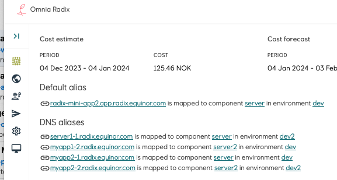
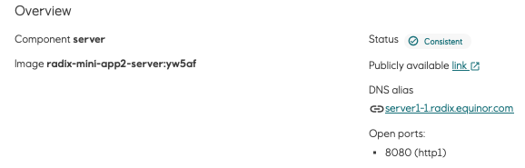
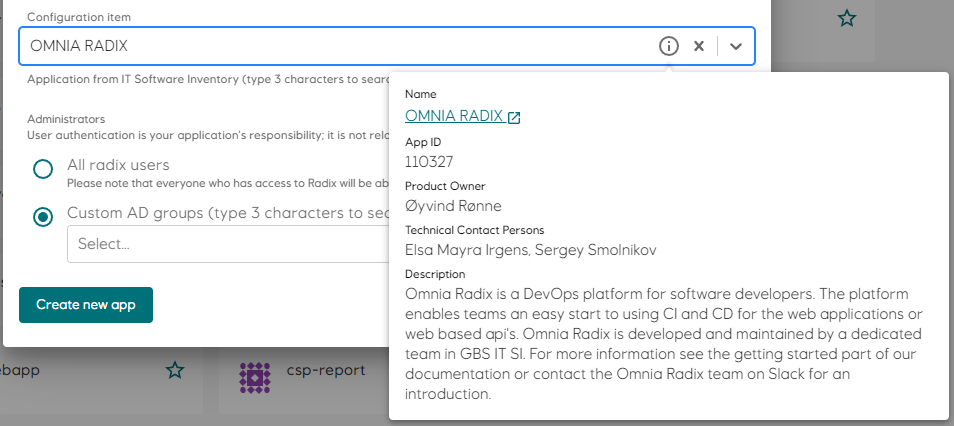
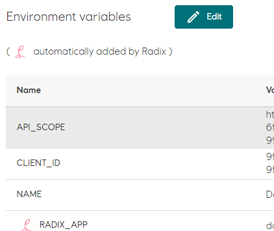

# What's new

## 2025

### 2025-08-21 New `proxyRequestBuffering` endpoint configuration option
We have added `proxyRequestBuffering` setting to [radixconfig](../../radix-config/index.md#network) to enable or disable request buffering in our proxy (enabled by default).


### 2025-07-17 Command and args in Radix jobs and batches
Added `command` and `args` properties to be optionally configurable when create Radix jobs and batches. Read [more](../../guides/jobs/job-manager-and-job-api.md#parameters).

### 2025-07-16 Image and variables for Radix jobs
Radix jobs can be run with optional `image` and `variables`. Read [more](../../guides/jobs/job-manager-and-job-api.md#parameters).

### 2025-07-08 Scale with Azure Event Hub events
Supported scale Radix application components based on [Azure Event Hub events](../../guides/horizontal-scaling/keda-azure-event-hub-trigger-overview.md).

### 2025-06-23 System managed Redis for OAuth2
[OAuth2](../../radix-config/index.md#oauth2) authentication can be configured with Redis session store, automatically deployed with an option `sessionStoreType: systemManaged` in the [radixconfig](../../radix-config/index.md).

### 2025-06-05 Command and args in components
Added `command` and `args` properties to components and job-components in [radixconfig](../../radix-config/index.md).

### 2025-05-26 fromType build options
Added `fromType` to the [`environments.build`](../../radix-config/index.md#fromtype) section in [radixconfig](../../radix-config/index.md).

### 2025-05-14 Radix GitHub Actions v2.0.0
Released Radix GitHub Actions v2.0.0 with breaking changes.
- The `args` command no longer executes.
- The action will now install `rx` into the workflow environment
- Optionally authenticate with GitHub Workload Identity and Federated Credentials, or Client Secret
- Automatically runs `rx logout` after the workflow has completed to make sure any Radix authentication tokens are removed from the environment.

Read details about the migrations here: [Migrating Radix Github Actions v1 to v2](../../guides/deploy-only/migrating-radix-github-action-v1-to-v2.md)

### 2025-05-15 Option to refresh build cache
Added an option to refresh build cache. It is applicable when a radixconfig.yaml property `useBuildKit` is set to `true`. Read more in [radixconfig](../../radix-config/index.md#refresh-build-cache).

### 2025-05-10 Supported custom node types
Added `nodeType` to the [`runtime`](../../radix-config/index.md#runtime-detailed) section in [radixconfig](../../radix-config/index.md).

### 2025-04-25 Configurable webhookEnabled build option
Added `webhookEnabled` to the [`spec.build`](../../radix-config/index.md#webhookenabled) section in [radixconfig](../../radix-config/index.md):

### 2025-04-08 Configurable proxyBufferSize option
Added `proxyBufferSize` to the [`network.ingress.public`](../../radix-config/index.md#network-detailed) section in [radixconfig](../../radix-config/index.md):

`proxyBufferSize` defines the size of the buffer used for reading the first part of the response received from the proxied server. The size must be large enough to hold the response headers.

### 2025-03-17 Improved volume mount cache
- Fixed [issue](https://github.com/equinor/radix/issues/348) with stale files when mounting Azure storage account blob containers.
- Add block cache support, and used as default [options](../../guides/volume-mounts/index.md#block-cache), for [blobFuse2](../../radix-config/index.md#blobfuse2). See [guide](../../guides/volume-mounts/index.md) for details.

### 2025-03-03 Radix CLI gets and stops scheduled batches and jobs
Radix API and Radix CLI can be used to [get](../topic-radix-cli/index.md#get-scheduled-batches-and-jobs) and [stop](../topic-radix-cli/index.md#stop-scheduled-batches-and-jobs) Radix scheduled batches and jobs.

### 2025-02-21 Vulnerability reports with Radix CLI
Radix CLI (v1.26.0) now supports getting vulnerability reports for your applications. Try `rx get vulnerability --application your-app-name` to see it in action. Read more [here](../topic-radix-cli/index.md#get-vulnearbility-scan-reports)

### 2025-02-20 Two options for authentication to OAuth2
Radix now supports two options for authentication to OAuth2 proxy for a Radix application component
- [Client Secret](../../guides/authentication/index.md#authentication-with-client-secret), already existing
- [Azure Workload Identity](../../guides/authentication/index.md#authentication-with-azure-workload-identity), available from now, authentication without need of Client secret.

### 2025-02-10 Two authentication options for Azure Storage Account
Radix now supports two options for authentication to Azure Storage Account from a Radix application component
- [Azure Storage Account Keys](../../guides/volume-mounts/index.md#access-keys), already existing
- [Azure Workload Identity](../../guides/volume-mounts/index.md#azure-workload-identity), available from now, authentication without need of Azure Storage Account key

## 2024

### 2024-12-20 Relaxed Memory limit rules

You can now have a higher memory limit than your requested limits. 
Beware that the memory abouve your requested amount might not be available and can lead to a Out Of Memory Exception that will terminate and restart your component. 

### 2024-12-19 Advanced Health Checks

A new `healthChecks` field is introduced to the `components` and `environmentConfig` section of your `radixconfig.yaml` file. This allows for more fine grained rules that will tell Radix when your application is ready for smoother upgrades and rollouts of new versions, or when we upgrade or replace a node.

See more in the in the [reference](../../radix-config/index.md#healthchecks)

### 2024-12-17 Controlling batch job failures using exit codes

We have added a new (optional) configuration option [failurePolicy](../../radix-config/index.md#failurepolicy) for jobs in radixconfig.
This allows you to control how job failures should be counted towards the backofflimit for different exit codes, for example by using FailJob to prevent retries in case of a software bug or configuration error, or not incrementing the counter toward backoffLimit in case of transient errors like connection issues by using Ignore.

### 2024-11-12 Radix CLI and gitHub action updates
[Radix CLI 1.24](https://github.com/equinor/radix-cli/releases/tag/v1.24.0) and Radix github action v1 now support announced earlier :arrow_up: :
- "apply-config" pipeline job with an option ``--deploy-external-dns-alias`` true|false (by default ``false`` )
- "build-deploy" pipeline job with an option ``--environment`` in addition to mandatory ``--branch``

### 2024-11-11 Changes to Radix pipeline jobs
The pipeline job "apply-config" can now optionally apply changes of External DNS aliases in the radixconfig without need to explicitly re-deploy connected environment (a new deployment willbe created though automatically)
The pipeline job "build-deploy" can now optionally have selected environment, if a selected branch is used in more then one environment or a build.from template matches to multiple environments. Support in Radix cli and github action will follow soon.

### 2024-11-11 Some UI (Web Console) improvements
The sections events, environment variables, scheduled job and batches list now keep its last collapsed/expanded state in the browser local storage.

Scheduled batch page and its job has extended breadcrumb and properties

:::tip Tips
Please hit Ctrl+F5 (⌘-R) if changes are not seen in the web-console
:::

### 2024-10-30 Components and pods events in the Radix console 
In addition to app-environment events, Radix console now shows events on component page (component-related) and replica page (replica's component and replica itself related).

:::tip Note
Just to remember - each event remains during only one hour.
:::

### 2024-10-24 Update on Azure PostgreSQL Flexible Server DNS resolution 
Microsoft has reverted the temporary DNS configuration for PostgreSQL servers described in this post: https://learn.microsoft.com/en-us/azure/postgresql/flexible-server/concepts-networking-private-link#private-link-and-dns

The new DNS configuration for PostgreSQL servers will only resolve to ``"server-name".privatelink.postgres.database.azure.com`` if the server has a private endpoint.
:::info Info
This means to you are no longer required to use private links from Radix to PostgreSQL servers.
:::

### 2024-10-14 Radix - new platform location
It is now an option to run your application in the West Europe data centre. This can be a good option if your data also is located in the same data centre. You will now find two platforms in the Radix, named Platform (North Europe)🇮🇪 and Platform 2 (West Europe)🇳🇱

### 2024-10-09 Public endpoint configuration options 
We have added three setting to [radixconfig](../../radix-config/index.md#network-detailed) for configuration of limits for public endpoints:

`proxyReadTimeout`: Defines a timeout, in seconds, for reading a response from the proxied server. The timeout is set only between two successive read operations, not for the transmission of the whole response. Default is 60 seconds.

`proxySendTimeout`: Defines a timeout, in seconds, for transmitting a request to the proxied server. The timeout is set only between two successive write operations, not for the transmission of the whole request: Defaults to 60 seconds.

`proxyBodySize`: Sets the maximum allowed size of the client request body. Default is 100M.

:::warning Caution
Setting `proxyBodySize` to "0", or an unnecessary high value, can lead to instability/denial of service or increased cost, depending on how the request body is processed by the backend, e.g. when buffering to memory or storing the content to disk, either locally or remotely. Never set the value to "0" unless the backend component is configured to enforce a limit.
:::

### 2024-09-27 Add service principals to the application's administrators/readers list in Radix Web Console

You can now add service principals (App Registration or Managed Identity) to the Administrators or Readers list in the application configuration page. You no longer have to go via a group.

The drop-down will search for groups and service principals when you start typing. Groups and service principals are grouped in the result list, showing groups first and service principals last. See attached screen recording.

### 2024-09-27 Restrict access to public components by IP address or CIDR
You can restrict access to the public endpoints for a component by configuring a list of IP addresses or CIDRs in the ``network.ingress.public.allow`` field in [radixconfig](../../radix-config/index.md#network-detailed).

When this field is set, only IP addresses matching items in the list can access the public endpoints for the component. Unauthorized IP addresses will receive a 403 response.

The component page in Radix Web Console will show information when IP filtering is active, or if all IPs are allowed.


### 2024-09-18  Fix for docker.io rate limit during build 
This fix will resolve docker.io rate limit errors during the build step for applications using [useBuildKit](../../radix-config/index.md#usebuildkit).

If your Dockerfile uses images from docker.io in the FROM instruction, Radix will pull the image as an authenticated used instead of as anonymous. This increases the rate limit to 5000 pulls per day, instead of 100 per 6 hours.

If you have configured credentials for docker.io in radixconfig ([privateImageHubs](../../radix-config/index.md#privateimagehubs)), these will be used instead.

### 2024-09-17 Manual Component Scaling

A new Scaling feature has been added to Radix Web Console and to RX, while also supports overriding any automatic scaling. Any manually scaled components (even scaled to 0, ie. Stopped) will retain the custom scaled untill its been reset, even across new deployments.

Start component has now been deprecated and should be replaced with reset-scale (both in the radix-api and in rx cli, and will be removed after August 2025).


### 2024-07-10 Custom batch status in Radix scheduled jobs
Radix now supports an optional custom rules defining a [batch status](../../radix-config/index.md#batchstatusrules) by batch job statuses. If rules are not set or none of them matching, the base (previously defined) rules are applied.

### 2024-06-06 Support for advanced horizontal scaling (KEDA)
We have released initial support for KEDA Triggers, to enable scaling of pods based on messages in a Azure Service Bus, or based on a CRON Schedule, as well as resource metrics as before (CPU/Memory). If you are using a non-resource trigger, we also support scaling to 0 replicas!
See  [radixconfig.yaml](../../radix-config/index.md#horizontalscaling) for more details.

:::tip
We recommend scaling most environments to 0 when not in use, this will save on cost and the environment 🌳💸
:::

#### Example:
- Scales to 0 at night
- Scales to minimum 1 at day time
- Scales up to maximum 5 at heavy load (the trigger with the highest number of target replicas will win)
```yaml
horizontalScaling:
  maxReplicas: 5
  minReplicas: 0
  triggers:
    - name: cpu
      cpu:
        value: 50 
    - name: cron
      cron:
        timezone: Europe/Oslo
        start: 0 7 * * 1-5 # 07:00 Monday - Friday
        end: 0 17 * * 1-5 # 17:00 Monday - Friday
        desiredReplicas: 1

```

### 2024-06-04 Strict validation of RadixConfig.yaml in Radix CLI

``rx`` (radix cli) and ``radix-github-action`` have received upgraded validation. It will now check for misplaced/misspelled  keys, and with even more checks than before!

### 2024-05-06 New option in radixconfig.yaml - sub-pipeline

[radixconfig.yaml](../../radix-config/index.md) has new option subPipeline in ``build`` and ``environments`` properties. Currently it has [variables](../../radix-config/index.md#subpipeline) (handovers from ``build.variables`` and ``environments.variables`` for sub-pipelines, backward compatible) and [identity (detailed)](../../radix-config/index.md#identity-detailed) (also in environments).  

When this ``subPipeline``'s ``identity.azure.clientId`` option is set, the environment variable ``AZURE_CLIENT_ID`` with its value is automatically added to the running pipeline, and it can be used in this pipeline tasks. Read more about the identity in the [component identity](../../radix-config/index.md#component-identity) option and about using it in the sub-pipeline in the [Pipeline with Azure workload identity](../../guides/sub-pipeline/example-pipeline-with-azure-workload-identity.md) example.

### 2024-04-19 New pipeline job type: apply-config

Sometimes radixconfig.yaml has properties, which does not require a re-deploy of components. The ``apply-config`` pipeline workflow perform these changes without re-deploying components or jobs. Currently it apply changes in : [DNS alias](../../radix-config/index.md#dnsalias), [build secrets](../../radix-config/index.md#secrets-build-secrets), [environments](../../radix-config/index.md#environments) (create new or soft-delete existing environments).  

It is available in Radix CLI 1.17.0 and in the [Radix GitHub action](https://github.com/equinor/radix-github-actions).  

### 2024-04-18 Extended scheduled job statuses

Radix recently got extended information in its console for scheduled jobs - more detailed info about job replicas, including failed ones.  

Job API also [provides extended status](../../guides/jobs/job-manager-and-job-api.md#get-a-state-of-a-batch) info (and extra field ``updated`` and timestamp when the status was last updated). Job statuses includes statuses of one or several replicas.  
New job status was added
``Active`` (in addition to ``Waiting``, ``Stopping``, ``Stopped``, ``Running``, ``Successful``, ``Failed``, ``DeadlineExceeded``), which means that the job has a replica created, but it is not ready (reasons can be volume mount is not ready, or it is a problem to schedule replica on a node because not enough memory available, etc). 
:::note
This [extension](../../guides/jobs/notifications.md#radix-batch-event) is also included in Notifications
:::

### 2024-04-16 Environment specific options now available on component level

In Radixconfig the properties [monitoring (detailed)](../../radix-config/index.md#monitoring-detailed), [horizontalScaling](../../radix-config/index.md#horizontalscaling-detailed) and [volumeMounts (detailed)](../../radix-config/index.md#volumemounts-detailed) could only be set in [environmentConfig](../../radix-config/index.md#environmentconfig) . Now these properties is supported in radixconfig on component (and job) level (monitoring, horizontalScaling and volumeMounts), in environments they can be overridden/altered or new can be added. Configurations in existing applications are still valid, no changes required (if not needed).

### 2024-04-12 Read-only root filesystem

``Containers should run with read-only root filesystem``  
In our Radix cluster a new security option has been enabled (but not enforced). However we encourage all teams to look into this and [opt in for the configuration](../../radix-config/index.md#readonlyfilesystem-detailed).
An immutable root filesystem prevents applications from writing to the local disk. This is desirable, in case of an intrusion from the attacker will not be able to tamper with the filesystem or write foreign executables to disk.  

The [container's](../topic-docker/index.md) **root filesystem** should be treated as not usable. This prevents any writes to the container's root filesystem at container runtime and enforces the principle of immutable infrastructure. Read about read-only filesystems in Kubernetes for more info.

Some options you can consider
- If you want to write it to a file, [mount a volume](../../guides/volume-mounts/index.md) instead.
- For temporary files or local caching, en **emptyDir** volume can be mounted with type Memory
- Any volume mounted into the container will have its own filesystem permissions

**What about logs**
If this is really about logs a better solution might be to reconfigure your application to send its logs to ``stdout``, typical log collectors know how to read the container logs.  


:::tip **emptyDir** 
A container crashing does not remove a Pod from a node. The data in an emptyDir volume is safe across container crashes.
:::

Some uses for an emptyDir are:
- Scratch space, such as for a disk-based merge sort
- Checkpointing a long computation for recovery from crashes
- Holding files that a content-manager container fetches while a webserver container serves the data


### 2024-03-07 Environment specific ``image``, src , dockerfileName in radixconfig.yaml

So far a component could be built from for all environments from the same ``src`` and ``dockerfileName`` (or "." and "Dockerfile" by default), or it could be deployed with an image, specified in ``image`` option (with possible altering by ``imageTagName`` for environments).  

Now these options can be different for individual environments of one component. Motivation was to allow building the component for one environment, but keep other environments being deployed from pre-built images (and vice-versa).  

Please read more about ``environmentConfig`` with [src](../../radix-config/index.md#src-detailed), [dockerfileName (detailed)](../../radix-config/index.md#dockerfilename-detailed) and [image](../../radix-config/index.md#image-detailed).  

### 2024-03-06 automatic issuance of Digicert (equinor.com) certificates

Managing SSL/TLS certificates can be a daunting task that requires a lot of manual effort. But now, with our new automated process, you can take the hassle out of issuing SSL/TLS certificates and let us handle it for you with ease.  

With this feature, you can ensure that all your certificates are up-to-date and issued on time. Our system will automatically generate and renew certificates for you, so you’re always one step ahead.  

More information regarding this feature can be found in the [External Alias Guide](../../guides/external-alias/index.md)


### 2024-03-04 Updated Radix documentation website

Radix documentation website has been migrated to the framework [Docusaurus](https://docusaurus.io/) due to previously used VuePress is retired. We also rearranged some of menu items.

### 2024-01-25 Option "component" added to deploy-only pipeline job

One or several components can be specified for a [deploy pipeline workflow](../../guides/deploy-only/index.md#deploy-only-specific-component) with the new option ``component`` for [Radix CLI](../topic-radix-cli/index.md#deploy-pipeline-job), [Radix GitHub action](https://github.com/equinor/radix-github-actions) and [Radix API](https://api.radix.equinor.com/swaggerui/).

### Custom DNS for your application - within radix.equinor.com

Radix now allows you to configure a custom FQDN in a form ``*abc*.radix.equinor.com``
Multiple FQDNs can be defined in the [radixconfig dnsAlias](../../radix-config/index.md#dnsalias) property (similar to [dnsAppAlias](../../radix-config/index.md#dnsappalias), but with less limitations and without .app in FQDN) for any environment component with public port. A supporting certificate is issued automatically.  

For the Playground cluster FQDN will be like  ``abc.playground.radix.equinor.com``  

Configured FQDNs are shown in the Radix application and component web-console forms  
  


### 2024-01-03 Sub-Pipeline can now use Workload Identity (Tekton)

We now support the use of Azure Workload Identity for Sub-Pipelines. With this release, a unique credential for each of your environments is provided, which will allow you to use Federated Credential wherever needed.
[Sub-Pipeline guide with Workload Identity](../../guides/sub-pipeline/example-pipeline-with-azure-workload-identity.md)


### 2024-01-02 New command available in Radix CLI

Runtime environment variable can be set or changed not only in the ``radixconfig`` or Radix console, now also in the Radix CLI
````
rx set environment-variable --application your-app1 --environment your-env --component your-component1 --variable LOG_LEVEL --value DEBUG
````
Use with github action
````
      - name: Set variable
        uses: equinor/radix-github-actions@v1
        with:
          args: >
            set environment-variable 
            --application your-app1
            --environment your-env
            --component your-component1
            --variable LOG_LEVEL 
            --value DEBUG    
````


## 2023
### 2023-12-05 Support for using images from private repositories

We have released support for using images from private repositories in the Dockerfile ``FROM`` instruction.
```docker
FROM myappacr.azurecr.io/myapp-base:latest
```
It requires ``useBuildKit: true`` in the radixconfig.

### 2023-11-14 Only build changed components and jobs

[`build-deploy`](../../guides/build-and-deploy/index.md) pipeline jobs created from a Github webhook will only build changed components and jobs. The commit ID from the webhook is compared with the commit ID from the active deployment to generate a list of changed directories. This list is compared with the path of the Dockerfile for each component and job. The component/job is built if the Dockerfile path is equal to, or a parent of any changed directory.

### 2023-11-13 New version of Radix CLI
We have just released a new version of Radix CLI v1.12.1 with a ``validate radix-config`` command. It checks radixconfig.yaml for structural and logical errors
Also available as a GitHub action step
```yaml
- name: 'Validate RadixConfig file '
  uses: equinor/radix-github-actions@v1
  with:
    args: validate radix-config --print
```

### 2023-10-20 Commit ID option in deploy-only pipeline jobs
Radix CLI v1.10.0 and Radix GitHub action support an additional option ``commitID`` in the command ``rx create pipeline-job deploy`` . It is a 40 chars text field, which can have a reference to a GitHub commit-id, which will be shown in the Radix console, in the list of pipeline jobs and job details.  
In Radix CLI and Radix GitHub action, an option ``job`` is renamed to ``pipeline-job`` for commands create job , get logs jobs -&gt; rx create pipeline-job , rx get logs pipeline-jobs. The previous option ``job`` well remain in these commands for backward compatibility. It is done to avoid confusion with "batch jobs", which are for job-components.

### 2023-10-18 Rerun failed or stopped pipeline jobs
If a pipeline job is failed or stopped, it can be rerun with a **button** in the Radix console - a new job is created with the same parameters and commit-id.  
This can be particularly useful in case of job, failed due to timeout in accessing external services.  

To reduce the error "TLS Handshake timeout" it has been mitigated in Radix pipeline logic now.  

### 2023-10-09 Changes in Azure Blob volume-mounts
If your Radix application uses Azure Blob volume mount, [radixconfig.yaml](../../radix-config/index.md) has a configuration of this volume mount, which has an optional property ``accessMode``. If the application need not only read, but also write to this Azure Blob container, please specify explicitly this property, we recommend for the read-write purpose to set it to ``ReadWriteMany``:
```yaml
volumeMounts:
  - name: volume-name
    path: /path/in/container/to/mount/to
    blobFuse2:
      container: container-name
      uid: 1000
      accessMode: ReadWriteMany
```

### 2023-10-02 Radix now supports docker BuildKit in the pipeline
Radix application can be configured to be built with [Docker BuildKit](https://docs.docker.com/build/buildkit/)  
Use an option ``useBuildKit: true`` in the [build radixconfig](../../radix-config/index.md#build) section.
:::info Note
There maybe be changes required in a dockerfile, particularly secrets will be passed with more secure way. Read more in the [guide](../../guides/build-secrets/index.md#build-secrets-with-buildkit)  
:::

### Grouped secrets in Radix Web Console
Secrets in Components have been redesigned, sorted and grouped, hopefully making them bearable to read through  

### 2023-09-26 Improved log feature for jobs (job compnent) in Radix Web Console
Previously, logs for completed jobs (status: succeeded, failed or stopped) disappeared from the Radix Web Console after some time (hours, days). The reason for this behavior is usually caused by internal Kubernetes cleanup processes or when nodes in the cluster are scaled down.  
We have added a new panel, **Job Logs History**, in the job detail page (similar to the **Replica Logs** panel for a component). This panel lists all runs/retries from the last **30 days** for a specific job, sorted descending by start time, and the log for a specific run/retry can be downloaded by clicking on the download button.  
The attached screenshot shows a job that has Backoff Limit set to 10 (will restart the job 10 times if exists with a non-zero error code). The job has failed 11 times (initial run + 10 retries). The Job Logs History lists all 11 runs. The log for a specific run can be downloaded by clicking on the download icon.


### 2023-09-19 Radix now runs all jobs in a separate node-pool
Because jobs often run a shorter period, then regular components, and may require larger amount of resources, Radix now runs any jobs (pipeline, scheduled) in their own Kubernetes node pool (a set of virtual machines), dedicated only for jobs. We expect it will reduce an impact on regular components (which runs normally permanently) and give more resources quickly available due to shorter run nature in most cases.  
This node pool also has autoscaling.

### 2023-08-22 Updated Radix CLI and Radix GitHub actions
[Radix CLI](https://github.com/equinor/radix-cli) updated (v1.8.0)
* Authentication now uses [MSAL library](https://github.com/AzureAD/microsoft-authentication-library-for-go)
* All commands return exit code 1 on error
* Usage description is not shown on command error
* Option ``await-reconcile`` is set by default to true and is applicable only for the command ``set environment-secret`` , as it is applicable only too this command.
* Added commands `get deployment` of an application in case you need to clean obsolete or not used images in own docker images repository

#### Radix github action updated
Now [it has releases](https://github.com/equinor/radix-github-actions/releases), with latest tested release v1 , which is recommended to use in GitHub actions, instead of master
Previous use example: ``equinor/radix-github-actions@master``
Recommended use example:
```yaml      
- name: 'Deploy app'
  uses: equinor/radix-github-actions@v1
  with:
    args: >
      create job
```
* With this v1 release it will get particular Radix CLI stable release instead of the latest one.


### 2023-08-15 Radix application reader role
A `Radix application reader` role has been added to Radix. This role is a read-only role intended for users who need to view information about a Radix application, but should not be allowed to perform any actions such as starting or stopping components, or deleting the application.
Readers have the privilege to view logs associated with their replicas and jobs.
The role is an Azure AD group that can be assigned under `Access control` in the Configuration page of the application. 

### 2023-08-01 Restart batches and *jobs with recent active deployment*

In addition to restart job with original deployment, Radix now allows to restart scheduled single jobs, entire batch or individual jobs within the batch with latest active deployment (if it is different than for the restarting job). [Read more](../../guides/jobs/jobs-in-web-console.md)
Scheduled jobs now can be run with `imageTagName` , specified in [radixconfig](../../radix-config/index.md) and altered in [JobDescription](../../guides/jobs/job-manager-and-job-api.md#create-a-single-job)  
```yaml
{
  "payload": "abc",
  "imageTagName": "1.0.0"
} 
```

### 2023-07-13 Restart scheduled batches and jobs

Radix now allows to restart scheduled single jobs, entire batch or individual jobs within the batch - completed, failed, stopped or running.
Technically it deletes the corresponding Kubernetes job and starts new instead, with the same deployment, job-description and payload.
Use-case - restart jobs, failed due to temporary issues, lack of memory, unavailable external data or api.

### 2023-07-05 Change in Azure Blob volume-mounts option

If your Radix application uses [Azure Blob volume mount](../../guides/volume-mounts/index.md), [radixconfig.yaml](../../radix-config/index.md) it is recommended to replace its configuration with BlobFuse2:  

```yaml
  volumeMounts:
    - name: storage1
      path: /app/image-storage
      blobFuse2:
        protocol: fuse2
        container: blobfusevolume
        uid: 1700
```

### 2023-05-16 Support for custom CPU scaling threshold and autoscaling on memory
Autoscaling has only been supported on CPU, with a hardcoded threshold of 80% utilization. Now the CPU threshold is configurable, and you can also configure autoscaling on memory.
This can be enabled in [radixconfig.yaml](../../radix-config/index.md#horizontalscaling).
:::info Deprecated
The `resources` block is deprecated and replaced by more flexible `triggers`, see [radixconfig.yaml](../../radix-config/index.md#horizontalscaling) for more details.
:::
Example:

```yaml
spec:
  components:
    - name: backend
      environmentConfig:
        - environment: prod
          horizontalScaling:
            resources:
                memory:
                  averageUtilization: 75
                cpu:
                  averageUtilization: 85
            minReplicas: 2
            maxReplicas: 6
```

### 2023-05-24 Old Replica logs! Get your old Replica logs here!

Is one of your replicas crashing? Have you ever wondered what the last signs of life were before it dramatically had its last breath of digital air?  
Well wonder no more!  
You can now download the logs of a components previous replicas, or even individual replica containers.  
This feature can be found on any of your Component Pages in the Radix Web Console, just below the Replica table.  

### 2023-05-02 Radix does not allow to run Sub-Pipeline task steps with root users

Radix cluster policy does not allow to run containers with root user. Sub-pipelines are also not allowed to run its task steps with root users. Please use rootless docker images or use step spec option runAsUser. E.g. `runAsUser: 1000`

```yaml
spec:
  steps:
    - image: alpine
      name: step1
      script: |
        #!/usr/bin/env sh
        id
        :
      securityContext:
        runAsUser: 1000
```

### 2023-04-14 Radix supports Azure Workload Identity for Azure Key Vaults

Radix now supports two options for authentication to Azure Key Vault from a Radix application component  
- [Azure Service Principal Client ID and Client Secret](../../guides/azure-key-vaults/index.md#authentication-with-azure-service-principal-client-id-and-client-secret) , already existing  
- [Azure Workload Identity](../../guides/azure-key-vaults/index.md#authentication-with-azure-workload-identity) , available from now, authentication without need of Azure Service Principal's Client ID and Client Secret  

### 2023-04-12 Radix application configuration - Admin AD group is now mandatory

Admin AD group can be set in Web console =&gt; Configuration =&gt; “Change administrator”.

### 2023-03-28 New version of Radix CLI version 1.7

More details in the [Radix documentation](../topic-radix-cli/index.md#commands) or with built-in `help`   
```shell
rx scale --help  
rx get logs component --help  
rx create pipeline-job deploy --help  
```

### 2023-03-14 Radix updates

* Job component configuration has an option `notifications.webhook` - it is a Radix application's component URL, which will be called on status changes of running batches and jobs.  
* Scheduled Batches and Scheduled Jobs were renamed in the Radix console to Batches and Jobs. Job Scheduler was also renamed to Job Manager. It is to simplify terminology.  
* We added basic overview information for Radix CLI.   
* A new property `backoffLimit` for jobs defines the number of times a job will be restarted if it exists in error. This value can be configured in radixconfig.yaml or when creating a new job or batch . The `backoffLimit` for a specific job, and the number of times a job has failed is available in the job detail page in Radix Web Console.  


### 2023-03-07 Schema for radixconfig.yaml

We have released the OpenAPI 3.0 Schema (an extended subset of JSON Schema) for the radixconfig.yaml file.  
This schema can be used in code editors (e.g. VS Code and Jetbrains IDEs) to provide auto-completion and validation when working with `radixconfig.yaml`, see [radixconfig schema](../topic-code-editor-integration/index.md)

### 2023-02-28 Radix Web Console: Stop a regular job and batched jobs

A brand new button has been added to allow users to easily stop a job or a batch.  
The `Payload` button (`Scheduled Jobs` only) has been moved inside an elipsis menu together with the new `Stop` button for convenience.  


### 2023-02-24 Option to pass $GITHUB_TOKEN to the Radix GH Action

The Radix Github Action is used by many Radixians to execute rx CLI commands in workflows. We have seen cases where workflows fail because the Radix Action fails to download the rx CLI because of GitHub API rate limits. To remedy this, we have patched the Action with an optional argument github-token, where you can supply your workflow's GITHUB_TOKEN secret. This effectively increases the hourly API request limit from 60 to 15,000.

```yaml
- name: list-apps
  uses: equinor/radix-github-actions@v1
  with:
    github-token: ${{ secrets.GITHUB_TOKEN }}
    args: >
      get
      application
```

### 2023-02-16 Radix Web Console: Start, Stop and Restart environments

- Git Tags are now visible on the Environment Summary Cards.
- Buttons to start, stop and restart an envrionment has been added.
  

### 2023-01-31 Radix Playground lifecycle policy

We will now implement a stricter [lifecycle policy](../topic-uptime/index.md#automatic-cleanup-in-playground-cluster) for using Radix Playground.  
Any application which has not been  
a - deployed - or  
b - restarted  
in the last 7 days will be stopped.  
After further 21 days of inactivity, all stopped applications will be deleted.  


### 2023-01-23 Radix Web Console: Shown replica resources and scheduled job resources and settings

Radix now provides Request and Limit resources for component replicas and scheduled jobs. For scheduled jobs it is also shown Time Limit and Backoff Limit (later will be soon configurable)


### 2023-01-18 Custom branch name for wildcard branch mapping

Radix now provides a text input field to put a full branch name for a build environment with [wildcard branch mappings](../../radix-config/index.md#build-environment)

### 2023-01-17 Machine user tokens deprecated

Machine user tokens pose a security risk due to lack of expiration time.  
Kubernetes underlying functionality used by machine user tokens has been removed in newer versions.  
Applications that currently use machine user tokens in their external CICD pipelines must switch to using Azure service principals (Azure AD app registrations or user-assigned managed identities).  


### 2023-01-10 Federated Credentials with Azure AD Application and Managed Identity

We have enabled support for federated credentials between applications running in Radix and Azure AD applications and Azure Managed Identities.
[Workload identities](../../guides/workload-identity/index.md) in Radix

## 2022

### 2022-11-10 Configuration Item replaces WBS and owner and is now mandatory

The `Owner` and `WBS` fields has been removed and is replaced by `Configuration Item` which refers to an IT application in ServiceNow.
When registering a new application in Radix, you will have to select a `Configuration Item` from the drop-down list. The drop-down will automatically query ServiceNow when you start typing.

To see more information regarding the selected `Configuration Item`, click the `info` icon on the right in the drop-down.

Existing applications should be updated with a `Configuration Item` in the Application Configuration page.

:::info
For the Playground cluster a Configuration Item is not mandatory.
:::



### 2022-11-01 Enable and/or Disable components

Components in the Radix application now can be enabled and disabled for any and all environments.  
This can be configured in [radixconfig.yaml](../../radix-config/index.md#enabled).

Example:

```yaml
spec:
  components:
    - name: backend
      environmentConfig:
        - environment: prod
          enabled: false
spec:
  components:
    - name: backend
      enabled: false
      environmentConfig:
        - environment: prod
          enabled: true
```

### 2022-11-01 External DNS certificate and key validation

You can now view information about TLS certificates for [external DNS aliases](../../guides/external-alias-certificate/index.md) in Radix Web Console.

### 2022-10-13 Supporting monorepo and custom radixconfig names

Radix now supports multiple Radix applications in the same GitHub repository - **monorepo** strategy.
It is now possible to use custom Radix configuration filenames (aka [radixconfig.yaml](../../radix-config/index.md)) and/or its location in the GitHub repository.  
Please read more in the [monorepo guideline](../../guides/monorepo/index.md)

### 2022-10-12 Radix CLI version v1.2.1

A new command have been added.
Use `version` to print current version of the rx

### 2022-09-23 Improvements in Radix Web Console

Ensure you have assigned permissions to your app's [configuration](../../start/registering-app/index.md), now you are able to grant the permission using the name of an AD group. At the same time add your applications to the list of favourites, only favourites will have the application status available on the Web Console front page.

Check out your vulnerability scan results: Are you using OAUTH feature? You may want to switch to [Radix OAUTH service](../../guides/authentication/index.md#using-the-radix-oauth2-feature), we are updating the images (dependencies) regularly

### 2022-09-20 Radix CLI version v1.2.0

Radix CLI 1.2.0 has new commands added such as `start`, `stop` and `restart` for a specific component, environment or an entire application.

#### Example

```sh
rx start component -a <application-name> -e <environment-name> -n <component-name>
rx stop environment -a <application-name> -e <environment-name>
rx restart application -a <application-name>
```

### 2022-09-20 Azure key vault secret autorotation

Radix now offers the [Azure Key Vault autorotation](../../guides/azure-key-vaults/index.md#autorotation-of-secrets) feature.

### 2022-09-01 Vulnerability scan removed from build pipeline

The `Vulnerability Scan` step has been removed from the `build-deploy` pipeline. It has been replaced by a scheduled scan (daily and after new deployment) that scans images for all components, not only those built by Radix. Aggregated scan results are shown in environment pages, and details in the component page.

### 2022-09-01 Select Radix Application Administrator Group by name

A new feature in Radix Web Console simplifies the configuration of application administrators. You can now select AD Groups in a drop-down list instead of entering a comma-separated list of ids. The drop-down list is populated as you type after two characters are entered.


### 2022-08-16 GIT Metadata updates

- Two new default build-time environment variables, `$RADIX_GIT_COMMIT_HASH` and `$RADIX_GIT_TAGS`.
- `$RADIX_GIT_COMMIT_HASH` has up until now been injected into pods if pipeline job was triggered via GitHub webhook. This variable is now also inferred from HEAD of the build branch for build-deploy jobs which are not triggered via the GitHub webhook.
- `$RADIX_GIT_COMMIT_HASH` is inherited from source deployments after promote pipeline.
- New default pod environment variable `$RADIX_GIT_TAGS`, containing a whitespace separated list of git tags which refer to `$RADIX_GIT_COMMIT_HASH`, if present.
- UI for creating promote pipeline jobs displays the build commit and git tags of source deployments, if present on the source deployment.
- The overview page for Environment now has a GitHub link to the source code commit from which the active deployment was built, if applicable. GitHub links to tags are also present, if applicable.
- The overview page for Deployment also has GitHub links to commit and tags, if applicable.

### 2022-08-10 Azure Key Vault values version

Radix Web Console can show version of [Azure Key Vault values](../../guides/azure-key-vaults/index.md#azure-key-vault-secret-certificate-and-key-versions) used in a Radix application component (if applicable) - which pod uses which version. Click the link of the Azure Key Vault secret, certificate or key to open a popup with this info. Statuses also reflect actual state, not just *External*

### 2022-08-10 Pipeline information for favourite appliactions in Radix Web Console

Radix Web Console now shows the last pipeline job status badge only for applications which are your favourites.

### 2022-06-28 Log lines limit

The Radix component log size have been limited to only display the last 1000 lines to reduce browser resources usage.  
Copy log to clipboard has also been limited to the last 1000 lines.  
The **Download** button will return the entire log.

### 2022-06-20 Change in Azure Blob volume-mounts accessMode

If your Radix application uses [Azure Blob volume mount](../../guides/volume-mounts/index.md), [radixconfig.yaml](../../radix-config/index.md) has a configuration of this volume mount, which has an optional property `accessMode`. If the application need not only read, but also write to this Azure Blob container, please specify explicitly this property.  
For `read-write` acces, we recommend to set it to `ReadWriteMany`.  

```yaml
  volumeMounts:
    - type: azure-blob
      name: storage1
      storage: blobfusevolume
      path: /app/image-storage
      gid: 1700
      accessMode: ReadWriteMany
```

Radix will soon get an update to set Blob volumes `accessMode` as `ReadOnlyMany` by default, when `accessMode` is not specified explicitly in the [radixconfig.yaml](../../radix-config/index.md#volumemounts-detailed). If a Radix application needs a read-only access to the Azure blob volume mount, please specify it explicitly  
**accessMode: ReadOnlyMany**

### 2022-06-20 Introducing sub-pipeline concept (Tekton)

This is an optional, configurable build step that is run before deployment. A typical use case for [sub-pipeline](../../guides/sub-pipeline/index.md#configure-sub-pipeline) is to perform a database update/migration immediately before deployment

### 2022-06-20 Improved performance of the Radix Operator

Various improvements have been made to optimize the Radix Operator

### 2022-05-30 Scheduled vulnerability scan implemented

Up until now all deployments to Radix was scanned by Snyk and the result was reported in the deploy pipeline in Radix Web Console. However, as most of you will be aware of, new vulnerabilities are discovered all the time and can exist in the image deployed to Radix.  
The scan of all images in Radix will now be done on a regular basis, and the  is reported in the environment page.

### 2022-04-28 Improved/simpler **egress** rules configuration

[Egress rules](../../radix-config/index.md#egress) have been simplified. A new field `allowRadix` can be set to allow or deny traffic to other Radix applications.  
If you use the [built-in Oauth2 feature](../../guides/authentication/index.md#using-the-radix-oauth2-feature), it is no longer necessary to allow traffic to [login.microsoftonline.com](http://login.microsoftonline.com/).

Docs now recommend using [Private Link](../../guides/egress-config/index.md#use-private-link) to get static IP address to Azure databases or other SaaS for use in egress rules

### 2022-04-12 Static **ingress** IPs

The Radix clusters now have static ingress IP ranges.  
This information can be found on the :information_source: information page on the applicable Radix Web Console.

:::info IP ranges

```text
Production: 20.223.122.0/30
Playground: 20.223.26.208/30
```
:::

### 2022-03-11 Custom configuration of the Metrics endpoint

You can now specify a custom port and path for monitoring.

Specifying monitoring path and port is now supported for application components in Radix. Read the [radixconfig.yaml reference entry](../../radix-config/index.md#monitoringconfig) for details.

### 2022-02-28 Support for egress rules

Network egress rules are now supported for application environments in Radix. Read the [radixconfig.yaml reference entry](../../radix-config/index.md#egress) for details, and read the [guide](../../guides/egress-config/index.md#built-in-rules) for limitations, tips and usage patterns.

Implement egress rules with caution!  
Applications may break if egress rules inadvertently block required resources.

### 2022-02-18 Build Pipeline steps

The sequence of steps performed in the build/deploy pipeline has been changed. This will reduce time to deploy and new builds.  
To achieve this the scan of the deployment was moved to the end of the workflow, allowing deployment before the scan is completed.


### 2022-02-07 Job manager: Configure time limit for jobs

To control running jobs, it is now possible to configrue a maximum time limit a job should is allowed to run.  
Specify "timeLimitSeconds" in [job payload](https://www.radix.equinor.com/guides/jobs/configure-jobs/#timelimitseconds) or in [radixconfig.yaml](https://www.radix.equinor.com/radix-config/index.md#timelimitseconds).  
A job exceeding the specified limit will be stopped automatically.

### 2022-02-01 Support for Azure Key Vault

[Azure Key Vault](https://docs.microsoft.com/en-us/azure/key-vault/general/basic-concepts) secrets, certificates and keys can be used in Radix as secrets. Once configured, they are available in replicas of Radix application as environment variables and files.  

Read more about this in [radixconfig.yaml](https://www.radix.equinor.com/radix-config/index.md#secretrefs) and [Azure Key Vaults](https://www.radix.equinor.com/guides/azure-key-vaults/) guide.

### 2022-02-01 Built-in configuration for OAuth2 authorization

Radix provides built-in configuration for adding OAuth2 authorization with OIDC to the component. Common `oauth2` settings can be configured at component level and/or in the component's `environmentConfig` section. When OAuth2 is configured for a component, Radix creates an OAuth2 service (using [OAuth2 Proxy](https://oauth2-proxy.github.io/oauth2-proxy/)) to handle the OAuth2 authorization code flow, and to verify the authorization state of incoming requests to the component.  

Read more in the OAuth section in [radixconfig.yaml](https://www.radix.equinor.com/radix-config/index.md#oauth2) documentation and the [OAuth guide](https://www.radix.equinor.com/guides/authentication/#using-the-radix-oauth2-feature).  

### 2022-01-11 Changes to validation of radixconfig

Two new validation rules now apply to radixconfig.

1. Component ports lower than **1024** are prohibited.  
1. Environment variables prefixed with **RADIX_** or **RADIXOPERATOR_** are prohibited.  

## 2021

### 2021-12-09 Active cluster IPs as environment variable

The IPs actively assigned the the cluster of which an application is deployed to are now added to the Radix environment variable RADIX_ACTIVE_CLUSTER_EGRESS_IPS. This environment variable contains a list of IPs which are used for outgoing traffic from the cluster and is added to every component.  

### 2021-11-23 Cluster IPs

Cluster IPs are now visible in the `About Pages` in Radix Web Console.

- [Radix Platform](https://console.radix.equinor.com/about)
- [Radix Playground](https://console.playground.radix.equinor.com/about)

### 2021-11-18 Radix Slack Alerts

We have released a new feature in Radix for sending alerts to Slack if a pipeline job fails, or a component or job fails to start or crashes/restarts (e.g. due to insufficient memory, unhandled exceptions etc.).  
[Read the documentation](../../guides/alerting/index.md),  on how to configure alerting for your application.  

PS! The alert GUI in Radix web console is still "work in progress". We're working with EDS to make it more aligned with the EDS design standard.  

### 2021-10-29 New design: Radix documentation (Public site)

The [Radix documentation site](https://www.radix.equinor.com/) has now been updated to a brand new version with a new design. And last but not least, now also with a SEARCH function.  
The most used page - [radixconfig.yaml reference](https://www.radix.equinor.com/radix-config/index.md) can be easily located under the Reference heading.

### 2021-10-14 Radix CLI version v1.0.7

A new version of the [Radix CLI](https://github.com/equinor/radix-cli) is now available.  
[Version v1.0.7](https://github.com/equinor/radix-cli/releases/tag/v1.0.7)

### 2021-09-09 New Radix Web Console

#### New design

The Radix Web Console has been redesigned in all its glory in accordance with the EDS Design Guidelines. This includes a more responsive design, new colors, new navigation, collapsable menus, icons, fonts and more!  


#### Improved vulnerability scanning

The results from the vulnerability scanning running on all components deployed to Radix are now visualized in the Pipeline Job page as a count of Critical, High, Medium and Low severity. The details of each vulnerabilities can be inspected in the Vulnerability page. This scanning is now performed by Snyk (due to rate limits in Trivy scans)  

  

[Vulnerability scanning - more information](../../start/radix-concepts/index.md#scanning-images-for-security-issues)

#### Favourites

Users now have the ability to favourite their most precious applications! (We all have at least one 😉)  

The new favourites section can be found at the top of the Applications page, making it easier to get an overview of what's important to you amongst the ever increasing list of available applications.  
Favourites are local and stored in the browser cache.


#### Environment variables

Environment variables can now be overridden from the Radix Web Console. Previously users would have to make changes to their `radixconfig.yaml` file and redeploy it to change the value of environment variables.  

:::tip 
Note that you will need to restart the component, or for jobs a new job should be started, for your changes to take effect.
:::



[Environment variables documentation](../../guides/environment-variables/index.md)

#### Performance improvement

The Applications page can now load up to 5x faster than before. Due to the increase in the number of applications, the load time of the Applications page had become way too long (due to the chain of Kubernetes queries needed to determine which applications a user have access to). With this improvement the page loads in a few seconds. Future improvements will be considered if/when needed.  

### 2021-09-01 Radix Security Policy: Enforce 'Run as non-root'

As you may know, Docker containers have root privileges enabled by default. This is unnecessary and can introduce security risks and vulnerabilities into your applications. The policy will technically configure the PodSecurityContext for your application.  

From now on every time you (build and) deploy your app, Radix will not allow applications to run as root. If you have not configured the app correctly, an error will be logged in Events (Events section can be found in the Environments page). The new image will not be deployed and the previous image will remain running.  
If by any circumstance the pod running your app restarts, for instance due to lack of required memory, all applications running on it will also be restarted. Any app not complying with the Security Policy will not be started.  

[Security – running as non-root](../topic-docker/index.md#running-as-non-root)  


### 2021-06-22 Support for files in Azure blob container

The Blobfuse FlexVolume driver has been deprecated by Microsoft. Radix has decided to replace it with the Azure Blob Storage CSI driver (particularly azure-storage-fuse), which is the recommended option.  
FlexVolume will be supported in Radix during transition periods for projects that still uses it.  
[Volume mounts documentation](../../radix-config/index.md#volumemounts-detailed)

```yaml
environmentConfig:
  - environment: dev
    volumeMounts:
      - type: azure-blob
        name: storage-name
        storage: blob-container-name
        path: /app/image-storage
        uid: 1000
```

For those who have used the FlexVolume driver: the `container` property is deprecated, being replaced by the `storage` property to specify a blobs container name.

### 2021-06-16 Pipeline job status badges

We have added support for generating badges that shows the status of the latest Radix Pipeline Job for a specific job type, environment and application.
A common place to add a status badge is in the README.md file of your repository, but it can be added to any web page you'd like.  

Read more about Pipeline Badges here: [Pipeline Badge](../../guides/pipeline-badge/index.md)

### 2021-06-07 Support for ClientCertificate authentication

We have added support for ClientCertificates, which can be configured for a component or a specific environment.  

Read more about ClientCertificates here: [ClientCertificate](../../radix-config/index.md#clientcertificate)

### 2021-04-19 Running on-demand jobs in Radix

A job is an on-demand and short lived container/process that performs a set of tasks, e.g. a ML training job or an ETL job, and exits when it's done.
The duration of a job can span from seconds to hours, depending on what tasks it performs, but it is expected to exit when it has completed the work.
Multiple jobs can be created and running simultaneously.  

CPU, GPU and memory resources requested by a job are reserved when it starts, and released when it ends. This will help reduce the total cost for an application since cost is only calculated for running containers.  

You define jobs in the radixconfig.yaml file in your repo, similar to how you define components.  

Jobs are started and monitored through a job-scheduler web API, created by Radix for each job defined in radixconfig.yaml
The OpenAPI/Swagger definition for the job-scheduler can be downloaded here, and you can use [https://github.com/OpenAPITools/openapi-generator](https://github.com/OpenAPITools/openapi-generator) to generate clients for your preferred language.  

Read more about jobs here: [Configure Jobs](../../guides/jobs/index.md)

### 2021-03-22 Regenerate webhook secret and deploy key

To support the lifecycle managment of applications, it is now possible to update the webhook secret and the deploy key for the integration from Radix to the GitHub repo.  

To get a brand new secret and key use the "Regenerate deploy key and webhook secret" button in the Application Configuration area in the Radix Web Console.

### 2021-01-13 Radix Web Console: Indication of outdated image

You will now be alerted on the Applications page if there is anything wrong with the running components on your application. A warning icon will now be present on the environment card on the Applications page if any of the active components are failing.  

The icon is a small exclamation mark next to the component name. To get more information on what is wrong you can hover over the icon. There is also a new warning label stating 'Outdated image' on the Environments page under 'Active components'.  
This label will appear when your running component is using an old image and typically happens when the latest deployment causes the new component to be unable to start, or the readiness probe is unable to reach it.  

:::warning
In the transition right after a deployment, the Outdated image label will appear. Once the new replicas have started this will be replaced with the Ok label.
:::

### 2021-01-12 Radix Web Console: Events available

Kubernetes events related to application environments are now displayed in the Environments page, below Previous deployments.  

These events can be helpful when diagnosing application issues, e.g. recurring crashes/restarts or incorrect port configurations.  

Events are sorted descending by the time the event occurred. There are two types of events; Normal and Warning.  

- Normal events are informational messages related to resources in the application environment, e.g. creating, starting, stopping and deleting containers, pulling images, syncing ingresses etc.
Warning events are logged when there is a problem with a resource in the application environment, eg. backoff (container crashing/restarting), readiness probe failure (container not listening on defined port), missing secrets etc.
- Warnings are usually related to issues with containers running in pods.
If/when the cause of a pod related warning is resolved, e.g. the readiness probe receives a response on the defined port or a crashed container restarts, the warning will be flagged as Resolved. Warnings that reference pods from an old deployment will be flagged as Obsolete.
Events older than one hour are delete from the list. A Warning event will remain in the list as long as it is not Resolved or Obsolete.

## 2020

### 2020-12-16 Support for mounting external storage in app containers

We have added support for mounting Blob Containers from Azure Storage Accounts to applications hosted in Radix.
The current implementation uses the Blobfuse FlexVolume Driver.  
This driver will most likely be replaced by the Blob CSI Driver, which was in preview when development started.
Blob storage is available in both Radix Playground and Radix Platform.  

[External storage configuration](../../guides/volume-mounts/index.md)
