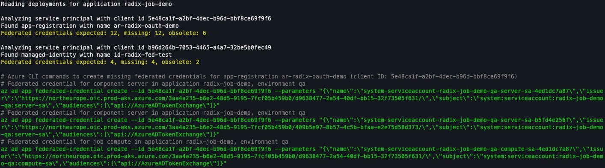

# Migration guide: New cluster OIDC issuer for federated credentials

## Action required
If your Radix application uses [Azure Workload Identity](../workload-identity/index.md), you must add new federated credential entries that use the new cluster OIDC issuer URL.

Azure Workload Identity can be used either in your own code, through an [OAuth2 proxy](../authentication/index.md), or for horizontal scaling with [Azure Service Bus](../horizontal-scaling/keda-azure-service-bus-trigger-authentication.md) or [Event Hub](../horizontal-scaling/keda-azure-event-hub-trigger-authentication.md).

- Action required by: 2026-08-31

## Summary
Radix is introducing Cilium networking, which means we're commissioning new clusters and moving existing applications onto them.

Each cluster has its own OIDC issuer URL, and Azure binds federated credential trust to that issuer value.
So before migration, any workload that relies on federated credentials needs a matching federated credential for the new issuer.

## Why we are doing this
We are moving to new clusters to introduce Cilium and improve the platform foundation for networking, security, and operations.

## Who is affected
You are affected if your app is hosted in Platform (North Europe) or Platform 2 (West Europe) and any of its components use federated credentials with Azure Workload Identity.

You are not affected if your app authenticates only with client secrets or certificates and does not use federated credentials.
You are also not affected if your app is hosted in Playground or Platform 3 (Sweden Central).

If you are unsure, follow the detection steps in [Check whether your app is affected](#check-whether-your-app-is-affected).

## Migration details

### Check whether your app is affected
Use the Radix CLI [rx validate workload-identity](../../docs/topic-radix-cli/index.md#validate-workload-identity) command.

For example:

```bash
rx validate workload-identity --application your-app-name
```

The output looks similar to this:



The output lists components within the application that are missing federated credentials.
It also provides an Azure CLI command you can run locally to add each missing credential.

### Add the new issuer
Run the supplied commands in green from the previous step to add the new credentials.

:::tip Do not remove the old ones until after migration is complete.

### Verify new federated credential
To verify that the new federated credentials were added you can run the Radix CLI command again.

:::tip Azure might take up to 30 seconds before registering the new federated credentials

### Remove old issuer credentials after migration
Once we have migrated all applications to the new clusters, and the old ones have been decomissioned, we will let you know.
You can then remove the old federated credentials by running the Radix CLI command once more.

## What happens if you do nothing
If this is not completed before the migration, token exchange to Azure AD (Entra ID) will fail for affected workloads. This will most likely break the application.

## FAQ

### Will my applicaton experience downtime?
No. We will simply redirect traffic to the new clusters after migration has been completed.

### Should I remove the old issuer immediately?
No. Remove it only after the communicated decommission date.

### Does this affect all applications?
No. It affects only workloads that use Azure Workload Identity.

## Support
If you need help, please don't hesitate contact us on Slack (#radix-support).