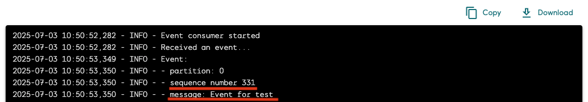
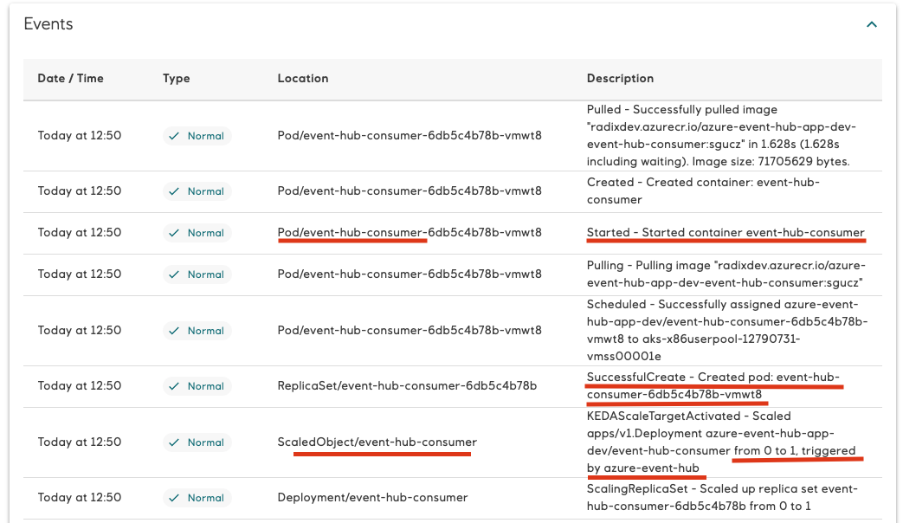

# Azure Event Hub events
## Failures
Invalid or not completed configuration of the Event Hub trigger can lead to errors, which can be found in events list (environment, component or replica pages)

## Received messages
When the Event Hub trigger is configured correctly, the events can be processed by the component with [SDK client](https://learn.microsoft.com/en-us/azure/event-hubs/sdks)

## Scaling up
Events show when `ScaledObject/my-component` is scaled by KEDA and its pod is created

## Scaling down
When the `ScaledObject/my-component` is scaled down, the pod is terminated and corresponding  events are shown in the events list

