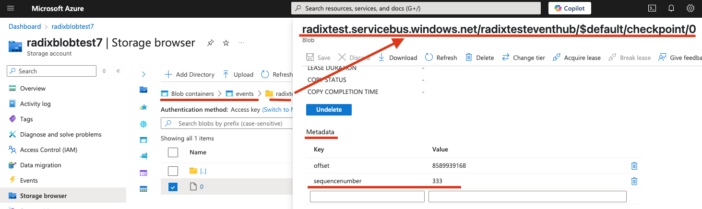

# Azure Event Hub 
## Overview
Scale application components based on [Azure Event Hub](https://learn.microsoft.com/en-us/azure/event-hubs/event-hubs-about) events.

Learn from an [example](https://github.com/equinor/radix-public-site/tree/main/examples/radix-example-keda-eventhub) scaling Radix application component by Azure Event Hub events.

Azure Event Hub target average value can be configured with `unprocessedEventThreshold` (defaults to 64) and `activationUnprocessedEventThreshold` (defaults to 0). Read [more](https://keda.sh/docs/2.17/concepts/scaling-deployments/#activating-and-scaling-thresholds) about activating and scaling thresholds.

Azure Event Hub scaler trigger reads events from Azure Event Hub and scales the component based on the number of unprocessed events in the Event Hub. To avoid re-process already read events, the scaler uses Azure Blob Storage to store the checkpoint of the last processed event. This allows the scaler to resume processing from the last checkpoint in case of a failure or restart. If the checkpoint is not found, the scaler starts processing from the beginning of the Event Hub event list.

When an event is processed by a Radix component it needs to update the checkpoint in the blob storage (with an [SDK client](https://learn.microsoft.com/en-us/azure/event-hubs/sdks)), writing the offset and sequence number of this event to a file metadata in the blob container with keys `offset` and `sequencenumber`. When the first checkpoint is being written, this file is created automatically within corresponding folder hierarchy (the trigger needs to have properly configured [authentication](#authenticate-keda-to-azure-event-hub)).
Name of the file, which metadata used to store checkpoint, is a PartitionID, e.g. `0` for partition 0, `1` for partition 1, etc. Read [more](https://learn.microsoft.com/en-us/azure/event-hubs/event-hubs-features#partitions) about partitions.

## Authentication
Authentication to the Azure Event Hub can be done with Workload Identity and with connection string. Read more about [Azure Event Hub trigger authentication](./keda-azure-event-hub-trigger-authentication.md).

## Events
Events can show scale up, down or failure of `ScaledObject/my-component`. They can be found in the Radix console in the environment, component or replica pages. Event live time is one hour. Read more [about scaling events](./keda-azure-event-hub-trigger-events.md).
