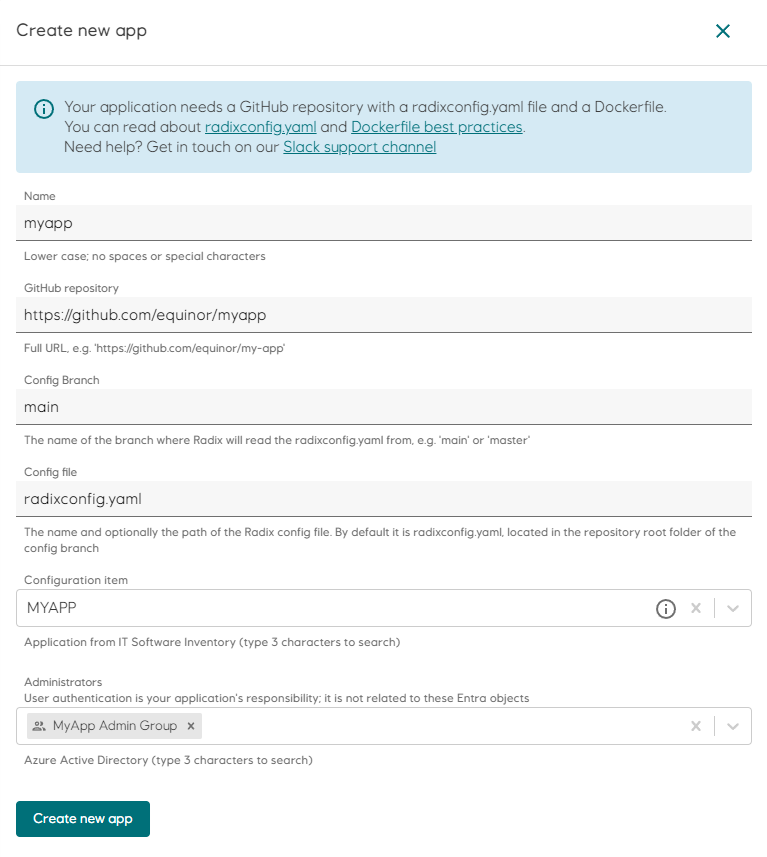

# Registering your application

We are now ready to register our application using the Web Console. Load the console for the [Radix cluster](../radix-clusters/index.md) that you want to use. Click "Create new app" in the top right of the page and follow the instructions there to integrate the GitHub repository with Radix.

Remember that we can always change the 📖 [`radixconfig.yaml`](/radix-config/index.md) file and the `Dockerfile`(s) after registration to change how the application builds and deploys.  

Here is an example of how a new application registration could look like  

:::tip
The **Configuration Item** and **Administrators** fields are optional in the Playground cluster.
:::

## Deploy key

When registering the application, Radix will create a **Deploy key** for the GitHub repository. This key is used to read the `radixconfig.yaml` file and other files in the repository, and it is not used for writing to the repository.

This key can be copied from the Radix Web Console, Configuration page, and put to the GitHub repository Deploy keys: `https://github.com/<user-organization>/<repo-name>/settings/keys`.

This deploy key can be found later in the Radix Web Console, under the **Configuration** tab of the application.

