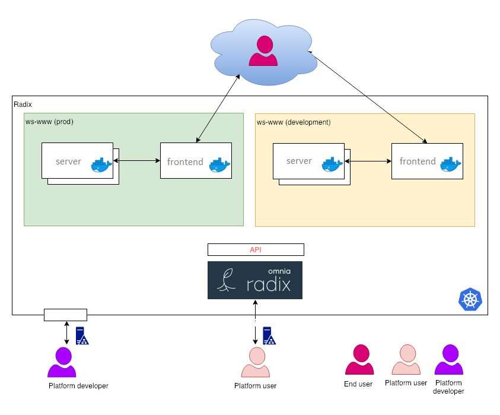

# Basic example of Radix application
Basic application with frontend and backend
Application - Create an application that requests information from `server`.

It will be implemented as a two module app. The public `frontend` will respond to requests, request an information from the non-public `server` module - and echo the data back to the requestor.

## Content

- ```backend``` contains the `server` module api
- ```frontend``` contains the `frontend` front-end web-application
- ```docs``` contains the workshop script ([link](./docs/workshop.md))

## A conceptual overview of the application.

 .
