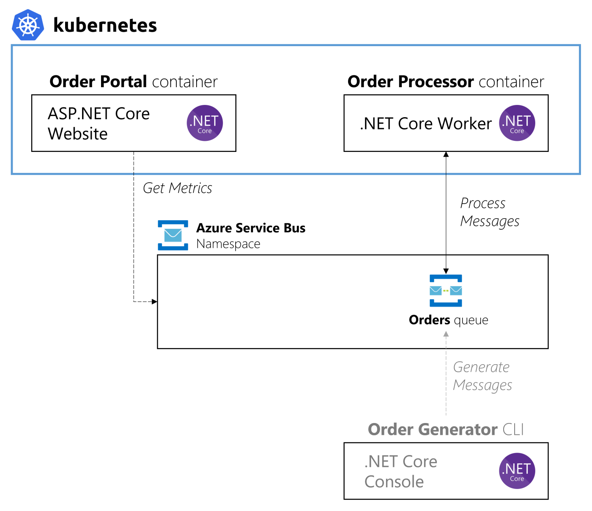

# .NET Core worker processing Azure Service Bus Queue scaled by KEDA
A simple Docker container written in .NET that will receive messages from a Service Bus queue and scale via KEDA.

The message processor will receive a single message at a time (per instance), and sleep for 2 second to simulate performing work. When adding a massive amount of queue messages, KEDA will drive the container to scale out according to the event source (Service Bus Queue).



> 💡 *If you want to learn how to scale this sample with KEDA 1.0, feel free to read about it [here](https://github.com/kedacore/sample-dotnet-worker-servicebus-queue/tree/keda-v1.0).*

This sample is a refactored version of the one found at https://github.com/kedacore/sample-dotnet-worker-servicebus-queue.
We Have removed all authentication options, and added AzureDefaultCredentials.
The sample is also upgraded from Dotnet core 3.1 to Dotnet 8.

## Configuring resources

Configure `terraform.tf` and modify `resource_group_name`, `location`, `name`, and `radix_app_name` (minium).

```shell
terraform init
# ...
terraform apply
# ...
# Outputs:

# client_id = "c2f17b62-7c2f-4541-acbc-22d7cfc66e0b"
# endpoint = "https://<YOUR NAME>.servicebus.windows.net:443/"
# queue_name = "orders"
```

Configure `appsettings.json` (or create a `appsettings.local.json`) in `./Radix.Samples.DotNet.Web`, `./Radix.Samples.DotNet.Processor` and `./Radix.Samples.DotNet.Generator`.

Start web server:
```shell
cd src/Radix.Samples.DotNet.Web; dotnet run
```

Start the processor:
```shell
cd src/Radix.Samples.Dotnet.OrderProcessor; dotnet run
```

Generate some events:
```shell
cd src/Radix.Samples.Dotnet.OrderGenerator; dotnet run
# Let's queue some orders, how many do you want?
# 2
# Queuing order 719a7b19-f1f7-4f46-a543-8da9bfaf843d - A Hat for Reilly Davis
# Queuing order 5c3a954c-c356-4cc9-b1d8-e31cd2c04a5a - A Salad for Savanna Rowe
# That's it, see you later!
```

## Deployment

Update Radixconfig with your ClientID and endpoint details and enjoy 🎉


### Radix Config Trigger details:
```yaml
metadata:
  name: <Your Radix App Name> # Change this!
  components:

    - name: web
      horizontalScaling:
        # defaults to using CPU scaling with 80% target utilization, and min 1 replica
        maxReplicas: 3 
        
    - name: processor
      horizontalScaling:
        maxReplicas: 10
        minReplicas: 0
        triggers:
         - name: azuresb
           azureServiceBus:
             namespace: <AzureServiceBusNamespace> #.servicebus.windows.net
             queueName: orders
             messageCount: 2 # How many messages should each replica handle? 
    
             # Workload Identity for KEDA to access service bus
             authentication:
               identity:
                 azure:
                   clientId: c2f17b62-7c2f-4541-acbc-22d7cfc66e0b
```


### Terraform Keda details:

To configure Keda, create a managed identity, and assign it a federated credential, like this if you are using Terraform:
```terraform
resource "azurerm_federated_identity_credential" "keda" {
  audience            = ["api://AzureADTokenExchange"]
  issuer              = local.radix_oidc_issuer_url # https://console.radix.equinor.com/about
  name                = "keda"
  resource_group_name = azurerm_servicebus_namespace.main.resource_group_name
  subject             = "system:serviceaccount:keda:keda-operator" # RADIX Keda operator
  parent_id           = azurerm_user_assigned_identity.main.id # Your managed identity that have access to the ServiceBus
}
```

> ⚠️ Giving Keda access to your servicebus to count messages eables any other Radix Application to scale their apps based on messages in your queues.
> 
> Note: This does not give their app access to your ServiceBus, only the trigger to read the count of messages.

## Cleanup
To cleanup your resources run `terraform destroy` and delete your app in Radix
