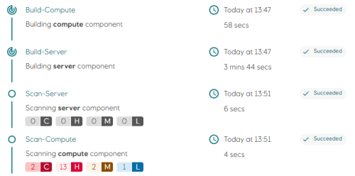
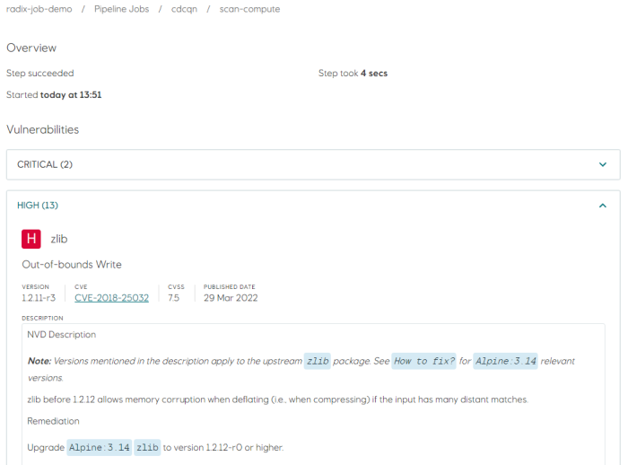
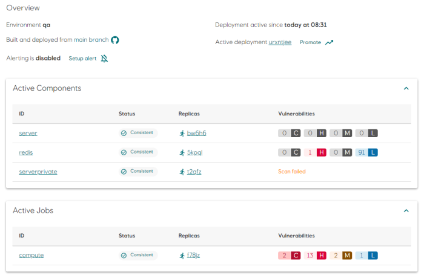
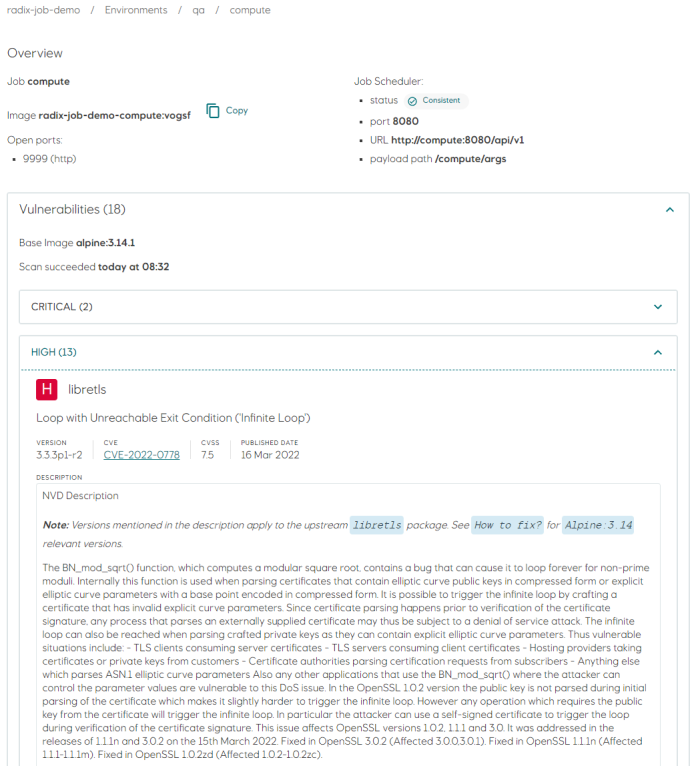

# Vulnerability Scanning

The Radix platform will scan applications running in our Platform for vulnerabilities. It is also expected that the developer team are responsible for keeping their code up to date and without critical vulnerabilities.

## Build-deploy pipeline scan

Images built with the `build-deploy` pipeline are scanned for vulnerabilities as the last step the job.

Detailed information about vulnerabilities can be accessed by clicking on the individual `Scan-` steps. Vulnerabilities are grouped by severity and sorted by CVSS score.

> Scanning as part of the `build-deploy` pipeline will be removed in a future release.

## Scheduled scan of deployed images

All components and jobs are scanned immediately after a successful deployment. The scan is not limited to images built by Radix, but will also scan components and jobs using images from public registries. Images stored in registries that require authentication are currently not scanned, and will show as `Scan failed` in the environment page (see screenshot below).

Radix will do a rescan of all images on a daily schedule in order to detect and report new vulnerabilities.

Aggregated scan results are displayed per component/job in the environment page.

Click on a component or job to view detailed information about vulnerabilities and when the scan was performed.

