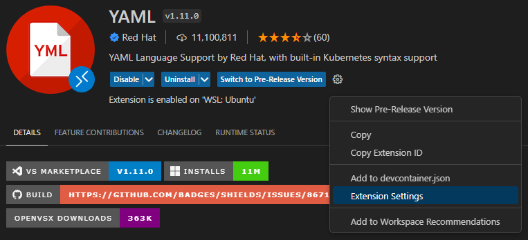
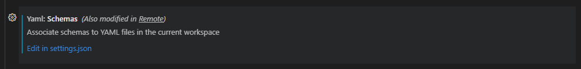
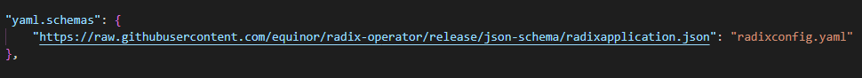
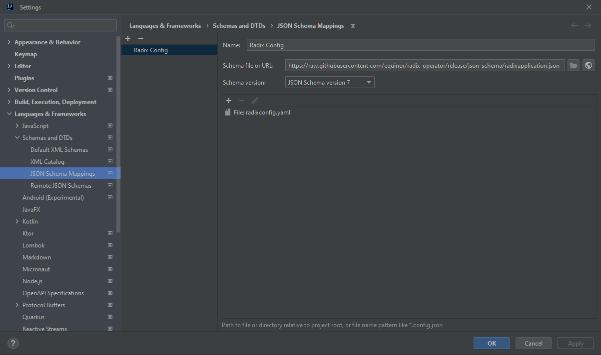

# Overview

The [OpenAPI 3.0 Schema](https://swagger.io/docs/specification/data-models/) for [radixconfig.yaml](../radix-config/) is available at [https://raw.githubusercontent.com/equinor/radix-operator/release/json-schema/radixapplication.json](https://raw.githubusercontent.com/equinor/radix-operator/release/json-schema/radixapplication.json). This schema is an [extended subset](https://swagger.io/docs/specification/data-models/keywords/) of the [JSON Schema Specification](https://json-schema.org/). 

The schema can be used in code editors to provide auto completion and schema validation when editing a `radixconfig.yaml` file.

## Visual Studio Code

Ensure that the [YAML](https://marketplace.visualstudio.com/items?itemName=redhat.vscode-yaml) extension is installed in VS Code.

Create an association between `radixconfig.yaml` and the JSON Schema by using one of the methods described below.

- **Inline schema association**  
  Add the following line to the top of the `radixconfig.yaml` file:
  ```
  # yaml-language-server: $schema=https://raw.githubusercontent.com/equinor/radix-operator/release/json-schema/radixapplication.json
  ```

- **Using yaml.schemas settings**  
  1. Open **Extension Settings** for the YAML extension.
  
  1. Scroll down to **Yaml: Schemas** and click **Edit in settings.json**
  
  1. Add `"https://raw.githubusercontent.com/equinor/radix-operator/release/json-schema/radixapplication.json": "radixconfig.yaml"` to the **yaml.schemas** section.
  

Read more about schema associations [here](https://github.com/redhat-developer/yaml-language-server#more-examples-of-schema-association).

## Jetbrains IDEs

Jetbrains IDEs have built-in support for JSON schemas.

1. Open the **Settings** dialog (`Ctrl+Alt+S`) and go **Languages & Frameworks** &gt; **Schemas and DTDs** &gt; **JSON Schema Mappings**.
1. Click `+` on the toolbar.
1. Insert `https://raw.githubusercontent.com/equinor/radix-operator/release/json-schema/radixapplication.json` in **Schema file or URL** and select `JSON Schema version 7` in **Schema version**. Specify a name of the schema in the **Name** field.
1. Click `+` in the mappings section and select **Add file** from the drop down list. Insert `radixconfig.yaml` in the **File** field.
1. Click `OK` or `Apply` to save changes.


