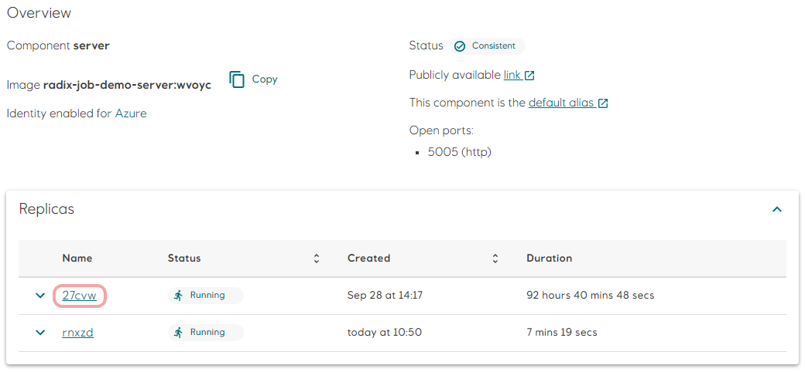
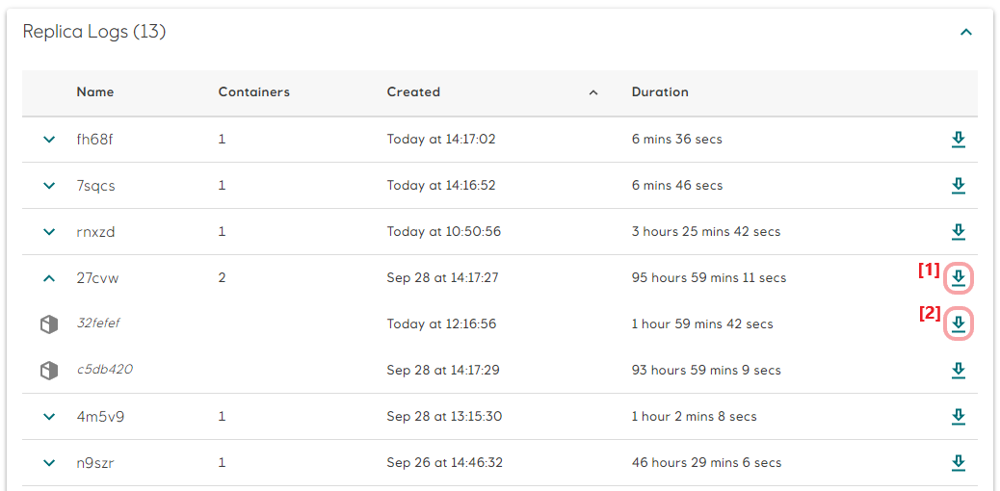
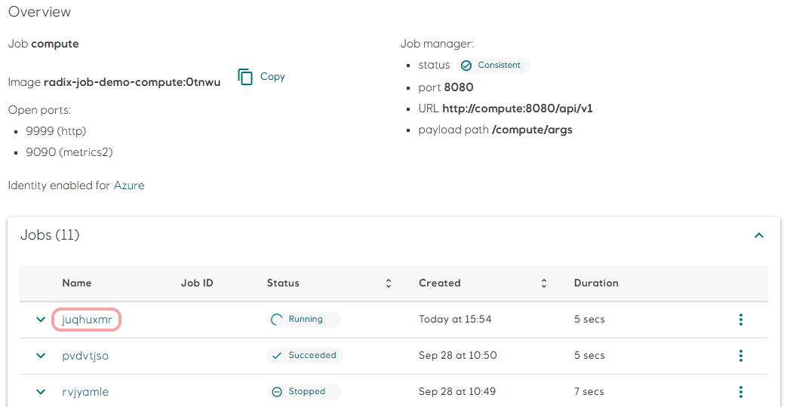
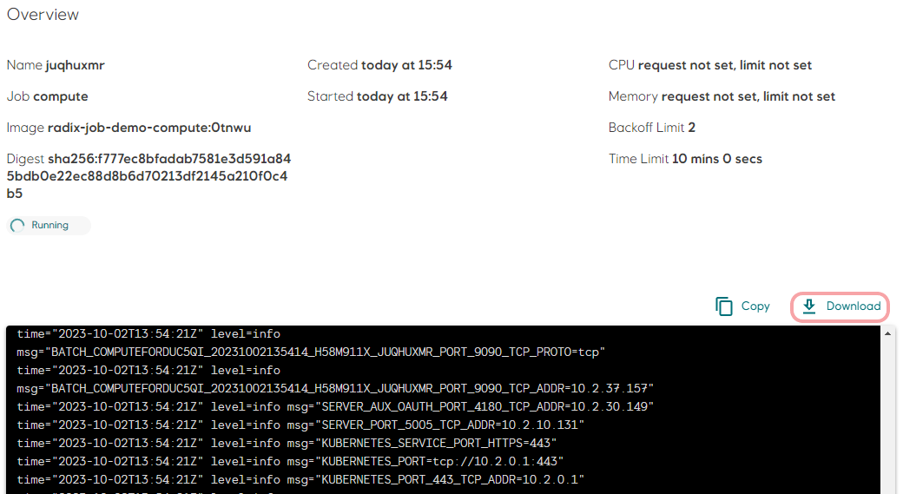
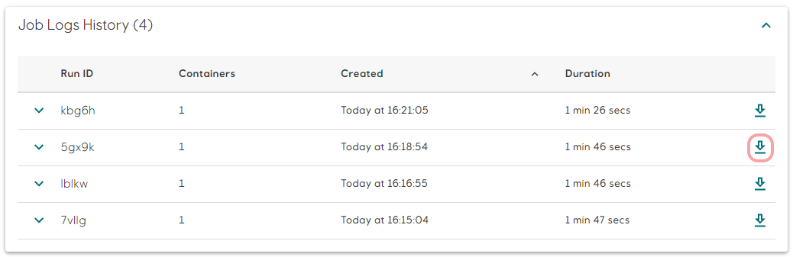
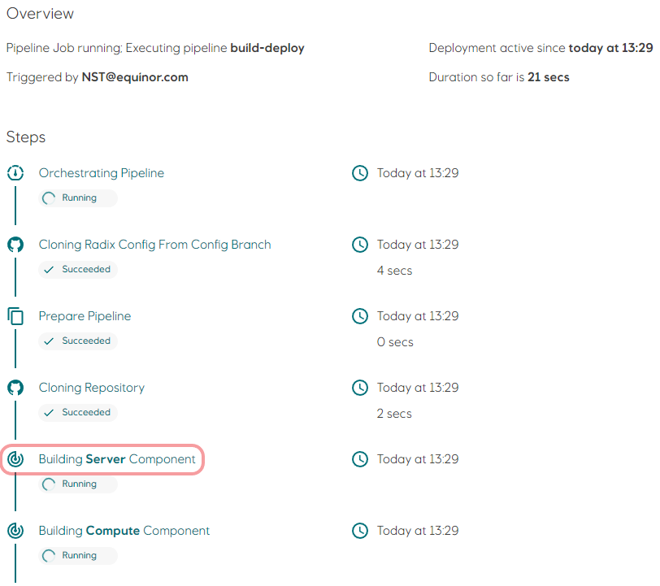
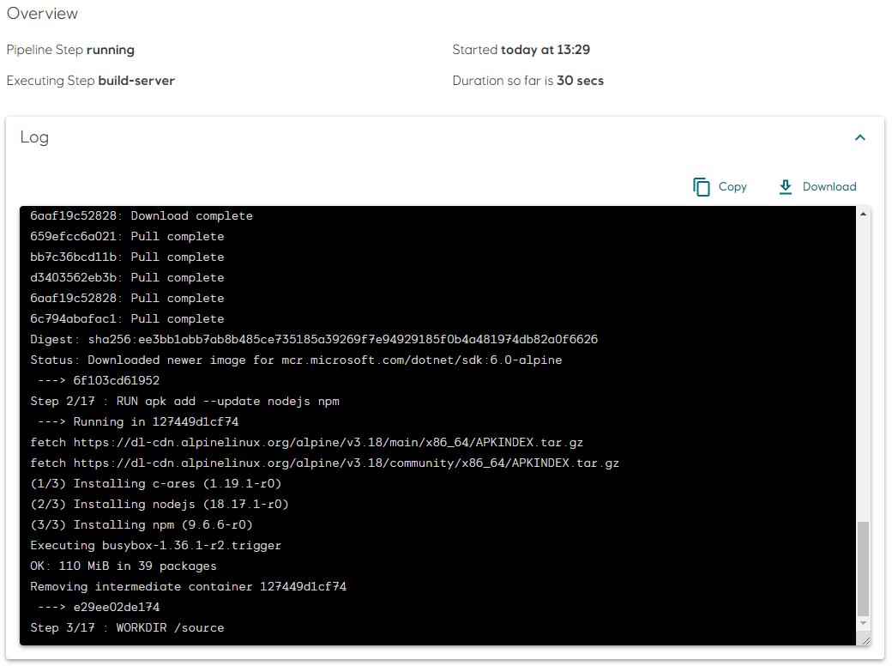

# Logs

Application logs can help you understand what is happening inside your application. The logs are particularly useful for debugging problems and monitoring activity.

Log entries written to the `stdout` and `stderr` streams are stored for 30 days and can be accessed through Radix Web Console or Radix CLI. 

## Radix Web Console

Radix Web Console provides access to logs for `components`, `jobs` and `pipeline jobs`. 

### Components

To view the current log for running replicas, click on a replica `name` in the `Replicas` list. The log page shows the last 1000 entries from the replica's container. To download the entire log, click the `Download` button.

When a pipeline job succeeds and deploy a new version of your application, or when you restart a component, Radix creates new replicas with new names. The old replicas are removed once the new replicas are running. If the container for an active replica crashes or is killed, Kubernetes will start a new container, and the previous container's log will no longer be available in the replica's log page.

`Replica Logs` lists all replicas and containers, both active and historical, for the component from the last 30 days. Replicas and containers in this list is sorted descending by their creation date, and containers are grouped within their respective replicas.

You can download the log for all containers belonging to a replica _[1]_, or for a specific container _[2]_ within the replica.

### Jobs

A job is an on-demand and short-lived workload, in the sense that it performs a set of tasks, and exits when the tasks are completed.

To view the log for a job, click the `name` of the job in the `Jobs` list.

For jobs with status `Running`, the last 1000 entries is shown on the job page. To download the entire log, click the `Download` button. The log may also be available for completed jobs (succeeded or failed), as long as Kubernetes has not garbage collected the log resources.

If the log is no longer available in Kubernetes, or the job has restarted one or more times, a `Job Logs History` list is shown on the botton of the page. Each row represents an attempt to run the job (the initial, or a retry if backoffLimit is set) and is sorted descending by creation date. You can download the log for a specific run by clicking on its download icon. 

### Pipeline jobs

Similar to on-demand jobs described in the previous section, a pipeline job is also a set of short-lived tasks (called steps in the Radix Web Console).
You can view the log for each step in a pipeline job by clicking on the step name. For completed steps (succeeded or failed), the log will be unavailable if the underlying log resources are garbage collected by Kubernetes.

## Radix CLI

[Radix CLI](../topic-radix-cli/) provides access to component and job logs by using the `rx get log` command.

For components, only logs for active replicas can be read, and for jobs the log from the last run, as long as Kubernetes has not garbage collected the log resources.

