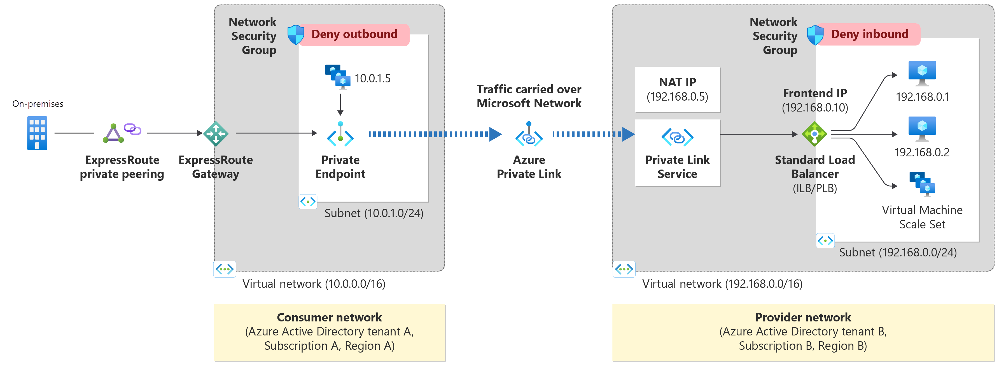

# Overview

When running an application in Radix and there is a need to access external Azure services through a private IP address, Private Link Services can be used to connect the Radix application to the resource, using a Private Endpoint. A Private Endpoint works by connecting a target resource to a Virtual Network. Data passing through a Private Endpoint travels the Microsoft backbone network, not exposed to the internet. 

More information can be found in the [Azure documentation](https://learn.microsoft.com/en-us/azure/private-link/private-link-service-overview)

:::warning
**All private links are shared across the cluster**. In other words, a private link does not replace authentication. However, it helps improve security and reduce network latency by avoiding internet traffic and routing data through Azure's private channels.
:::

## Create a Private Endpoint

In order to establish a Private Endpoint from Radix to your external resource, follow instructions in the [Private Link Guide](/guides/private-link/).

The following information is needed:

- Subscription owner (GitHub username)
- Subscription ID
- Resource ID (found in the properties of a resource in the Azure portal), eg. `/subscriptions/A01234567-bc89-123d-ef45-678g9hi12jkl/resourceGroups/Some_RG_Prod/providers/Microsoft.Sql/servers/sql-some-prod`

This will show up as a pending request in the destination subscription. When the request is approved, a Private Endpoint will be created in your subscription, and a Private Link between the two endpoints will be established.

You can continue using the same FQDN to access the remote resource after the Private Endpoint has been created.

## A word about On-Premise

If your resource type has a Private DNS Zone in Omnia Classic, you **cannot** create private endpoints to Omnia Radix.

If you do so, devices on-premise will fail to resolve to the correct IP and will stop working. 
This applies to Blob Storage for Azure Storage Accounts and SQL Server among many others.

It is relatively easy to test:

1. Create the Private endpoint using Radix Issue workflow linked above.
2. Approve the private endpoint (this will create the required DNS records in Omnia Radix).
3. Verify connectivity in On-Premise devices.
4. **If they fail**, just remove the private endpoint in your resource's network pane in Azure Portal (this will remove any broken DNS records).

For any suprises, notify Radix in **#omnia-radix-support** and we can update this document.

## A word about Omnia Classic

Private links have other [policies](https://docs.omnia.equinor.com/governance/security/components/v4/vnet-private-link/#introduction) in Omnia Classic subscriptions, **which makes it impossible** to establish services like Private Endpoints with Radix. More information in [Omnia Docs](https://docs.omnia.equinor.com/products/classic/PrivateEndpoints-documentation-for-AppTeams/)

:::tip Tips
An alternative can be to host an API in Omnia Classic, publish this in [APIM](https://api.equinor.com/). Then this API can be used by an Radix application.
:::