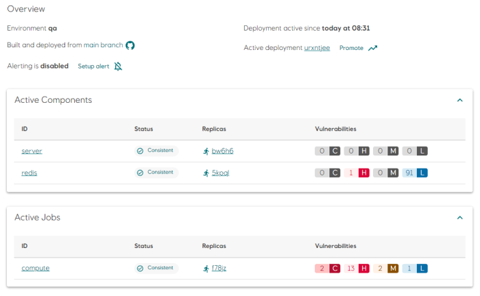
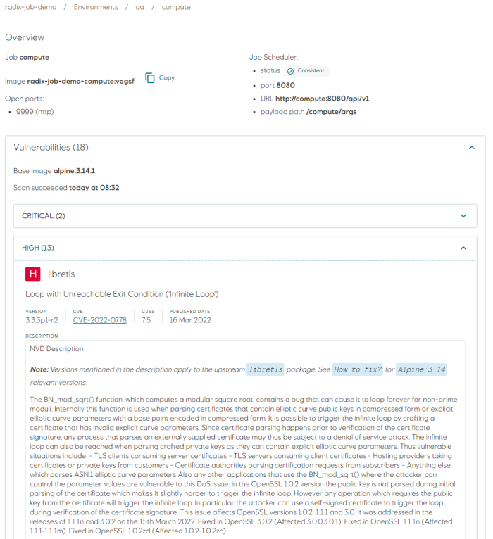

# Vulnerability Scanning

The Radix platform will scan applications running in our Platform for vulnerabilities. It is also expected that the developer team are responsible for keeping their code up to date and without critical vulnerabilities.

All components and jobs are scanned immediately after a successful deployment. The scan is not limited to images built by Radix, and will also scan components and jobs using images from public registries.

Radix will do a rescan of all images on a daily schedule in order to detect and report new vulnerabilities.

Aggregated scan results are displayed per component/job in the environment page.

Click on a component or job to view detailed information about vulnerabilities and when the scan was performed.

