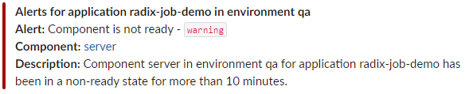
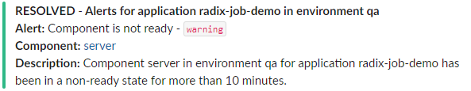
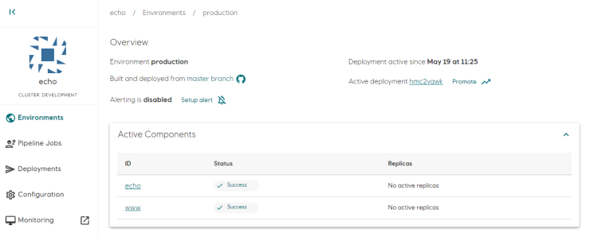
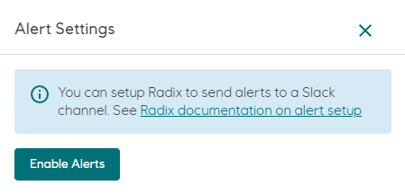
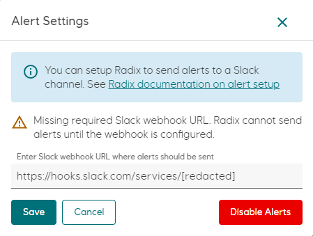
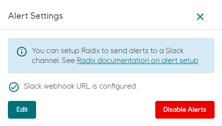
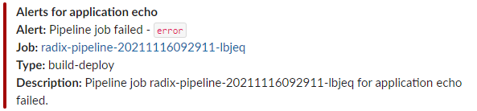
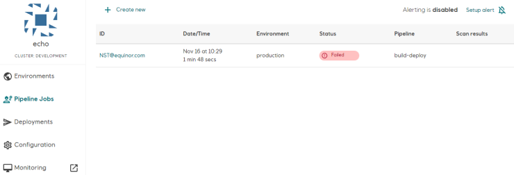

# Alerting

Radix can send alerts about failing pipeline jobs, components or jobs to Slack using [Incoming Webhooks](https://api.slack.com/messaging/webhooks).

The alert message contains information about the pipeline job, component or job that is failing, the name of the application and optionally the environment name where the alert was triggered.

For alerts that are triggered due to missing prerequisites, e.g. missing secrets for components or jobs, a **RESOLVED** message will be sent when the cause of the alert is fixed.

Alerting must be enabled and configured per application for pipeline jobs, and for each environment within the application for components and jobs.

## Configure alerting for components and jobs in an environment

If alerting is enabled for an application environment, Radix will send alerts to Slack if any of the following errors occur:

- A **component** or **job** is unable to start due to missing secrets, or if the [Readiness Probe](/docs/docs/topic-rollingupdate/#readiness-probe) is unable to verify that the container is running correctly. A 10 minute grace period is given from the alert is triggered until the message is sent. A **RESOLVED** message is sent once the underlying cause of this alert is resolved.
- A **component** crashes/exits, e.g. due to insufficient memory or unhandled exceptions causing the application to exit. A **RESOLVED** message is sent once the component has been able to run for more than five minutes after this alert has been sent.
- A **job** exits with an non-zero exit code, or is killed due to insufficient memory.

**Example of an alert message and corresponding RESOLVED message**  
  

To enable alerting for an application environment, open [Radix Web Console](https://console.radix.equinor.com/), navigate to an application and open one of the environment pages.  

In this example, alerting is disabled for components and jobs for the environment. To enable alerting, click **Setup alert** on the environment page and **Enable Alerts** in the dialog.  

Enter the Slack Webhook URL where alerts should be sent in the text box and click **Save**.  

If save is successful, the text **Slack webhook URL is configured** is displayed in the dialog.

To disable alerting, click **Disable Alerts**. If alerting is re-enabled, the Slack webhook URL must be re-entered.

To update the Slack webhook URL, click **Setup alert** in the environment page, then **Edit** in the dialog, enter the the new URL and click **Save**.

## Configure alerting for pipeline jobs

When alerting is enabled for pipeline jobs, Radix will send an alert to Slack if a job fails. All job types (build-deploy, promote, deploy) for all environments are monitored.

**Example of alert message for a failed pipeline job**  

To enable alerting for pipeline jobs, open [Radix Web Console](https://console.radix.equinor.com/), navigate to an application and open **Pipeline Jobs**. Alerting status and configuration is located in the top-right area of the page. Follow the same procedure as described in [Configure alerting for components and jobs in an environment](./#configure-alerting-for-components-and-jobs-in-an-environment) to configure alerting.

