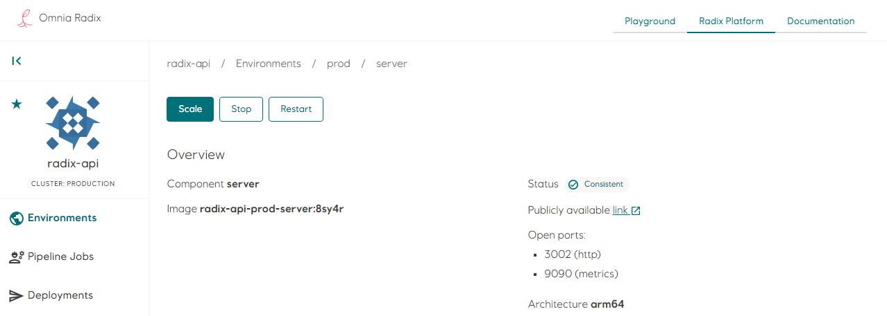

# Component scale/stop/restart

Stop, Scale and Restart of a running component can be done in the Web console, when special circumstances requires it (i.e. after having updated a secret), even though the recommended approach is to change the configuration in [`radixconfig.yaml`](/radix-config/index.md)

:::info
When manually scaled a component, it will be persisted accross deployments. Click `reset` to resume normal scaling.
:::

## Scale

*Scale* will manually override the configured number of replicas. Click *reset* to resume normal scaling.

## Stop

*Stop* will manually scale the number of replicas to 0 for the component.

## Reset

*Reset* removes the manually configured replicas count and will use the number of replica to the number set in the [`radixconfig.yaml`](/radix-config/index.md) for the *active deployment* or by [horizontal scaling](https://radix.equinor.com/radix-config/index.md#environmentconfig).

## Restarting

*Restarting* the component will make a rolling restart of the *active deployment*. That means that the application will be responsive during the enire restart, just as with [rolling updates](/docs/topic-rollingupdate/).
