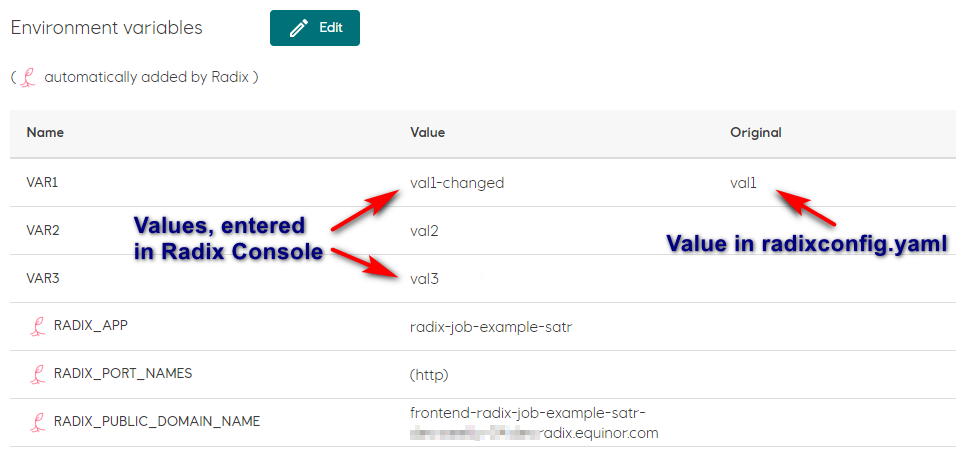

# Configure environment variables

[Environment variables](/radix-config/index.md#variables) can be configured in the [radixconfig.yaml](/radix-config/index.md). Additionally Radix will add some environment variables prefixed with `RADIX_` and `RADIXOPERATOR_` - these prefixes should not be used for environment variables.

Environment variables can be overridden in the Radix Console, excluding those marked with the `RADIX_` and `RADIXOPERATOR_` prefix.  

The value of an environment variable, changed to a new value in the Radix Console, will use this new value for all new deployments. To revert to the original value - edit it again, changing to its original value, specified in the `radixconfig.yaml`.

## Overriding environment variables in the Radix Console

- Navigate to the application component or job page
- Click the `Edit` button
- Change one or more variables
- Click the `Apply` button

After a few seconds the value of the overridden environment variables will be shown in the table.
:::tip
Note that changes made in the Radix Console will not be applied to _currently running_ replicas or jobs, meaning these will have to be restarted for the changes to take effect.

 To apply changed environment variables:

 - go to component replicas - restart the component
 - go to jobs - start new jobs
:::

In the `Environment variables` table, the column marked `Original` is used to show the original value of all modified variables.

### Example

- Environment variables configured in `radixconfig.yaml`.

  ```yaml
  variables:
    VAR1: "val1"
    VAR2: "val2"
    VAR3: "" # leaving a variable empty is a valid option
  ```

- Environment variables shown in the Radix Console. Variables `VAR1` and `VAR3` has been changed.

