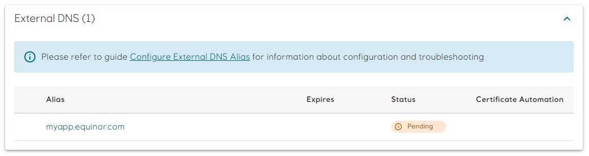
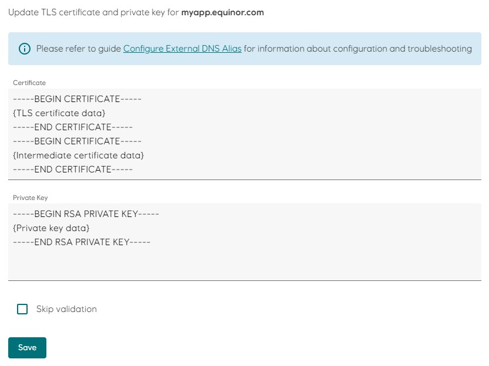
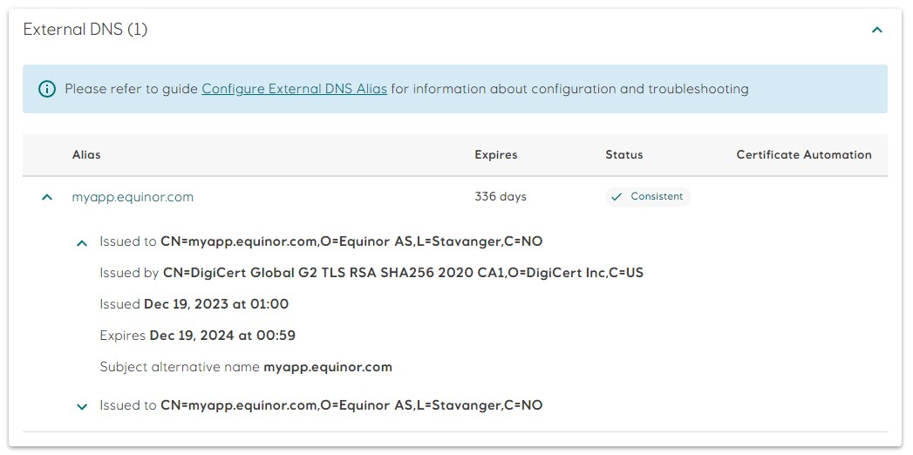

# Configure External DNS Alias

&lt;!--
An application can be configured to use external DNS aliases, in addition to the automatically generated [domain names](../../docs/topic-domain-names), provided you register the DNS record and optionally bring the corresponding TLS certificate into Radix. Traffic routing is configured in [`dnsExternalAlias`](../../references/reference-radix-config/#dnsexternalalias) in `radixconfig.yaml`.
--&gt;
An application can be configured to use external DNS aliases, in addition to the automatically generated [domain names](../../docs/topic-domain-names), provided you register the DNS record and bring the corresponding TLS certificate into Radix. Traffic routing is configured in [`dnsExternalAlias`](../../references/reference-radix-config/#dnsexternalalias) in `radixconfig.yaml`.

The external DNS record must point to the [public name](../../docs/topic-domain-names/#public-name) of a component, to the [app default alias](../../docs/topic-domain-names/#app-default-alias) or to the [app alias](../../docs/topic-domain-names/#app-alias).

&lt;!--
`useCertificateAutomation` in [`dnsExternalAlias`](../../references/reference-radix-config/#dnsexternalalias) controls if the TLS certificate is automatically managed by Radix, or manually by you.
--&gt;
## Acquire a DNS record in the equinor.com zone

The process for setting up the DNS record depends on the service used to register and manage the DNS zone. This guide assumes registration of a DNS record in the `equinor.com` zone, but you should be able to adapt the instructions to a third-party provider.

1. Open the [Services@Equinor](https://equinor.service-now.com/selfservice) portal and find the service "Domain name system (DNS)"
1. Select option `New` in `Select service`
1. In `Where should the DNS record be added, changed or deleted?`, select if you only need `Internal DNS Service` (accessible only from Equinor internal network) or `Internal and external DNS service` (accessible from both Equinor internal network and Internet).
1. Enter the host name in `Host name` (exclude `.equinor.com` suffix).
1. Select `CNAME` in the `Type` drop down.
1. In the `Data (IP or FQDN)` field, enter the [public name](../../docs/topic-domain-names/#public-name), [app default alias](../../docs/topic-domain-names/#app-default-alias) or [app alias](../../docs/topic-domain-names/#app-alias) for which the new DNS record should point to.  

:::details Example

```text
Select service:
New

Where should the DNS record be added, changed or deleted?:
Internal and external DNS service

Host name:
myapp

Type:
CNAME

Data (IP or FQDN):
frontend-myapp-prod.radix.equinor.com
```

:::

## Configure `dnsExternalAlias` in radixonfig.yaml

Add the alias to `dnsExternalAlias` in radixconfig.yaml. You can add multiple entries as long as the `alias` value is unique. The referenced environment must be re-deployed in order for the changes to take effect.

&lt;!-- 
If `useCertificateAutomation` is `true`, the external DNS record must be already created in order for Radix to start the automatic certificate issuing process.
--&gt;

&lt;!--
``` yaml
apiVersion: radix.equinor.com/v1
kind: RadixApplication
metadata:
  name: myapp
spec:
  ...
  dnsExternalAlias:
    - alias: myapp.equinor.com
      component: frontend
      environment: prod
      useCertificateAutomation: false|true
```
--&gt;
``` yaml
apiVersion: radix.equinor.com/v1
kind: RadixApplication
metadata:
  name: myapp
spec:
  ...
  dnsExternalAlias:
    - alias: myapp.equinor.com
      component: frontend
      environment: prod
```

## Acquire an Equinor TLS certificate

&lt;!-- 
This step is only required when `useCertificateAutomation` in `dnsExternalAlias` is omitted or set to `false`.

### How to get it
--&gt;
1. Start by getting familiar with the appropriate procedures about handling keys and certificates in Equinor, as they are considered to be sensitive information.
1. Create a _Certificate Signing Request_ on you local pc using the [openssl](https://www.openssl.org/) command:
    ```sh
    # Step 1: Generate a private key
    openssl genrsa -out ./myapp.equinor.com.key 2048
    # Keep this file safe and out of version control. You will need it later. 

    # Step 2: Generate Certificate Signing Request (CSR) file using the private key
    openssl req -new -key ./myapp.equinor.com.key -out ./myapp.equinor.com.csr
    ```
1. Store the private key in a safe location.
1. Open the [Services@Equinor](https://equinor.service-now.com/selfservice) portal and find the service **Public SSL certificate**.
1. Request a SSL certificate and an intermediate certificate for your alias, and attach the CSR file you created in step 2:
   ```text
   Title: Public SSL certificate with intermediate
   Certificate name: myapp.equinor.com
   ```
1. You will receive an email (within a day or two) containing the requested certificate and corresponding intermediate certificate. Store them together with the private key in a safe location.

:::tip Side note
[How Certificate Chains Work](https://knowledge.digicert.com/solution/how-certificate-chains-work)
:::


### Apply the certificate and private key to the external DNS alias

1. In [Radix Web Console](https://console.radix.equinor.com/), navigate to the environment and component referenced in `dnsExternalAlias`.
1. Scroll down to `External DNS` and click on the `myapp.equinor.com` alias.
   
1. Add the TLS certificate and intermediate certificate to the `Certificate` field, and the private key to the `Private Key` field. Make sure that the certificates are in correct order, as shown in the picture.
   
1. Click the `Save` button to save. Radix will validate the certificate and the private key before applying them. Refer to the [Troubleshooting](./#troubleshooting) section for a list of common validation errors and hints how they can be resolved.
1. After successful save, the `myapp.equinor.com` alias will change status to `Consistent`. Basic information about the certificate is available by clicking on the chevron next to the alias.
   

## Troubleshooting

The most common validation errors are described below.

- **x509: certificate signed by unknown authority**  
The certificate is not signed by a trusted authority. You will see this error if the intermediate certificate is missing, or if you use a self signed certificate.

- **x509: certificate is not valid for any names, but wanted to match one.example.com**  
The certificate is not valid for any domain names. This error is usually reported if you switch the order of the TLS certificate and the CA certificate.

- **x509: certificate is valid for two.example.com, not one.example.com**  
The certificate is not valid for the selected alias.

- **x509: missing PEM block for certificate**  
The `Certificate` value does not contain a `CERTIFICATE` PEM block.

- **tls: private key does not match public key**  
The private key does not match certificate's public key. Use the correct private key.  
[openssl](https://www.ibm.com/support/pages/openssl-commands-check-and-verify-your-ssl-certificate-key-and-csr) can be used to test if a certificate and private key matches.

- **tls: failed to find PEM block with type ending in "PRIVATE KEY" in key input**  
The `Private Key` value does not contain a `PRIVATE KEY` or `RSA PRIVATE KEY` PEM block.
