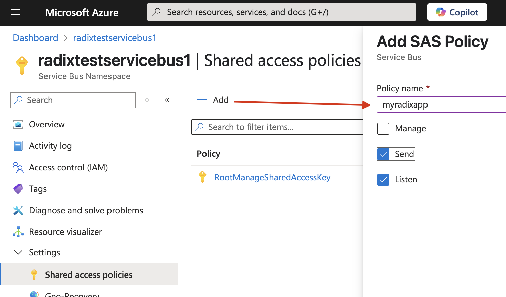
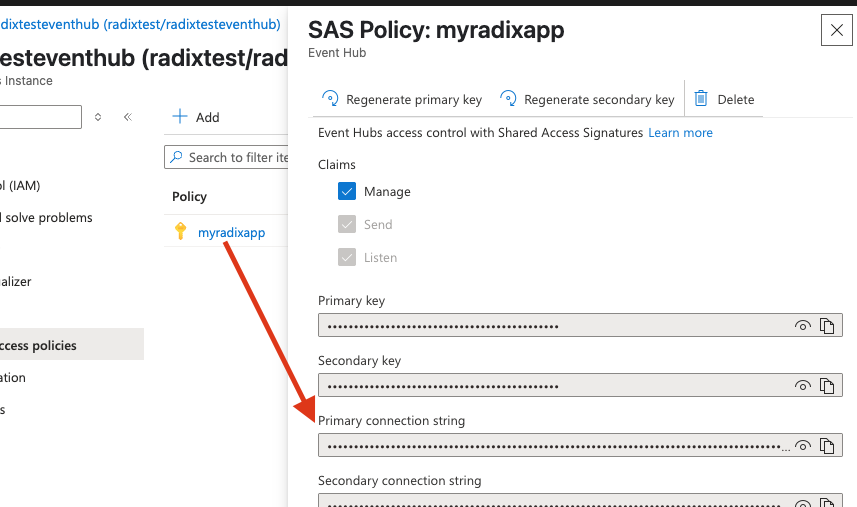

# Authenticate Keda to Azure Event Hub
* [Authenticate with Workload Identity](#authenticate-with-workload-identity)
* [Authenticate with connection string](#authenticate-with-connection-string)

## Authenticate with Workload Identity
:::warning
When access to your Event Hub is provided to Keda, _any_ other Radix applications can scale their components based on your queue! Use authentication with [connection string](#authenticate-with-connection-string) to avoid this.

We are hoping on improving this - https://github.com/kedacore/keda/issues/5630
:::
ClientID to a managed identity should be provided, that contains a federated credential with following properties:
```yaml
Federated credential scenario: Kubernetes Service Account
Cluster Issuer URL: https://northeurope.oic.prod-aks.azure.com/00000000-0000-0000-0000-000000000000/00000000-0000-0000-0000-000000000000/ 
Namespace: keda
Service Account: keda-operator
```
`Cluster Issuer URL` - current value can be found in Radix console [About page](https://console.radix.equinor.com/about) in the environment variable `CLUSTER_OIDC_ISSUER_URL`.

Cluster Issuer URL can be changed on cluster migration, please watch the Slack channel `#omnia-radix` for updates.

````yaml
spec:
  components:
    - name: backend
      horizontalScaling:
        minReplicas: 0
        maxReplicas: 2
        triggers:
          - name: azure-eh
            azureEventHub:
              eventHubName: my-event-hub
              eventHubNamespace: my-event-hub-namespace
              accountName: my-storage-account
              container: my-blob-container
              authentication:
                identity:
                  azure:
                    clientId: 00000000-0000-0000-0000-000000000000
````
Read more about [Azure workload identity](/guides/workload-identity/)

## Authenticate with connection string
````yaml
spec:
  components:
    - name: backend
      horizontalScaling:
        minReplicas: 0
        maxReplicas: 2
        triggers:
          - name: azure-eh
            azureEventHub:
              container: my-blob-container
              eventHubConnectionFromEnv: EVENT_HUB_CONNECTION
              storageConnectionFromEnv: STORAGE_CONNECTION
````
`storageConnectionFromEnv` - Name of the environment variable your deployment uses to get the connection string of the Azure Event Hub namespace. 

Connection string can be Event Hub namespace or instance scope.
* [Get connection string for Azure Event Hub namespace](#get-connection-string-for-azure-event-hub-namespace)
* Get connection string for Azure Event Hub instance
#### Get connection string for Azure Event Hub namespace
To get the connection string for your Event Hub namespace, follow these steps:
1. Go to the [Azure portal](https://portal.azure.com/).
2. Navigate to your Event Hub namespace.
3. In the left-hand menu, select "Shared access policies".
4. Select the policy you want to use or create a new one with required claims: Manage, Send or Listen.
5. Copy the "Primary Connection String" or "Secondary Connection String".
6. Store the connection string in an environment variable in your Radix component configuration, e.g. `EVENT_HUB_CONNECTION`, a [Radix secret](/radix-config#secrets-1) or [Azure Key Vault](/radix-config#azurekeyvault) secret.

This connection string has the following format:

`Endpoint=sb://<sb>.servicebus.windows.net/;SharedAccessKeyName=<key name>;SharedAccessKey=<key value>`

It does not have `EntityPath` property, so it can be used for all Event Hub instances in the namespace. Therefore: 

7. Specify for a trigger an instance name in `eventHubName` or in an environment variable, referred by `eventHubNameFromEnv` properties.
#### Get connection string for Azure Event Hub instance
To get the connection string for your Event Hub instance, follow these steps:
1. Go to the [Azure portal](https://portal.azure.com/).
2. Navigate to your Event Hub namespace.
3. Select the specific Event Hub instance "Entities/Event Hubs".
4. In the left-hand menu, select "Settings/Shared access policies".

5. Select the policy you want to use or create a new one with required claims: Manage, Send or Listen.
6. Copy the "Primary Connection String" or "Secondary Connection String".
   
7. Store the connection string in an environment variable in your Radix component configuration, e.g. `EVENT_HUB_CONNECTION`, a [Radix secret](/radix-config#secrets-1) or [Azure Key Vault](/radix-config#azurekeyvault) secret.
This connection string has the following format:

`Endpoint=sb://<sb>.servicebus.windows.net/;SharedAccessKeyName=<key name>;SharedAccessKey=<key value>;EntityPath=<hub-name>`

It includes the `EntityPath` property, therefore specifying `eventHubName` or `eventHubNameFromEnv` is not required.


