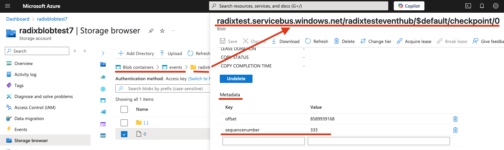

## Azure Event Hub overview
Azure Event Hub scaler trigger reads events from Azure Event Hub and scales the component based on the number of unprocessed events in the Event Hub. To avoid re-process already read events, the scaler uses Azure Blob Storage to store the checkpoint of the last processed event. This allows the scaler to resume processing from the last checkpoint in case of a failure or restart.

Last read event offset and sequence number is stored in Azure Blob Storage. The scaler uses the `container` property to specify the blob container where the checkpoint will be stored. The `accountName` property is used to specify the Azure Storage account name or it a connection string it taken from the secret, which name is specified in the `storageConnectionFromEnv` property.

When event is read from the Event Hub, the scaler checks the checkpoint in the blob storage to determine the last processed event. If the checkpoint is not found, it starts processing from the beginning of the Event Hub.

When event is processed, the scaler updates the checkpoint in the blob storage writing the offset and sequence number of the last processed event to a file metadata in the blob container with keys `sequencenumber` and `offset`. When the first checkpoint is being written this file and its folder hierarchy are created automatically (if the trigger has properly configured [authentication](#authenticate-keda-to-azure-event-hub)).

Name of the file, which metadata used to store checkpoint, corresponds to the PartitionID, e.g. `0` for partition 0, `1` for partition 1, etc. Read [more](https://learn.microsoft.com/en-us/azure/event-hubs/event-hubs-features#partitions) about partitions.

