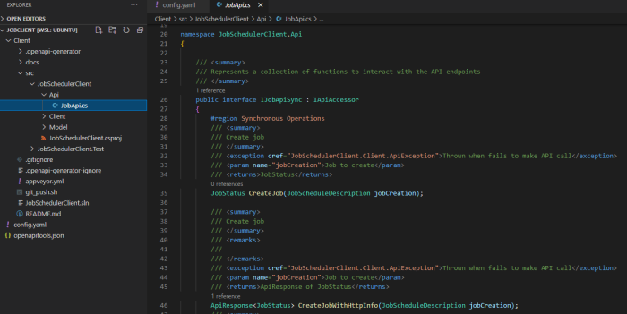

## OpenAPI/Swagger spec

[Download][1] Swagger/OpenAPI specification for job-scheduler

## Generating clients

The [openapi-generator](https://github.com/OpenAPITools/openapi-generator) can be used to generate client code for communicating with the `job-scheduler` API. It can also generate server stub code that can be used for local development and testing purposes.

The tool can be installed using [Homebrew](https://github.com/OpenAPITools/openapi-generator#15---homebrew), [npm](https://github.com/OpenAPITools/openapi-generator#17---npm), or by downloading the [JAR file](https://github.com/OpenAPITools/openapi-generator#13---download-jar). It can also be executed using a pre-built [Docker image](https://github.com/OpenAPITools/openapi-generator#16---docker).

To get the list of supported language and framework generators, execute

```sh
openapi-generator-cli list
```
On MacOS this CLI has the name `openapi-generator`.

Each language/framework generator has its own set of additional configuration options

```sh
openapi-generator-cli config-help -g <generator-name>
```

These configuration options can be added to a file, e.g. `config.yaml`, and referenced in the `openapi-generator` CLI using the `-c` option (see examples below)

```yaml
additionalProperties:
  targetFramework: net5.0
  packageName: JobScheduler
  netCoreProjectFile: true
```
## swagger.json
Download or reference the [swagger.json](https://raw.githubusercontent.com/equinor/radix-job-scheduler/main/swaggerui/html/swagger.json) file

## Examples

Using the `config.yaml` above, we can generate a C# NET Core 5.0 client by executing

```sh
openapi-generator-cli generate 
  -g csharp-netcore
  -i https://raw.githubusercontent.com/equinor/radix-job-scheduler/main/swaggerui/html/swagger.json
  -c config.yaml
  -o Client
```

`openapi-generator-cli` generates client code, tests and documentation



Server stub code for AspNetCore can be generated using the `aspnetcore` generator

```sh
openapi-generator-cli generate 
  -g aspnetcore 
  -i https://raw.githubusercontent.com/equinor/radix-job-scheduler/main/swaggerui/html/swagger.json
  -c config_server.yaml
  -o Server
```

[1]:https://raw.githubusercontent.com/equinor/radix-job-scheduler/main/swaggerui/html/swagger.json
