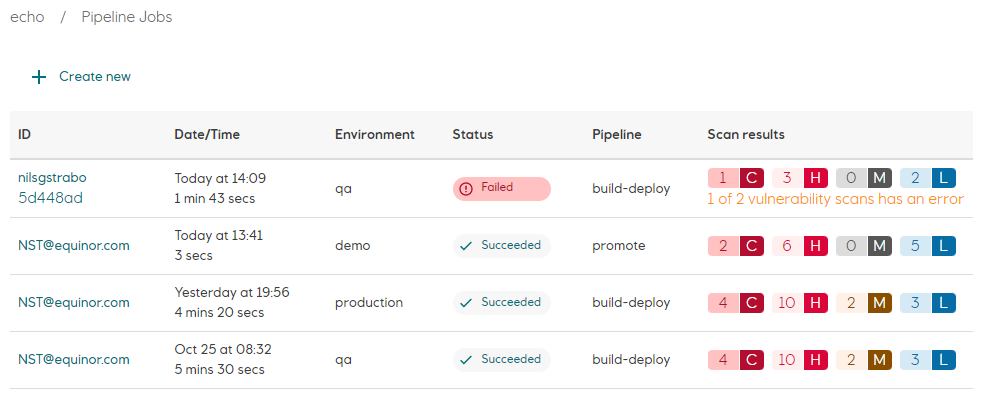

# Configure Pipeline Badges

A pipeline status badge shows the status of the latest pipeline job of a specific type in a specific environment. Status is one of **success**, **failing**, **stopped**, **pending** or **running**.

The URL for generating a badge is:  
```
https://api.<cluster-dns-zone>/api/v1/applications/<app-name>/environments/<env-name>/buildstatus?pipeline=<pipeline-type>
```

where `app-name` is the name of the application, `env-name` is the name of the environment within the application, and `pipeline-type`(optional) is one of **build-deploy**(default), **deploy** or **promote**. Refer to *DNS Zone* in [Radix clusters](../../start/radix-clusters/) to get the `cluster-dns-zone` value for the cluster where your application is hosted.

Requesting a badge for a non-existing application or environment, or for a pipeline type that hasn't been run yet, the badge returns with an **unknown** status.  


:::tip
GitHub uses an image cache and proxy for images referenced in markdown files. Initial investigation shows that images are cached for up to one minute, which means that a pipeline status badge will not be "realtime" when viewed on GitHub.
:::

## Example

An application named `echo` with three environments; `qa`, `demo` and `production`. The latest `build-deploy` job for qa environment has **Failed**, and the latest `build-deploy` for production has **Succeeded**. The `promote` job to the demo environment has status **Succeeded**.



The pipeline status badge URL for the latest `build-deploy` job in `qa` environment, *https://api.radix.equinor.com/api/v1/applications/**echo**/environments/**qa**/buildstatus*, returns  


And for `production` environment, *https://api.radix.equinor.com/api/v1/applications/**echo**/environments/**production**/buildstatus*, the following badge is returned  


The URL for the latest promote job in the demo environment, *https://api.radix.equinor.com/api/v1/applications/**echo**/environments/**demo**/buildstatus?pipeline=**promote***, returns  

