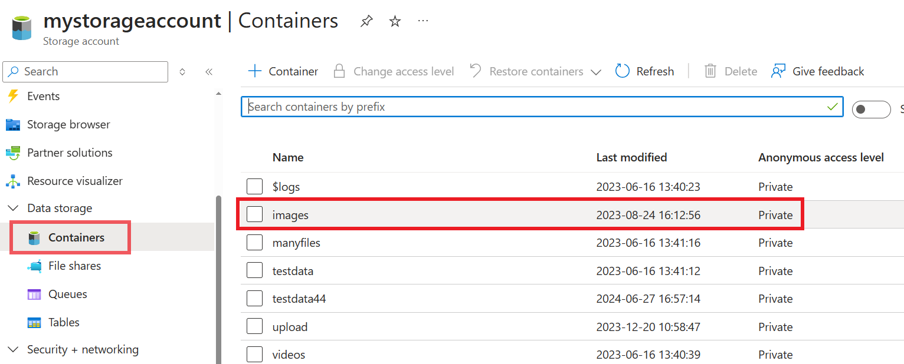
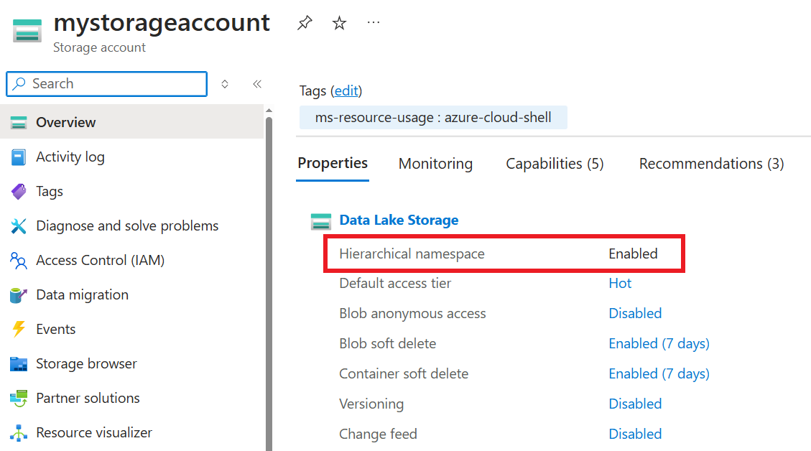
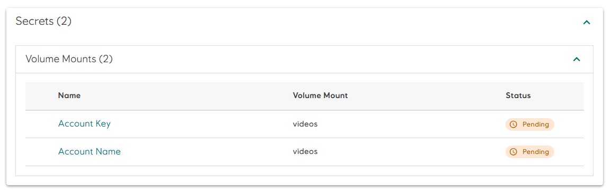
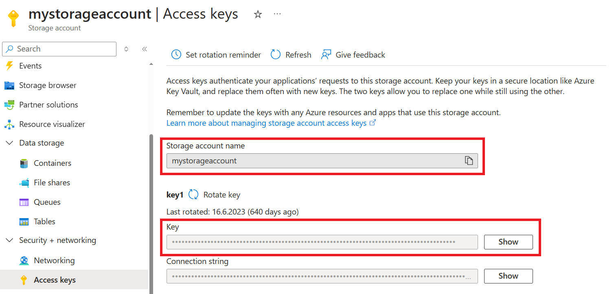
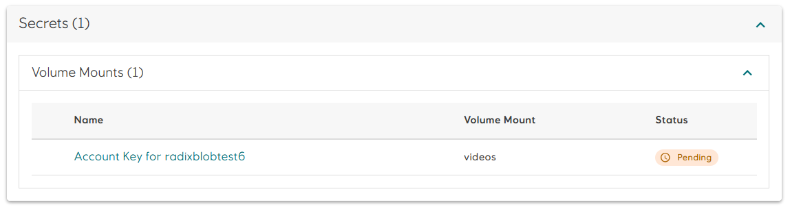

Radix supports mounting [Azure storage account](https://docs.microsoft.com/en-us/azure/storage/common/storage-account-overview) blob containers with the [`blobFuse2`](../../radix-config/index.md#blobfuse2) volume type in [`radixconfig.yaml`](../../radix-config/index.md), using the [blob-csi-driver](https://github.com/kubernetes-sigs/blob-csi-driver/).

## General Settings

The only required settings in a `blobFuse2` configuration are `container` and `useAdsl`. `container` defines the name of the container in the Azure storage account to mount into `path`, and `useAdls` is a flag that defines if the storage account is [hierarchical namespace](https://learn.microsoft.com/en-us/azure/storage/blobs/data-lake-storage-namespace) enabled or not.

``` yaml
volumeMounts:
- name: myimages
    path: /mnt/files
    blobFuse2:
      container: images
      useAdls: true
```

With this minimal configuration, the **videos** container is mounted **read only** into **/mnt/files**, using [Access Keys](#access-keys) as the authentication method, and [Block](#block-cache) as `cacheMode`. The two screenshots below shows where to find container names and if hierarchical namespace is enabled or disabled.





`accessMode` specifies if the volume is mounted in **read-only** (default) or **read-write** mode. Valid values are:
- `ReadOnlyMany` (default) - Volume is mounted read-only.
- `ReadWriteMany` - Volume is mounted with read-write access. Warning: This option can lead to data corruption if multiple replicas write to the same file. Read [this](limitations.md) for more information.

`uid` and `gid` specifies the owning user and group for the files and directories in the mounted volume. It is optional to configure these settings, since the current version of the driver does not honor user and group ownership.

## Authentication

The **blob-csi-driver** will use access key as credentials when accessing an Azure storage account. The access key can be set manually in [Radix Web Console](https://console.radix.equinor.com/), or it can be read by the driver using [Azure workload identity](https://www.radix.equinor.com/guides/workload-identity/#configure-workload-identity-in-radix) when `useAzureIdentity` is set to `true`.

### Access Keys

When `useAzureIdentity` is omitted or set to `false`, the access key and the name of the Azure storage account must be set manually, either on the component/job page in Radix Web Console, or with [Radix CLI](../../docs/topic-radix-cli/). Component replicas will be in **Pending** state until both secrets are set.



Values for these secrets can be found under **Access keys** in the Azure storage account.



The name of the Azure storage account can also be specified in the `storageAccount` field in [`radixconfig.yaml`](../../radix-config/index.md), in which only the access key must be set i Radix Web Console.

``` yaml
volumeMounts:
- name: myimages
    path: /mnt/files
    blobFuse2:
      container: images
      useAdls: true
      storageAccount: mystorageaccount # replace with real storage account name
```



### Azure Workload Identity

When `useAzureIdentity` is set to `true`, the driver will connect to the Azure storage account using the [Azure Workload Identity](../workload-identity/#configure-workload-identity-in-radix) configured for the compopnent or job, to acquire an access key to be used when accessing data in a blob container.

For the driver to successfully acquire an access key, the service principal configured in `identity.azure.clientId` must be granted the [**Microsoft.Storage/storageAccounts/listkeys/action**](https://learn.microsoft.com/en-us/azure/storage/blobs/authorize-data-operations-portal#use-the-account-access-key) permission on the Azure storage account.

The following `blobFuse2` settings are required, and is used by the driver when acquiring an access key.
- `storageAccount` - Name of the Azure storage account.
- `resourceGroup` - Name of the resource group for the storage account.
- `subscriptionId` - ID of the subscription for the storage account.

Example configuration:
``` yaml
volumeMounts:
- name: myimages
    path: /mnt/files
    blobFuse2:
      container: images
      useAdls: true
      storageAccount: mystorageaccount # replace with real storage account name
      resourceGroup: myresourcegroup # replace with real resource group name
      subscriptionId: ffffffff-ffff-ffff-ffff-ffffffffffff # replace with real subscription ID
```

## Cache Modes

Caching improves subsequent access times, and can reduce ingress and egress traffic to the Azure storage account, which in turn can lower cost related to data transfer.

`cacheMode` defines how data should be cached:
- `Block` (default) - Improve performance with parallel and chuncked (blocks) read/write operations for large files.
- `File` (default) - Cache entire files for improved subsequent access.
- `DirectIO` (default) - Disables caching.

### Block Cache

Block cache adds support for parallel reading and writing file in blocks, which can improve access times for large files. 


### File Cache

### Direct IO

Disables caching. All operations are sent directly to the storage account.

## Attribute Cache

## Deprecated Options

The `streaming` section in `blobFuse2` is deprecated in favor of `cacheMode`. To prevent breaking changes to existing configurations, Radix will implicitly use [File](#file-cache) as `cacheMode` when `streaming.enabled` is set to `false`, and [Block](#block-cache) when `streaming.enabled` is set to `true`. The `streaming` section is ignored when `cacheMode` is set.

`streaming` will be removed in a future release, and it is therefore recommended to migrate to use `cacheMode` instead.

Replace implicit **File** cache:
```yaml
volumeMounts:
- name: myimages
    path: /mnt/files
    blobFuse2:
      <...>
      streaming:
        enabled: false
```

with:
```yaml
volumeMounts:
- name: myimages
    path: /mnt/files
    blobFuse2:
      <...>
      cacheMode: File
```

Replace implicit **Block** cache:
```yaml
volumeMounts:
- name: myimages
    path: /mnt/files
    blobFuse2:
      <...>
      streaming:
        enabled: true
```

with:
```yaml
volumeMounts:
- name: myimages
    path: /mnt/files
    blobFuse2:
      <...>
      cacheMode: Block
```