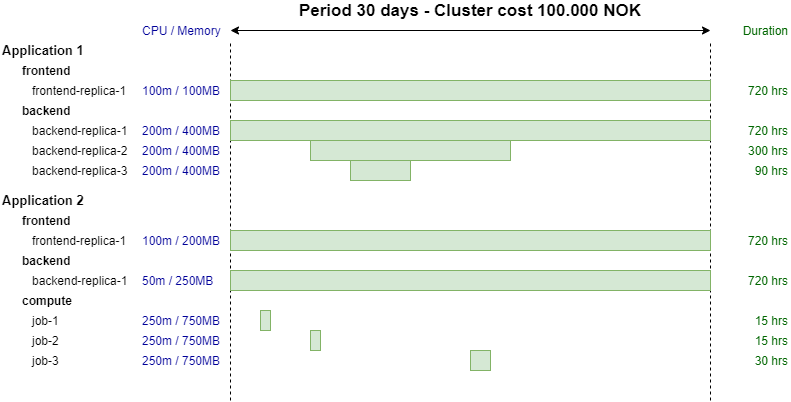

# Radix cost allocation

As part of hosting an application on Radix, each application will take it's share of the cloud cost assosiated with the Radix Platform cluster. The cost will be allocated monthy following the routines issued by Equinor.

## How is the cost calculated

Cost calculation is based on the total time the replicas(containers) belonging to an application has been running, and how much CPU and memory the replicas requested. The cost is split between applications by dividing each application's CPU and memory time by the total CPU and memory time for all applications.
Cluster cost is split 50/50 between CPU and memory time.

## Example

Assuming a period of 30 days where total cluster cost is 100.000NOK. Two applications, `Application 1` and `Application 2`, are running in the cluster.

`Application 1` has two components, `frontend` and `backend`. `horizontalScaling` is configured for `backend` to automatically start new replicas during periods of high CPU utilization. `Application 2` has two components, `frontend` and `backend`, and a job named `compute`.

**CPU and memory time by Application 1**  
frontend-replica1 - CPU: 100m * 720hrs = 72.000 - Memory: 100MB * 720hrs = 72.000  
backend-replica1 - CPU: 200m * 720hrs = 144.000 - Memory: 400MB * 720hrs = 288.000  
backend-replica2 - CPU: 200m * 300hrs = 60.000 - Memory: 400MB * 300hrs = 120.000  
backend-replica2 - CPU: 200m * 90hrs = 18.000 - Memory: 400MB * 90hrs = 36.000  

Total CPU time: 72.000 + 144.000 + 60.000 + 18.000 = 294.000  
Total memory time: 72.000 + 288.000 + 120.000 + 36.000 = 516.000  

**CPU and memory time by Application 2**  
frontend-replica1 - CPU: 100m * 720hrs = 72.000 - Memory: 200MB * 720hrs = 144.000  
backend-replica1 - CPU: 50m * 720hrs = 36.000 - Memory: 250MB * 720hrs = 180.000  
job-1 - CPU: 250m * 15hrs = 3.750 - Memory: 750MB * 15hrs = 11.250  
job-2 - CPU: 250m * 15hrs = 3.750 - Memory: 750MB * 15hrs = 11.250  
job-3 - CPU: 250m * 30hrs = 7.500 - Memory: 750MB * 30hrs = 22.500  

Total CPU time: 72.000 + 36.000 + 3.750 + 3.750 + 7.500 = 123.000
Total memory time: 144.000 + 180.000 + 11.250 + 11.250 + 22.500 = 369.000

**Calculation**  
Total cluster CPU time: 294.000 + 123.000 = 417.000  
Total cluster memory time: 516.000 + 369.000 = 885.000  
Total cluster CPU cost: 100.000 / 2 = 50.000  

Application1 CPU cost: 294.000 / 417.000 * 100.000NOK * 0.5 = 35.252NOK  
Application1 memory cost: 516.000 / 885.000 * 100.000NOK * 0.5 = 29.152NOK  
Application1 total cost: **64.405NOK**  

Application2 CPU cost: 123.000 / 417.000 * 100.000NOK * 0.5 = 14.748NOK  
Application2 memory cost: 369.000 / 885.000 * 100.000NOK * 0.5 = 20.847NOK  
Application2 total cost: **35.595NOK**  

