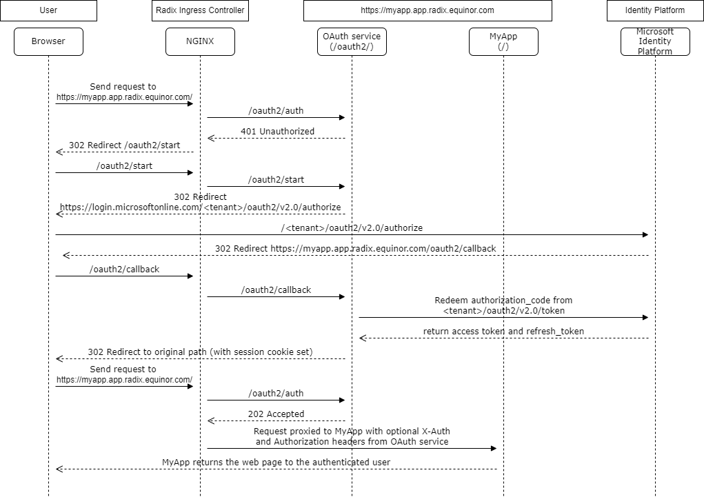
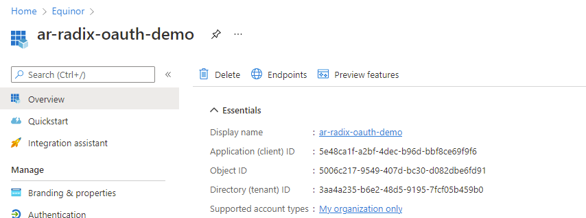
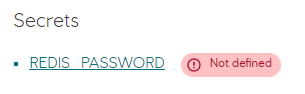
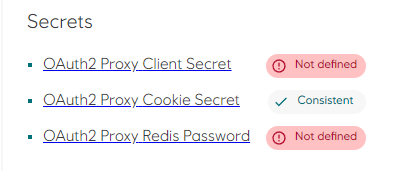
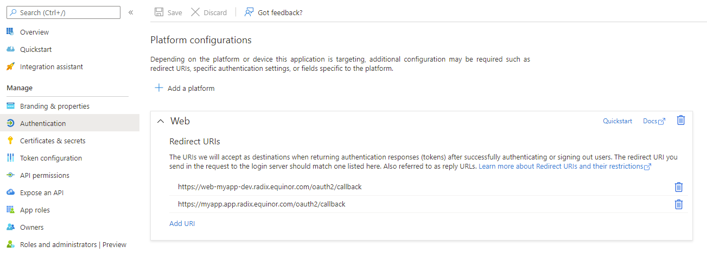
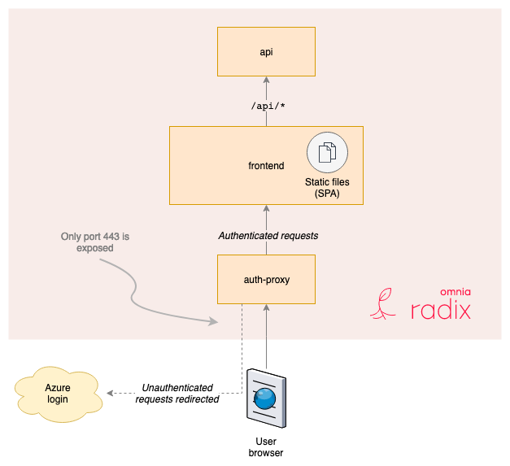

# Authentication

Equinor uses Azure AD for authentication of applications hosted outside the internal network. Azure AD is synced with Equinor internal AD, and contains information on Equinor users and groups.

When doing authentication for applications and APIs hosted outside Equinor internal network, we use [OAuth 2.0](https://tools.ietf.org/html/rfc6749) protocol and OpenId Connect. OAuth 2.0 is an industry-standard protocol developed by IETF OAuth Working Group. Information on these protocols can be found at [oauth.net](https://oauth.net/2/), [openid.net](https://openid.net/connect/), [Microsoft documentation](https://docs.microsoft.com/en-us/azure/active-directory/develop/v2-overview) or a more compact explanation by Equinor [Nils Hofseth Andersen](https://equinor.github.io/mss-architecture/oauth2/openid/2019/08/22/oauth2-basics-playground.html).

**The rest of this document assumes you have basic knowledge of OAuth 2.0, OpenId Connect and JWT tokens.**

::: tip
It is highly recommended to use common library/components maintained by others for OAuth 2.0 authentication. [MSAL](https://docs.microsoft.com/en-us/azure/active-directory/develop/msal-overview) is the recommended library to use in Equinor. It is developed and maintained by Microsoft, and can be used for many scenarios/languages.
:::

If your web app should access one or more resources, e.g. API, you have to take time to understand OAuth 2.0 and Openid Connect. It is not trivial to setup authentication for these scenarios, either using oauth-proxy or a library as MSAL.

## Client authentication

The user has access to a front-end client, but needs to acquire an authentication token to call protected APIs. How do you get this token?

### Using the Radix OAuth2 feature

Radix has built-in support for OAuth2 code flow authentication with OIDC.

When OAuth2 is enabled for a component in [`radixconfig.yaml`](../../references/reference-radix-config/#oauth2), Radix creates an OAuth2 service and configures this service to verify if incoming requests are authorized or not, handle the authorization code flow, and manage session state for an authorized user.



#### Configuration
- Create an application registration in Azure AD.  
  

- Configure `oauth2` in radixconfig.yaml.  
  ``` yaml
  components:
    - name: web
      authentication:
        oauth2:
          clientId: 5e48ca1f-a2bf-4dec-b96d-bbf8ce69f9f6
          scope: openid profile email offline_access
          setXAuthRequestHeaders: true
          setAuthorizationHeader: true
          sessionStoreType: redis
          redisStore:
            connectionUrl: redis://redis:6379
      ports:
        - name: http
          port: 5005
      publicPort: http
    - name: redis
      image: bitnami/redis:latest
      secrets:
        - REDIS_PASSWORD
      ports:
        - name: redis
          port: 6379
  ```  
  `clientId` is the application ID for the application registration in Azure AD.  
  `scope` is configured to include **offline_access**. With **offline_access** included, the OAuth2 service receives a long lived refresh token that is used to get a new access token as the old one expires. Read more about Microsoft Identity Platform scopes [here](https://docs.microsoft.com/en-us/azure/active-directory/develop/v2-permissions-and-consent#openid-connect-scopes).  
  `setXAuthRequestHeaders` and `setAuthorizationHeader` are set to **true** to include to the upstream request *X-Auth-** headers with claims from the access token, the access token itself, and the *Authorization: Bearer* header with the ID Token.  
  `sessionStoreType` can be set to **redis** instead of using the default of **cookie**. `connectionUrl` defines the address to the Redis server.
  It is recommended to use Redis as session store instead of cookie because of [knows issues](#known-issues) with refreshing the access token and updating the session cookie's Expires attribute.  
  The Redis server can be hosted as a Radix component, or an external Redis service like [Azure Cache for Redis](https://azure.microsoft.com/nb-no/services/cache/). In this example, Redis is hosted as a Radix component. 

- Build the application in Radix and open the Radix Web Console to set REDIS_PASSWORD for the `redis` component, and required secrets for the OAuth service used by the `web` component.
    - Open the `redis` component and set a password for connecting to the Redis server in the REDIS_PASSWORD secret.  
      
    - Open the `web` component configure secrets required by the OAuth service.  
        
      `Client Secret` - A secret registered for the application registration in Azure AD.  
      `Redis Password` - The password for connecting to the Redis server used for storage of session data.  
      `Cookie Secret` - The secret used for encryption and decryption of session cookies. Automatically generated by Radix when OAuth2 is enabled.  
- Register the OAuth2 service's callback URLs in the Azure AD application registration. The default path is **/oauth2/callback**, and is composed of the value in `proxyPrefix` (default **/oauth2**) and suffixed with **/callback**.
    

::: tip Sample
Example application: [radix-example-oauth2-feature](https://github.com/equinor/radix-example-oauth2-feature)
:::
#### Restrict access to AAD group
A common requirement in OAuth2 scenarios is to only allow web access for members of a particular AAD group. [This tutorial from Microsoft](https://learn.microsoft.com/en-us/azure/active-directory/manage-apps/add-application-portal-assign-users#assign-a-user-account-to-an-enterprise-application) describes the required steps. 

#### Session store types

The OAuth2 service uses a session cookie to track a user's authentication state between multiple requests.

Session data (ID token, access token and refresh token) is encrypted with the `Cookie Secret` key, and in either session data cookies or in a Redis cache.
- `cookie` - Session data is stored in multiple client side cookies and is tranferred on every request the the server.
  If OAuth tokens are not needed by the backend component, they can be stripped from the cookies by setting `cookieStore.minimal` to **true**. In such case, the OAuth service cannot refresh the access token, and a full OAuth2 authorization flow is performed when the session cookie expires. `cookie.refresh` must also be set to **0**, and `setXAuthRequestHeaders` and `setAuthorizationHeader` must be **false**.
- `redis` - Session data is stored in a Redis cache. The Redis server can be hosted as a component in Radix, as shown in the example, or as an external hosted service like [Azure Cache for Redis](https://azure.microsoft.com/en-us/services/cache/).

#### Session cookie settings

The `expire` and `refresh` settings in the `oauth2.cookie` section controls the lifetime of the session cookie and the interval when the OAuth2 service should redeem a refresh token for a new access token.  
After successful refresh of the access token, the session cookie is updated with a new value for the `Expires` attribute.

`refresh` must be less than `expire`, or the OAuth2 service will fail to start.

#### Known issues

If **cookie** is used as `sessionStore`, the OAuth2 service fails to update the session data cookies after refresh of the access token. The session state is lost, and a full OAuth2 authorization flow is initiated. To avoid this it is recommended to use **redis** as a session store type.

### OAuth2 Proxy as a component

It's possible to use a proxy in front of the client application that takes care of the authentication flow. This can be introduced to any existing components, and is a good alternative if you have an existing web application where you do not want to implement authentication in the client itself. This is also a suitable solution if you need to make sure that only users in Equinor's Azure AD can access your app - but there is no need for finer grained authorization.



For an example using [oauth2_proxy](https://github.com/oauth2-proxy/oauth2-proxy/blob/master/docs/docs/configuration/overview.md) see [Radix oauth example](https://github.com/equinor/radix-example-oauth-proxy). [Radix Web Console](https://console.radix.equinor.com/) uses this service, and does API calls to radix-api through a [nginx reverse proxy](https://github.com/equinor/radix-web-console/blob/master/proxy/nginx.conf)

Pro

- No need to introduce extra libraries and complexity in client which handles auth
- Security patching can be done by updating auth proxy image, no need for changes in client
- New versions or changes to OAuth protocol can be supported without changing client
- The whole front-end client is protected; no HTML/JS/CSS code is sent to the client prior to authentication

Cons

- During development, to get the same experience as in production, you need to run the proxy in front of client. In this case docker-compose would be your friend - see the example above for example usage
- All calls to other resources (as an API) that uses the auth token, need to go through the proxy

We have not investigated using oauth-proxy when you need to call multiple API, with different resources ids from the client.

### In client - Single page application

A single-page application (SPA) is a web application or web site that interacts with the user by dynamically rewriting the current page rather than loading entire new pages from a server. Web browser JavaScript frameworks, such as React, AngularJS, Vue.js, Ember.js, and ExtJS have adopted SPA principles. Most of these applications live entirely in the browser, which is an unsafe environment.

Microsoft has a set of examples in their [documentation](https://docs.microsoft.com/en-us/azure/active-directory/develop/authentication-flows-app-scenarios#application-scenarios) or on [github](https://github.com/Azure-Samples?utf8=%E2%9C%93&q=active-directory&type=&language=) for how to authenticate a client from different languages using [MSAL](https://docs.microsoft.com/en-us/azure/active-directory/develop/msal-overview). Equinor also have a [template](https://github.com/equinor/videx-react-template) for developing SPA ReactJS applications. This is currently used and maintained by an Omnia team.

Pro

- Can perform API calls to other resources directly from client, without having to go through a proxy
- Same experience under development and when running in production
- MSAL is the recommended library to use for authentication by Equinor
- Fine-grained control on the front-end of rendering for unauthenticated users (or with different authorisation levels)

Cons

- MSAL uses an authentication flow called [implicit grant](https://docs.microsoft.com/en-us/azure/active-directory/develop/v2-oauth2-implicit-grant-flow) for SPA. This is [less secure](https://tools.ietf.org/html/draft-ietf-oauth-security-topics-13#section-3.1.2) then [authorization code grant](https://docs.microsoft.com/en-us/azure/active-directory/develop/v2-oauth2-auth-code-flow) used by the oauth-proxy and for web applications rendered on the server side. However both [Google](https://developers.google.com/identity/protocols/OAuth2UserAgent) and [Microsoft](https://docs.microsoft.com/en-us/azure/active-directory/develop/v1-oauth2-implicit-grant-flow) uses it for their examples on how to do OAuth 2.0 authorization for SPAs

A good in-depth article on OAuth2 for SPA can be found at [link](https://auth0.com/blog/oauth2-implicit-grant-and-spa/). The article discuss implicit grant and authorization code grant for SPA. It also goes through two common topologies, and how to [secure them](https://auth0.com/blog/oauth2-implicit-grant-and-spa/#Different-SPA-Topologies-and-Alternative-Approaches).

### In client - Web app (not SPA)

For web application where html is rendered on the server side, served to the browser and all API calls are done through the web app server, see [Microsoft documentation](https://docs.microsoft.com/en-us/azure/active-directory/develop/scenario-web-app-call-api-overview) on how to use MSAL for authentication. This document how to get authentication going with Python, Java and .Net core.

## API authentication

How should you protect a web API, so that only authenticated and authorized users can access the API?

In general it's recommended that any API should be responsible for access control of its own endpoints. This indicates that all requests to an API should be authenticated and authorized from inside the API, and not by a proxy in front of the API.

Again Microsoft has a set of examples on [github](https://github.com/Azure-Samples?utf8=%E2%9C%93&q=active-directory+api&type=&language=) on how this can be done for different languages. Their [documentation](https://docs.microsoft.com/en-us/azure/active-directory/develop/authentication-flows-app-scenarios#application-scenarios) contains an example using dotnet core.

There are of course other examples out there for other languages (not done by Microsoft). Ask on #[development_community](https://equinor.slack.com/messages/C3HLP8ZTQ) slack channel for input on frameworks to use for your need.
