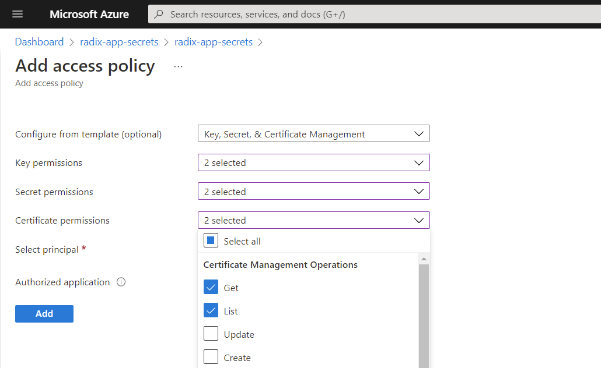
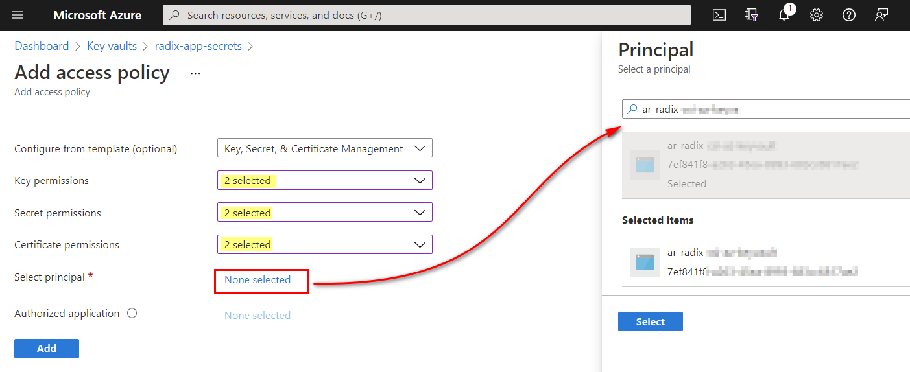
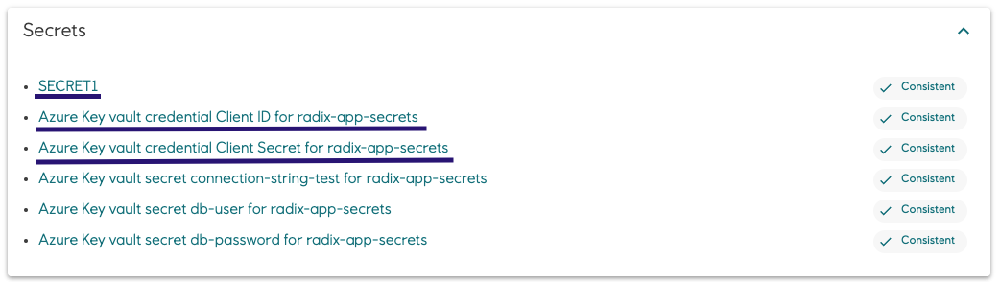
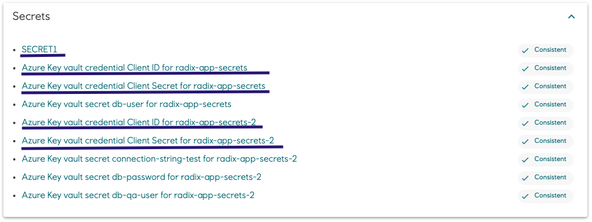
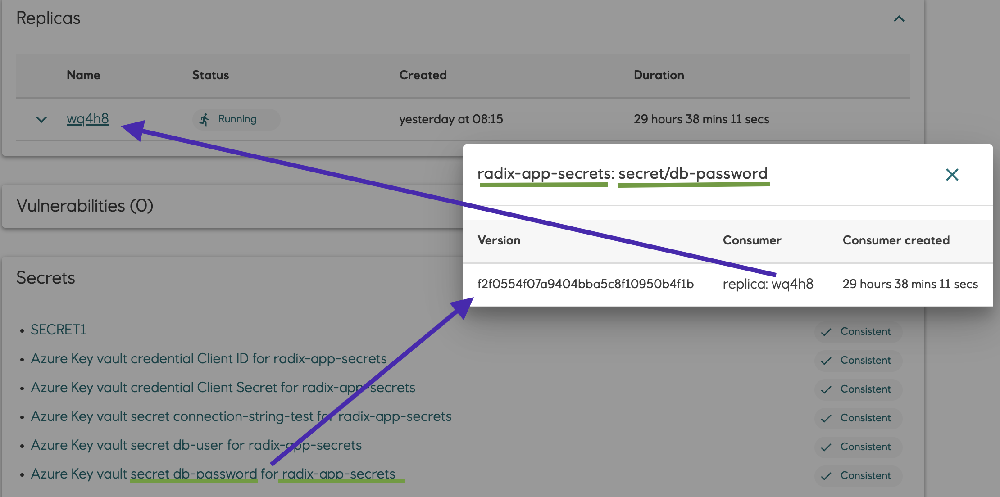

# Configuring Azure Key vaults

Azure Key vault secrets, keys and certificates can be used in Radix, configured in the property `secretRefs.azureKeyVaults` of the [radixconfig.yaml](../../references/reference-radix-config/#secretrefs) file. It is implemented with Azure Key Vault Provider for Secrets Store CSI Driver for Kubernetes. Read [more](https://github.com/Azure/secrets-store-csi-driver-provider-azure) about the driver.

## Configuration
- Create or use existing Azure Key vault in own Azure subscription
- Add or use existing `Access policy` (e.g. with [Azure App registration](https://portal.azure.com/#blade/Microsoft_AAD_RegisteredApps/ApplicationsListBlade) as a selected principal) with `Get` and `List` permissions to secrets, keys and/or certificates
  
  
  
- Create or use existing secrets, keys and/or certificates to be used in Radix application component as secrets
  
  

- Define properties of the Azure Key vaults in the [`radixconfig.yaml`](../../references/reference-radix-config/#secretRefs) property `secretRefs.azureKeyVaults`
- `secretRefs.azureKeyVaults` properties `name` and `path` should be unique within one Radix application component and its environment (different environments can have the same `name` and `path`).
  - Examples of correct configurations in component and `environmentConfig` (if exists) sections
    ```yaml
    variables:
      VAR1: "val1"
    secrets:
      - SECRET1
    secretRefs:
      azureKeyVaults:                    #Azure Key vault configuration, common for the component
        - name: radix-app-secrets
          path: /mnt/secrets                   #overrides default "path", where secrets, keys and certificates are available as files
          items:
            - name: connection-string-prod     #example value "server:prod" in Azure Key vault "radix-app-secrets"
              envVar: CONNECTION_STRING        #default environment variable CONNECTION_STRING
            - name: db-user                    #example value "readeruser" in Azure Key vault "radix-app-secrets"
              envVar: DB_USER                  #default environment variable DB_USER
            - name: db-password                #example value "Pa$$w0rd!" in Azure Key vault "radix-app-secrets"
              envVar: DB_PASS                  #default environment variable DB_PASS
    environmentConfig:
      - environment: dev
        secretRefs:
          azureKeyVaults:                #Azure Key vault configuration, customized in environment "dev"
            - name: radix-app-secrets
              path: /mnt/dev                   #overrides common configuration "path" in "dev" environment
              items:
                - name: connection-string-test #example value "server:dev" in Azure Key vault "radix-app-secrets"
                  envVar: CONNECTION_STRING    #overrides Azure Key vault "radix-app-secrets" secret name for environment variable CONNECTION_STRING
      - environment: qa
        secretRefs:
          azureKeyVaults:                #Azure Key vault configuration, customized in environment "qa"
            - name: radix-app-secrets-2        #overrides common configuration Azure Key vault name in "qa" environment
              items:                           #"qa" environment uses the same "path" as in common configuration
                - name: connection-string-test #example value "server:qa" in Azure Key vault "radix-app-secrets-2"
                  envVar: CONNECTION_STRING    #overrides Azure Key vault secret name for environment variable CONNECTION_STRING
                - name: db-password            #example value "$ecretPa$$!" in Azure Key vault "radix-app-secrets-2"
                  envVar: DB_PASS              #overrides Azure Key vault secret name for environment variable DB_PASS
                - name: db-qa-user             #example value "writeruser" in Azure Key vault "radix-app-secrets-2"
                  envVar: DB_QA_USER           #new environment variable, existing only in environment "qa"
      - environment: prod                #Azure Key vault configuration is not customized in environment "prod"
        variables:
          VAR1: "val2"
    ```
    - Environment variables in "dev" environment replica
    ```yaml
    VAR1="val1"
    SECRET1="some secret dev"
    CONNECTION_STRING="server:dev"
    DB_USER=readeruser
    DB_PASS="Pa$$w0rd!"
    ```
    - Environment variables in "qa" environment replica
    ```yaml
    VAR1="val1"
    SECRET1="some secret qa"
    CONNECTION_STRING="server:qa"
    DB_USER=readeruser
    DB_PASS="$ecretPa$$!"
    DB_QA_USER=writeruser
    ```
    - Environment variables in "prod" environment replica
    ```yaml
    VAR1="val2"
    SECRET1="some secret prod"
    CONNECTION_STRING="server:prod"
    DB_USER=readeruser
    DB_PASS="Pa$$w0rd!"
    ```
    - Files in "dev" environment replica
    ```yaml
    $ ls /mnt/dev/
    connection-string-test db-password db-user
    ```
    - Files in "qa" environment replica
    ```yaml
    $ ls /mnt/secrets/
    db-user
    $ ls /mnt/azure-key-vault/radix-app-secrets-2/
    connection-string-test db-password db-qa-user
    ```
    - Files in "prod" environment replica
    ```yaml
    $ ls /mnt/secrets
    connection-string-prod db-password db-user
    ```
  - Examples of invalid configuration in component section
    ```yaml
    variables:
      VAR1: "val1"
    secrets:
      - SECRET1
    secretRefs:
      azureKeyVaults:
        - name: radix-app-secrets-1
          path: /mnt/1
          items:
            - name: secret1
              envVar: VAR1          #invalid: collision with environment variable VAR1
            - name: secret4
              envVar: SECRET1       #invalid: collision with secret SECRET1
            - name: secret2
              envVar: SECRET2
            - name: secret3
              envVar: SECRET2       #invalid: duplicate environment variable SECRET2 in Azure Key vault configuration
            ...
        - name: radix-app-secrets-1 #invalid: duplicate Azure Key vault configuration
          path: /mnt/1              #invalid: duplicate "path" within the component
          items:
            - name: secret4
              envVar: SECRET2       #invalid: duplicate environment variable SECRET2 in Azure Key vault configuration 
            ...
    ```
  - Examples of invalid configuration in component and `environmentConfig` sections
    ```yaml
    secretRefs:
      azureKeyVaults:
        - name: radix-app-secrets-1
          items:
            - name: secret1
              envVar: VAR1          #invalid: collision with environment variable VAR1
            - name: secret2
              envVar: SECRET1
            ...
    environmentConfig:
      - environment: dev
        secretRefs:
          azureKeyVaults:               #Azure Key vault configuration, customized in environment "dev"
            - name: radix-app-secrets-1
              path: /mnt/1
              items:
                - name: secret1
                  envVar: VAR1          #invalid: collision with environment variable VAR1
                - name: secret2
                  envVar: SECRET1       #correct: overrides environment variable SECRET1 in common Azure Key vault configuration
                - name: secret3
                  envVar: SECRET3
                ...
            - name: radix-app-secrets-1 #invalid: duplicate Azure Key vault configuration
              path: /mnt/1              #invalid: duplicate "path" within the component
              items:
                - name: secret3
                  envVar: SECRET3       #invalid: duplicate environment variable SECRET2 in Azure Key vault configuration
                ...
      - environment: qa
        secretRefs:
          azureKeyVaults:              #Azure Key vault configuration, customized in environment "qa"
            - name: radix-app-secrets-1
              path: /mnt/1
              items:
                - name: secret2
                  envVar: SECRET1       #correct: overrides environment variable SECRET1 in common Azure Key vault configuration
                - name: secret3
                  envVar: SECRET3       #correct: unique environment variable in environment "qa"
                ...
    ```

- Get access policy principal client-id and client secret to enter as credential secrets in the Radix Console
  
  
- After environment has been built and deployed, set the generated credential secrets with client-id and client-secret of Azure principal, selected in access policy for Azure Key vault. This should ensure that secrets are in Consistent status. It is recommended to restart a component after credential secrets has been set in the console
  - Credential secrets in "prod" environment
    
  - Credential secrets in "qa" environment
    

## Azure Key vault secret, certificate and key versions
Secret, certificate and key versions from referenced Azure Key vault currently used by component replicas can be shown in the Radix console.
Click on the link of Azure key vault secret, cert or key to open a popup with this info.
  
  
For job component the dialog show information which job or batch uses secret versions (prefixed with "job" and "batch") and which secret version willbe used in new started jobs (consumer is "New job")
  

## Certificates

When a certificate is created in a Azure Key vault, secret and key [are created implicitly](https://docs.microsoft.com/en-us/azure/aks/csi-secrets-store-driver#obtain-certificates-and-keys) with the same names:

|Object|Return value|Returns entire certificate chain|
|-|-|---------------------|
|`key`|The public key, in Privacy Enhanced Mail (PEM) format|N/A|
|`cert`|The certificate, in PEM format|No|
|`secret`|The private key and certificate, in PEM format|Yes|

Use `alias` property to get all these three items in Radix application component. Example to use certificate and its keys `cert1` as three files in the component replicas:
* Create a certificate in an Azure Key vault, `cert1` in this example.
* Key and secret with the same names are implicitly created in this Key vault, but not shown in the Azure Key vault.
* Refer to them in the `radixconfig.yaml` `azureKeyVaults.items` with the same `name`, but with different `alias`.
* The `envVar` property should be omitted if environment variables for these values are not needed.

 ```yaml
  secretRefs:
    azureKeyVaults:
      - name: radix-app-secrets
        path: /mnt/secrets
        items:
          - name: secret1     #regular Azure Key vault secret - available in the container as an environment variable SECRET1 and as a file /mnt/secrets/secret1
            envVar: SECRET1
          - name: cert1       #The certificate, manually generated in Azure Key vault - no environment variable (as envVar is not set), only as a file /mnt/secrets/cert1.crt
            type: cert
            alias: "cert1.crt"
          - name: cert1       #The public key, automatically generated in Azure Key vault - no environment variable (as envVar is not set), only as a file /mnt/secrets/cert1.pem
            type: key
            alias: "cert1.pem"
          - name: cert1       #The private key and certificate, automatically generated in Azure Key vault - no environment variable (as envVar is not set), only as a file /mnt/secrets/cert1.key
            type: secret
            alias: "cert1.key"
  ```
Files in the component replica
```shell
/mnt/secrets $ ls
cert1.crt     cert1.key     cert1.pem  secret1
```

## Autorotation of secrets

Radix cluster supports Azure Key vault autorotation. Kubernetes secrets, containing Azure Key vault secrets keys and certificates, used in Radix component containers are updated every 2 minutes with new versions of these values if new versions exist.

>Recommendation of using Azure Key vault secrets in Kubernetes replicas [in Microsoft documentation](https://docs.microsoft.com/en-us/azure/aks/csi-secrets-store-driver#enable-and-disable-autorotation):
>
> _When a secret is updated in an external secrets store after initial pod deployment, the Kubernetes Secret and the pod mount will be periodically updated depending on how the application consumes the secret data._
>* _**Mount the Kubernetes Secret as a volume**: Use the auto rotation and Sync K8s secrets features of Secrets Store CSI Driver. The application will need to watch for changes from the mounted Kubernetes Secret volume. When the Kubernetes Secret is updated by the CSI Driver, the corresponding volume contents are automatically updated._
>* _**Application reads the data from the container’s filesystem**: Use the rotation feature of Secrets Store CSI Driver. The application will need to watch for the file change from the volume mounted by the CSI driver._
>* _**Use the Kubernetes Secret for an environment variable**: Restart the pod to get the latest secret as an environment variable. Use a tool such as Reloader to watch for changes on the synced Kubernetes Secret and perform rolling upgrades on pods._

Follow the secret versions in the [popup dialogue](#azure-key-vault-secret-certificate-and-key-versions) and notifications about rotated secret in the events list:
  