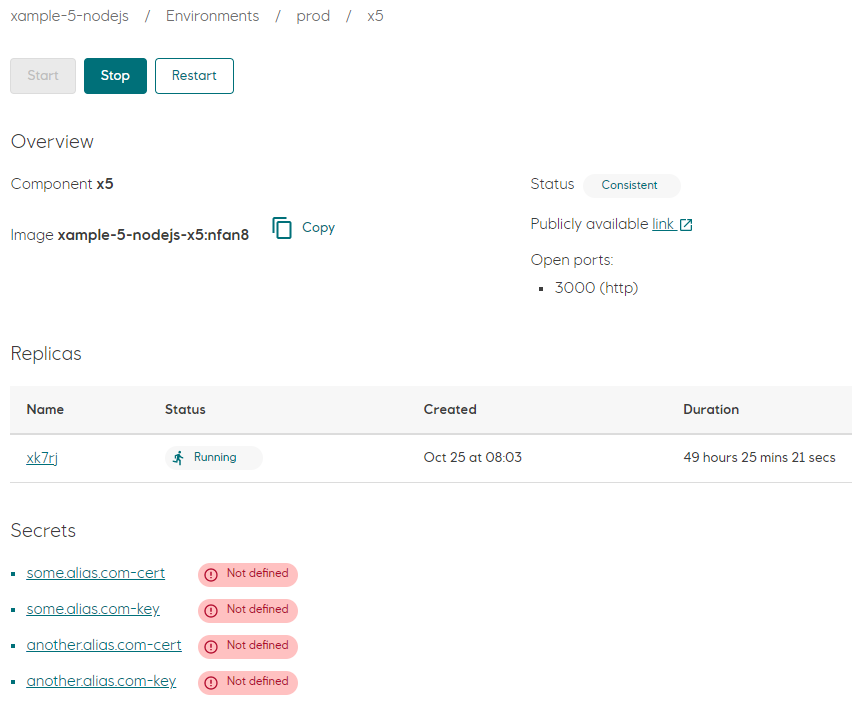
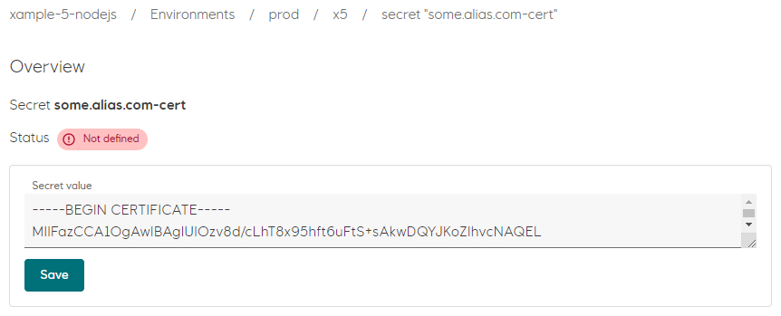
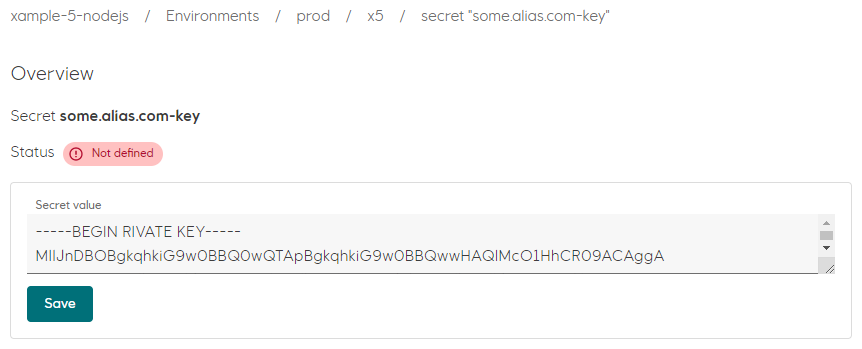
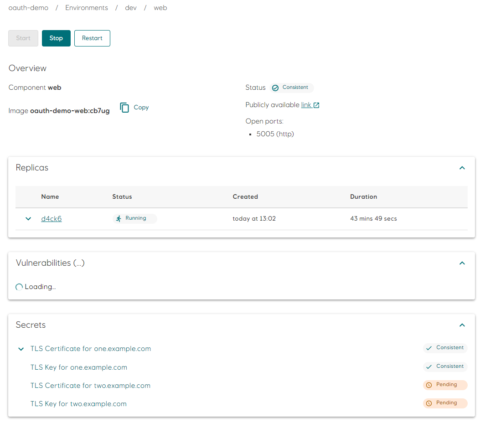
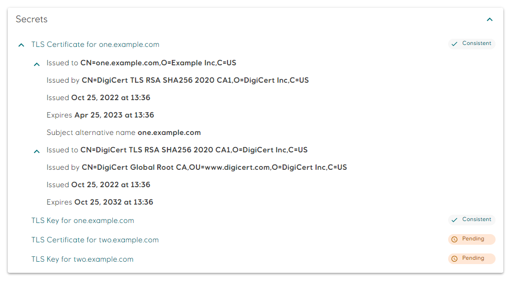
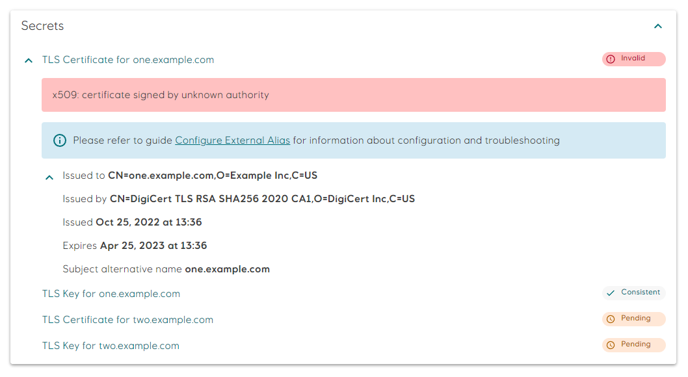

# Configure External Alias

It is possible to make an application available on a custom alias via a setting in `radixconfig.yaml`, provided you register the alias and bring the corresponding TLS certificate into Radix.

This alias must point to the [public name](../../docs/topic-domain-names/#public-name) of a component in your app. By using the public name Radix can ensure that your app will always be available at the same url even when it is internally moved around due to container orchestration. In contrast the canonical name will change according to the same orchestration.

The process for setting up the alias depends on the service used to register and manage the alias. This guide assumes registration of a `*.equinor.com` alias, but you should be able to adapt the instructions to a third-party provider.

## Acquire an Equinor alias

1. Open the [Services@Equinor](https://equinor.service-now.com/selfservice) portal and find the service "Domain name system (DNS)"
1. Request an alias, and specify which [public name](../../docs/topic-domain-names/#public-name) the alias should point to.  
   ::: details Example

    ```raw
    New alias: myapp.equinor.com
    Point to: frontend-myapp-prod.radix.equinor.com
    ```
    :::

1. Specify in the request if you only need "internal entry" (used within internal Equinor network) or "both - internal and external entries" (used both - within internal Equinor and public networks).

## Acquire an Equinor certificate

### What you need

You need to request two certificates

- SSL certificate
- Intermediate certificate

::: tip Side note
[What is an intermediate certificate?](https://support.ssl.com/Knowledgebase/Article/View/11/0/what-is-an-intermediate-certificate)
:::

These certs can be bundled into one file using the PEM container format, and quite often this file is what we end up calling "the cert we serve the client".  

A PEM container holding both the SSL and the intermediate certificate in the same file, in this particular order:
::: details Example
```raw
-----BEGIN CERTIFICATE-----
{ssl certificate content}
-----END CERTIFICATE-----

-----BEGIN CERTIFICATE-----
{intermediate certificate content}
-----END CERTIFICATE-----
```
:::

### How to get it

1. Start by getting to know the appropriate procedures on how to handle keys and certificates in Equinor, as they are considered sensitive information
1. Create a _Certificate Signing Request_ on you local pc using the `openssl` command:

    ```sh
    # Step 1: Generate a private key
    openssl genrsa -out ./mydomain.equinor.com.key 2048
    # Keep this file safe and out of version control. You will need it later. 

    # Step 2: Generate Certificate Signing Request (CSR) file using the private key
    openssl req -new -key ./mydomain.equinor.com.key -out ./mydomain.equinor.com.csr
    ```

1. Open the [Services@Equinor](https://equinor.service-now.com/selfservice) portal and find the service **Public SSL certificate**
1. Request a SSL certificate and an intermediate certificate for your alias and attach the CSR file you created in step 2:

   ```raw
   Title: Public SSL certificate with intermediate
   Certificate name: mydomain.equinor.com
   ```

1. Once you get the requested certificates, store them together with the private key in a safe location (see step 1)

## Update configuration

You must add a new `dnsExternalAlias` section to your [`radixconfig.yaml`](../../references/reference-radix-config/#dnsexternalalias) file.  

1. The application must be built and deployed for the configuration to be applied.
1. If authentication proxy is used - its redirect URL can be changed to use external alias (to avoid showing long proxy URL, when redirected).  

### Apply custom certificate

Adding the certificate information to your application is done using the Radix Console.

Radix needs two pieces of information to enable the certificate for an external alias:

- the certificate itself
- the private key

These must be entered as [secrets](../../docs/topic-concepts#secret) in the page of the component chosen as the target of the alias (in the appropriate environment). The two secrets will be named `<domain-name>-cert` and `<domain-name>-key`.



### Add `<domain-name>-cert` secret

Combine the SSL certificate and the intermediate certificate into a single certificate using a PEM container format. Certificates should be put [in particular order](https://www.digicert.com/kb/ssl-support/pem-ssl-creation.htm): first - SSL certificate, second - Intermediate certificate:
::: details Example
```raw
-----BEGIN CERTIFICATE-----
{ssl certificate content}
-----END CERTIFICATE-----

-----BEGIN CERTIFICATE-----
{intermediate certificate content}
-----END CERTIFICATE-----
```
:::



### Add `<domain-name>-key` secret

Paste the contents of the private key file that you generated at the start of the process.



## Certificate and key validation

When both the certificate and key is set, the secrets should change to `Consistent` state. The `Consistent` state indicates that the certificate is valid, signed by a trusted authority, and the private and public key pair matches.



Basic information about the TLS certificate and intermediate authorities is available by clicking on the chevron next to the `TLS Certificate` secret. Certificates in the list are presented in the same order as set in the `<domain-name>-cert` secret.



If there are any issues with the certificate or private key, the state of the secret(s) will be `Invalid`. The reason for the invalid state is shown in the details section for the certificate or key.



Refer to the [Troubleshooting](./#troubleshooting) section for a list of common validation errors and how to they can be resolved.

## Troubleshooting

The most common validation errors are described below.

- **x509: certificate signed by unknown authority**  
The certificate is not signed by a trusted authority. You will see this error if you forget to include the intermediate CA certificate in the `<domain-name>-cert` secret.  
Read the [Add domain-name-cert secret](./#add-domain-name-cert-secret) section for more information.

- **x509: certificate is not valid for any names, but wanted to match one.example.com**  
The certificate is not valid for any domain names. This error is reported if you switch the order of the TLS certificate and the CA certificate. Check the order of the certificates in the details section.  
Read the [Add domain-name-cert secret](./#add-domain-name-cert-secret) section for more information.

- **x509: certificate is valid for two.example.com, not one.example.com**  
The certificate is not valid for the expected domain name. Update the `<domain-name>-cert` secret with the correct certificate.

- **x509: missing PEM block for certificate**  
The `<domain-name>-cert` secret value does not contain a `CERTIFICATE` PEM block. Update the `<domain-name>-cert` secret with a value containing the certificates.

- **tls: private key does not match public key**  
The private key set in the `<domain-name>-key` secret does not match the public key for the certificate. Set the private key matching the certificate public key to fix.  
[openssl](https://www.ibm.com/support/pages/openssl-commands-check-and-verify-your-ssl-certificate-key-and-csr) can be used to verify that the certificate and key matches, before setting the secrets.

- **tls: failed to find PEM block with type ending in "PRIVATE KEY" in key input**  
The `<domain-name>-key` secret value does not contain a `PRIVATE KEY` or `RSA PRIVATE KEY` PEM block. Update the `<domain-name>-key` secret with a value containing the private key.  
Read the [Add domain-name-key secret](./#add-domain-name-key-secret) section for more information.
