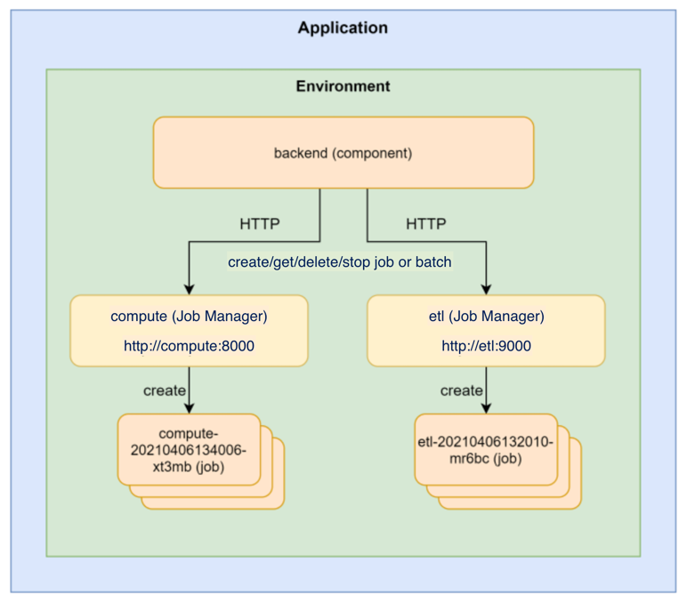

# Jobs

A job is an on-demand and short lived container/process that performs a set of tasks, e.g. a ML training job or an ETL job, and exits when it is done.
The duration of a job can span from seconds to hours, depending on what tasks it performs, but it is expected to exit when it has completed the work. Multiple jobs can be created and running simultaneously.

CPU, GPU and memory resources requested by a job are reserved when it starts, and released when it exits. This will help reduce the total cost for an application since cost is only calculated for running containers. A job that requests 10GB of memory and 2 CPUs, started once per day and runs for one hour, will only accumulate cost for the hour it is running. A component that requests the same resources will accumulate cost for all 24 hours of a day.

Docker images built from the definition in the components section in radixconfig.yaml are started automatically when a new build-deploy, promote or deploy pipeline completes. Jobs on the other hand, must be managed through the [job-scheduler](#job-scheduler) web API service. Radix creates a job-scheduler for each job and environment defined in [`radixconfig.yaml`](../../references/reference-radix-config/). The job-scheduler can start new containers from the Docker image build by the pipeline, delete and list existing jobs.

The job-scheduler does not require any authentication since it is not exposed to the Internet and is only accessible by components in the same application and environment.

A job can be run as a single job or as a batch of jobs.

A max of 10 single completed jobs remains in the history of a job component. When a single job started - the oldest of 10 existing single jobs is deleted. The same applies for batched jobs - its history is independent of single jobs history. A max of 10 completed batched jobs remain in the batch history, with all their jobs.

* [Configure jobs](./configure-jobs.md)
* [Job manager and job API](./job-manager-and-job-api.md)
* [Environment variables](./environment-variables.md)
* [Manage jobs in Radix web-console](./jobs-in-web-console.md)
* [OpenAPI/Swagger](./openapi-swagger.md)

 
### Component diagram example

