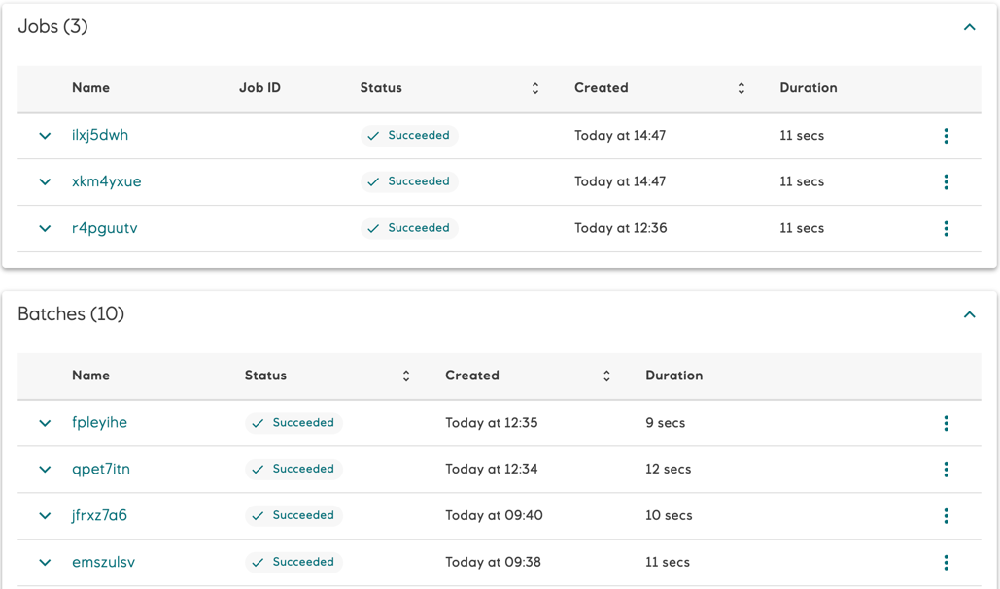
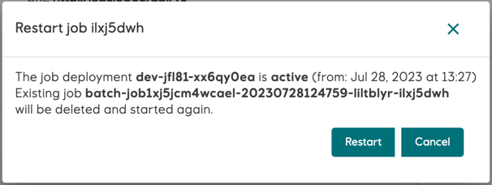

## Managing Jobs in Web Console

Batches and jobs can be found in the Web console under the "Batches" and "Jobs" tabs. Job scheduler manager pod status and its log can be found in the "Job manager" section

* It shows batch and job states. When all jobs in a batch are completed, the batch is completed. If any job fails, the batch is failed. 
  
* Ellipsis icon on the right side of the batch or job row opens a menu with the delete option
  
  * Show job payload
  
    
  * Deleting a batch deletes all jobs in the batch
  * Deleting a job from a batch is not supported
  * Running job or batch can be stopped - all Kubernetes jobs for these jobs or jobs of a batch will be deleted
  * Job or batch can be restarted from any status (running, completed, failed or stopped), with the same options and payload
    * when a job or a batch is running with an active deployment, all Kubernetes jobs for these jobs or jobs of a batch will be deleted and created again
    
    * when a job or a batch is running with a non-active deployment - it is an option to run a copy the job or the batch with a new active deployment.
      
    * jobs in a batch can be restarted or copied individually. When a batch job restarted with another active deployment, a new batch is created with a copy of this only job
