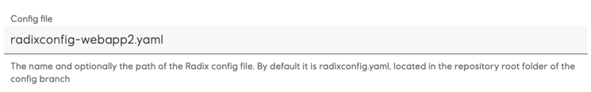
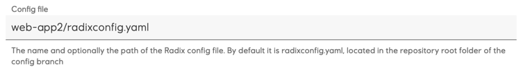
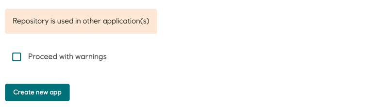
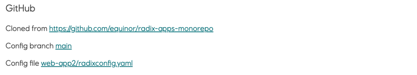

# Multiple Radix application with the same GitHub repository

It is possible to use the same GitHub repository for multiple Radix applications. It is mandatory to use different Radix configuration files for such applications, because the configuration file contains an application name, which should be unique within the Radix cluster. 

Example:
* Register an application A, specifying a GitHub repository. The name of this application is also specified in a Radix configuration file, which is by default `radixconfig.yaml`, but it can be altered.
* Start registering a second application B, specifying the same GitHub repository. 
  * The name of this  second application need to be also specified in a Radix configuration file, so it should be another file:
    * a file with different name
    * a file in a sub-folder of this GitHub repository, and optionally have different name
    * a file in another branch of this GitHub repository. It is optionally, but preferably to give this configuration file different name, or keep it in different sub-folder, to avoid potential overwriting with different application's configuration file during merge from its branch.
    Configuration file can be altered on the create application page, in the field `Config file`
    
    or
    
  * Because the same repository will be used for multiple applications, on creating the application a warning shown
  
  * Ticking the checkbox under warnings confirms understood consequences, like of pushing changes in the repository can create Radix pipeline jobs for all applications, which use it.
    > [Radix CLI](https://github.com/equinor/radix-cli) also reposts this warning, when creating of an application with a GitHub repository, used in another application. To confirm such operation - add an option `--acknowledge-warnings` to command line arguments
* When an application is registered, GitHub webhook with a secret can be added to the repository to run Radix pipeline jobs when changes are pushed to the repository. Because all applications have different webhook secrets, the webhook URL has an argument with an application name to validate GitHub event signature with particular application's webhook secret:
  `https://webhook.playground.radix.equinor.com/events/github?appName=radix-apps-monorepo-1`
  `https://webhook.playground.radix.equinor.com/events/github?appName=radix-apps-monorepo-2`
* When an application is registered - Radix web-console configuration page for the application shows the GitHub repository name, config branch and config file - all with actual links
  
* v
