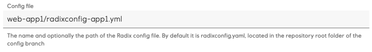
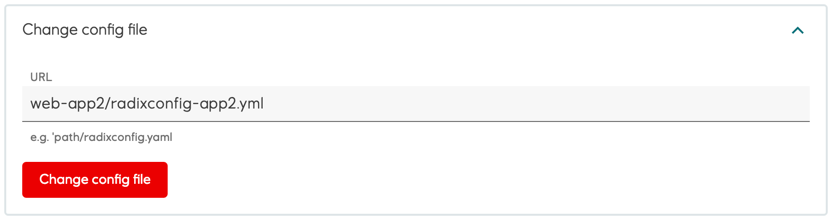

# Multiple Radix applications with the same GitHub repository - monorepo strategy

It is possible to have multiple Radix applications, using the same GitHub repository, also known as monorepo software development strategy. These applications have to use different Radix configuration files, because the configuration file contains an application name, which should be unique within the Radix cluster. 

Example:
* Register an application, specifying a GitHub repository. The name of this application is defined in a Radix configuration file. This file is by default `radixconfig.yaml`, located in the repository root folder, but it can have different name and location in the repository:
  
* Start registering a second application, specifying the same GitHub repository
  * This second application might have different components and settings, and its name should also be different, so another Radix configuration file have to be used. Following options are available:
    * a file with a different name
    * a file in a sub-folder of this repository, and optionally having different name
    * a file in another branch of this repository. It is optional, but recommended to give this configuration file a different name or keep it in different sub-folder to avoid its potential overwriting during merge from another branch.
    Configuration file can be defined on the application registration form, in the field `Config file`
    
    or
    
  * Because the same repository will be used for multiple applications, a warning is shown on creating of the application
  
  * Ticking the checkbox under warnings confirms understood consequences, like pushed changes to the repository can start Radix pipeline jobs for all applications, which use it.
    > [Radix CLI](./https://github.com/equinor/radix-cli) also shows this warning, when creating an application with a GitHub repository, used in another application. To confirm such operation - add an option `--acknowledge-warnings` to command line arguments
* When an application is registered, GitHub webhook with a secret can be added to the repository to run Radix pipeline jobs, when changes are pushed to the repository. Because each application has a unique webhook secret, the webhook URL has an argument with an application name to validate GitHub event signature with a webhook secret of this particular application. Example:
  * Webhook URL for the application "radix-app-1"
  `https://webhook.playground.radix.equinor.com/events/github?appName=radix-app-1`
  * Webhook URL for the application "radix-app-2"
  `https://webhook.playground.radix.equinor.com/events/github?appName=radix-app-2`
  > Newly introduced webhook URL argument `appName` does not exist in webhooks of already registered applications. If repositories of such applications will be used in another applications, these existing webhook need to get this argument with their application names. Otherwise, Radix pipeline is not able to validate GitHub events from webhooks of multiple applications.  
* When an application is registered, Radix web-console configuration page for the application shows the GitHub repository name, config branch and config file - all with actual links
  
* Radix configuration file name and path can be changed on the Radix web-console configuration page for the application. This file can have extension `yaml` or `yml`, it can optionally be located in a sub-folder of the GitHub repository. In the example below - the configuration file `radixconfig-app2.yml` is located in the sub-folder `web-app2` of the repository (no leading slash is required)

* If applications are configured to have [sub-pipelines](../sub-pipeline), these sub-pipelines can be different applications. To solve this requirement, Radix currently expects sub-pipeline folder `tekton` be in the same location, where the Radix configuration file is defined to be for the application.