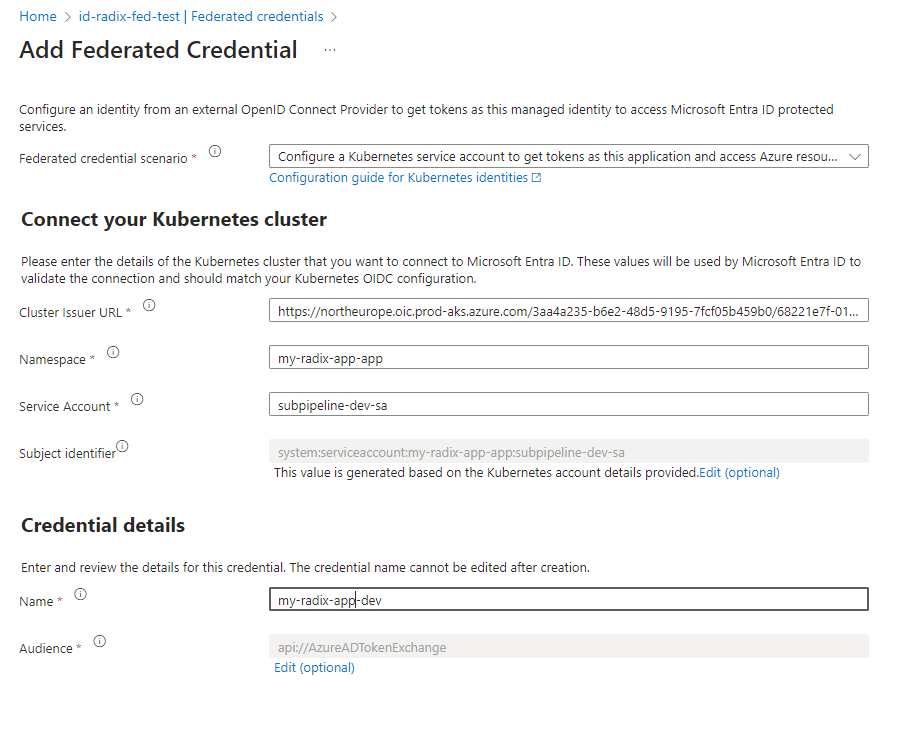
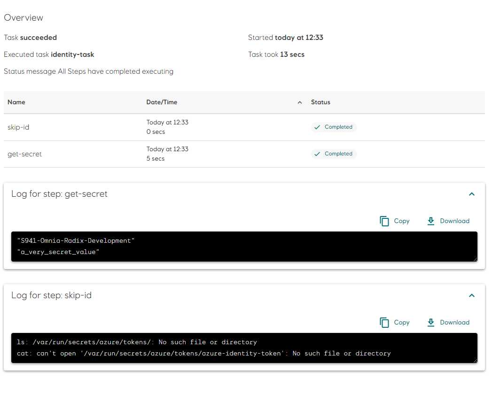

# Sub-pipeline example: Pipeline with Azure Workload Identity

* In the Radix application repository create a folder `tekton`. This folder need to be in the configuration branch and in the same folder, where `radixconfig.yaml` file is located (by default it is a root of the repository).
* The sub-pipeline in this example runs a single tasks.
* Create the Pipeline and task files. File names of tasks can be arbitrary (no any connection with a task actual name, used in a sub-pipeline), file extensions should be `yaml`.
* Create a Federated credential in an Azure Managed Identity and provide the Client Id to your step (AZURE_CLIENT_ID). This client id can be set manually in code, as a environment variable, or passed down via parameters from radixconfig Secrets or variables.
* Create a file `identity.yaml` for the task `identity`. This task runs 2 steps, one is enabled for workload identity and will print the secret from the keyvault,
  the other is disabled for workload identity and will try (and fail) to print the token from the workload identity.

## Federated credential

You will need to configure a federated credential in your Azure Managed Identity. This is done by creating a new federated credential in a existing Mananged Identity that has the correct permissions you need.

::: tip
The `issuer` URL will change in certain cases when a Radix Cluster is replaced during upgrading or in a disaster recovery scenario.

We will notify as early as possbile when this happens in the **#omnia_radix** slack channel.
:::

1. Go to Radix Console and click the `i` icon in the top right corner of the cluster you want to use. Or click [here](https://console.radix.equinor.com/about) for production.
2. Copy the `CLUSTER_OIDC_ISSUER_URL` value. This is the credentials issuer in Radix Cluster.
3. Find the `Namespace` for your application, this is always your application name and a `-app` suffix: `<application name>-app`.
4. Find the `Service Account` for your application, this changes with your environment and is always `subpipeline-<environment>-sa`.
5. On the Managed Identity overview page and take a note of your `Client ID`. This is the `AZURE_CLIENT_ID` you will need to provide in the next step.

For a Radix application named `my-radix-app` in the `dev` environment, the `Service Account` would be `subpipeline-dev-sa` and the `Namespace` would be `my-radix-app-app`:



(The Credential name can be anything you want, but it is recommended to use the name `<application>-<env>`)

## Create a Task

This task will run two steps, one enabled for workload identity and one disabled for workload identity.
Radix wil automatically inject credentials prepared for workload identity and set the corresponding environment variable `AZURE_FEDERATED_TOKEN_FILE` to the path of the token file.
We will also configure `AZURE_TENANT_ID` and `AZURE_AUTHORITY_HOST`. You need to add your `AZURE_CLIENT_ID` from the previous step to yuor workload. 
You can either pass it straight in as below, or use parameters and RadixConfig secrets or variables to store the ID. 
Together these 4 enables MSAL to automatically pick up the token and use it for authentication. You can also log in manually using the `az login` command as the example below shows:

```yaml
apiVersion: tekton.dev/v1
kind: Task
metadata:
  name: identity
  labels:
    # This label is required to enable Workload Identity, it must be lowercase
    azure.workload.identity/use: "true"
  annotations:
    # This annotation is optional and can be used to limit wich steps are enabled for workload identity
    azure.workload.identity/skip-containers: skip-id
spec:
  stepTemplate:
    # Make sure all steps runs as a regular user. Running as root is not allowed
    securityContext:
      runAsUser: 1000
    image: mcr.microsoft.com/azure-cli:2.55.0
    env:
      # Az needs a home directory that the authorizatio information can be stored in
      - name: HOME
        value: "/tmp"

  steps:
    - name: get-secret
      script: |
        #!/usr/bin/env sh
        TOKEN=`cat $AZURE_FEDERATED_TOKEN_FILE`
        AZURE_CLIENT_ID="<Client ID>" # Use you App (client) Id here

        # Log in to Azure with the provided credentials, that matches the configured ferated credential
        az login --service-principal \
          --username $AZURE_CLIENT_ID \
          --tenant $AZURE_TENANT_ID \
          --federated-token $TOKEN \
          --query [0].name

        # Use your current logged in user to access protected Azure resources
        az keyvault secret  show --vault-name <your-key-vault-name> --name <secret-name> --query value        

    # This step will fail since it is not enabled for workload identity
    - name: skip-id
      script: |
        #!/usr/bin/env sh
        ls -lah /var/run/secrets/azure/tokens/
        cat /var/run/secrets/azure/tokens/azure-identity-token
        :
```
The first step logs in to Azure with the provided credentials and prints the subscription name to the output.
The second half of the scripts use this authentication to fetch and print out a secret from your key vault.

## Create a Pipeline

To make it all work, create a pipeline.yaml that runs the task above:
```yaml
apiVersion: tekton.dev/v1
kind: Pipeline
metadata:
  name: pipeline
spec:
  tasks:
    - name: identity
      taskRef:
        name: identity

```

* File structure can be like this:

```sh
/
├── tekton/
│   ├── pipeline.yaml
│   ├── identity.yaml
└── radixconfig.yaml
```

### Running the pipeline:

When this pipeline is submitted to your main branch, Radix will run it in all your environments.


