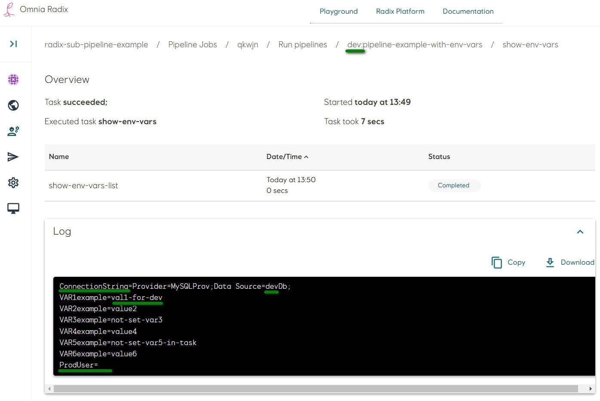
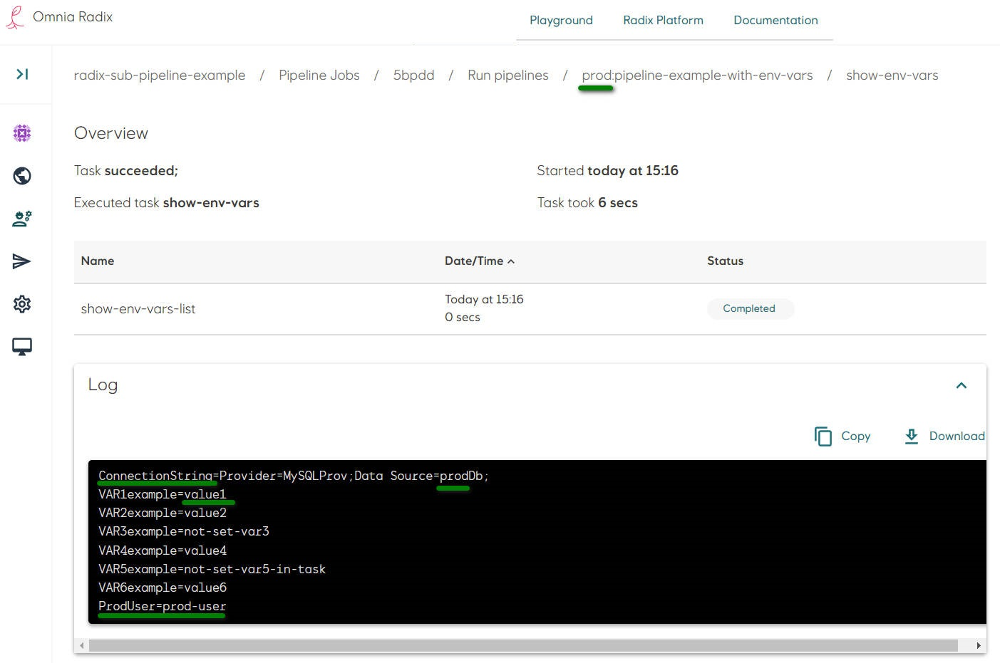

# Sub-pipeline example: Pipeline with environment variables for environments

[Source code](https://github.com/equinor/radix-sub-pipeline-example/tree/pipeline-example-with-env-vars-for-envs) for this example.

* This example extends the example [Sub-pipeline with environment variables](./example-pipeline-with-env-vars.md). The differences are following:
* In the task below:
  * There is two more parameters with names `CONNECTION_STRING` - mandatory, no default value, and `PROD_USER` - optional, set default value if it is not passed from the sub-pipeline.

  ```yaml
  params:
    ...
    - name: CONNECTION_STRING     #it must be set in a sub-pipeline's task params, because it does not have default value
    - name: PROD_USER             #it can be set in a sub-pipeline's task params, if not - used default "not-set-in-task"
      default:
        type: string
        stringVal: not-set-in-task  
  ```

  * There are two more environment variables in a step `ConnectionString` and `ProdUser`

  ```yaml
  env:
    ...
    - name: ConnectionString
      value: $(params.CONNECTION_STRING)  #set by parameter CONNECTION_STRING
    - name: ProdUser
      value: $(params.PROD_USER)  #set by parameter PROD_USER
  ```

  * The step script has extended command, to print in addition environment variables, which name contain `VAR`, `Connection` or `User`
  `printenv | grep -E 'VAR|Connection|User'`
  * Task file `env-vars-list-task.yaml`

  ```yaml
  apiVersion: tekton.dev/v1
  kind: Task
  metadata:
    name: env-vars-list
  spec:
    params:
      - name: VAR1T                 #it must be set in a sub-pipeline's task params, because it does not have default value
      - name: VAR2T                 #it can be set in a sub-pipeline's task params, if not - used default "not-set-var2-in-task"
        default:
          type: string
          stringVal: not-set-var2-in-task
      - name: VAR3T                 #it can be set in a sub-pipeline's task params, if not - used default "not-set-var3-in-task"
        default:
          type: string
          stringVal: not-set-var3-in-task
      - name: VAR4T                 #it can be set in a sub-pipeline's task params, if not - used default "not-set-var4-in-task"
        default:
          type: string
          stringVal: not-set-var4-in-task
      - name: VAR5T                 #it can be set in a sub-pipeline's task params, if not - used default "not-set-var5-in-task"
        default:
          type: string
          stringVal: not-set-var5-in-task
      - name: CONNECTION_STRING     #it must be set in a sub-pipeline's task params, because it does not have default value
      - name: PROD_USER             #it can be set in a sub-pipeline's task params, if not - used default "not-set-in-task"
        default:
          type: string
          stringVal: not-set-in-task
    steps:
      - name: show-env-vars-list
        image: alpine
        env:
          - name: VAR1example
            value: $(params.VAR1T)  #set by parameter VAR1T
          - name: VAR2example
            value: $(params.VAR2T)  #set by parameter VAR2T
          - name: VAR3example
            value: $(params.VAR3T)  #set by parameter VAR3T
          - name: VAR4example
            value: $(params.VAR4T)  #set by parameter VAR4T
          - name: VAR5example
            value: $(params.VAR5T)  #set by parameter VAR5T
          - name: VAR6example
            value: "value6"         #set explicitly with the value "value6"
          - name: ConnectionString
            value: $(params.CONNECTION_STRING)  #set by parameter CONNECTION_STRING
          - name: ProdUser
            value: $(params.PROD_USER)  #set by parameter PROD_USER
        script: |
          #!/usr/bin/env sh
          printenv | grep -E 'VAR|Connection|User'
  ```

* The sub-pipeline in addition has:
  * parameters `CONNECTION_STRING` - mandatory, no default value, and `PROD_USER` - optional, set default value if it is not set in the `radixconfig.yaml`

  ```yaml
    params:
      ...
      - name: CONNECTION_STRING  #it must be set in the radixconfig.yaml
      - name: PROD_USER          #it can be set in the radixconfig.yaml, if not - used default empty string
        default:
          type: string
          stringVal: ""
  ```

  * task parameters `CONNECTION_STRING` - set by `CONNECTION_STRING` sub-pipeline parameter, and `PROD_USER` - set by `PROD_USER` sub-pipeline parameter

  ```yaml
  params:
    ...
    - name: CONNECTION_STRING #set by parameter CONNECTION_STRING, from the radixconfig.yaml
      value:
        type: string
        stringVal: $(params.CONNECTION_STRING)
    - name: PROD_USER         #set by parameter PROD_USER, from the radixconfig.yaml
      value:
        type: string
        stringVal: $(params.PROD_USER)
  ```

  * Sub-pipeline file `pipeline.yaml`

```yaml
apiVersion: tekton.dev/v1
kind: Pipeline
metadata:
  name: pipeline-example-with-env-vars
spec:
  params:
    - name: VAR1               #it must be set in the radixconfig.yaml
    - name: VAR2               #it can be set in the radixconfig.yaml, if not - used default "not-set-var2"
      default:
        type: string
        stringVal: not-set-var2
    - name: VAR3               #it can be set in the radixconfig.yaml, if not - used default "not-set-var3"
      default:
        type: string
        stringVal: not-set-var3
    - name: CONNECTION_STRING  #it must be set in the radixconfig.yaml
    - name: PROD_USER          #it can be set in the radixconfig.yaml, if not - used default empty string
      default:
        type: string
        stringVal: ""
  tasks:
    - name: show-env-vars      #name of the task "env-vars-list" in this pipeline
      params:
        - name: VAR1T          #set by parameter VAR1, from the radixconfig.yaml
          value:
            type: string
            stringVal: $(params.VAR1)
        - name: VAR2T          #set by parameter VAR2, from the radixconfig.yaml or used default "not-set-var2"
          value:
            type: string
            stringVal: $(params.VAR2)
        - name: VAR3T          #set by parameter VAR3, not set in the radixconfig.yaml - used default "not-set-var3"
          value:
            type: string
            stringVal: $(params.VAR3)
        - name: VAR4T          #set explicitly with the value "value4"
          value:
            type: string
            stringVal: value4
        - name: CONNECTION_STRING #set by parameter CONNECTION_STRING, from the radixconfig.yaml
          value:
            type: string
            stringVal: $(params.CONNECTION_STRING)
        - name: PROD_USER         #set by parameter PROD_USER, from the radixconfig.yaml
          value:
            type: string
            stringVal: $(params.PROD_USER)
      taskRef:
        name: env-vars-list    #task name
```

* File structure can be like this:

```sh
/
├── tekton/
│   ├── pipeline.yaml
│   └── env-vars-list-task.yaml
└── radixconfig.yaml
```

* The file `radixconfig.yaml` has two environments `dev` and `prod`, with addition field `variables`, which adds or overrides common build variables from the field `build.valiables`:

```yaml
apiVersion: radix.equinor.com/v1
kind: RadixApplication
metadata:
  name: radix-sub-pipeline-example
spec:
  build:
    variables:
      VAR1: value1     #it must be set, as it is expected by the sub-pipeline
      VAR2: value2     #it can be set, if it does not exist - the sub-pipeline will set default value
      VAR100: value100 #it is not used in the sub-pipeline and its tasks
  environments:
    - name: dev
      build:
        from: pipeline-example-with-env-vars-for-envs
        variables:
          VAR1: "val1-for-dev"  #overrides common env-var VAR1 in the "dev" Radix pipeline
          CONNECTION_STRING: "Provider=MySQLProv;Data Source=devDb;" #overrides common env-var CONNECTION_STRING in the "dev" custom sub-pipeline
    - name: prod
      build:
        from: release
        variables:
          PROD_USER: "prod-user" #it exists only in prod environment
          CONNECTION_STRING: "Provider=MySQLProv;Data Source=prodDb;" #overrides common env-var CONNECTION_STRING in the "prod" custom sub-pipeline
  components:
    - name: frontend
      src: frontend
      ports:
        - name: http
          port: 8001
      publicPort: http
  dnsAppAlias:
    environment: dev
    component: frontend
```

* common valiables: `VAR1`, `VAR2` and `VAR100`, they can be used in all environments.
  * `VAR1` - mandatory variable, it is expected by the sub-pipeline.
  * `VAR2` - optional
  * `VAR100` - unnecessary variable, not used in the sub-pipeline, it will be not passed to the sub-pipeline parameters.

  ```yaml
  spec:
    build:
      variables:
        VAR1: value1     #it must be set, as it is expected by the sub-pipeline
        VAR2: value2     #it can be set, if it does not exist - the sub-pipeline will set default value
        VAR100: value100 #it is not used in the sub-pipeline and its tasks
  ```

* `dev` build environment:
  * Common variable `VAR1` is overridden to be passed to the sub-pipeline parameter `VAR1` with the value "val1-for-dev".
  * New variable `CONNECTION_STRING` contains `dev`-environment specific connection string "Provider=MySQLProv;Data Source=**devDb**;"

  ```yaml
  environments:
    - name: dev
      build:
        from: pipeline-example-with-env-vars-for-envs
        variables:
          VAR1: "val1-for-dev"  #overrides common env-var VAR1 in the "dev" external pipeline
          CONNECTION_STRING: "Provider=MySQLProv;Data Source=devDb;" #overrides common env-var CONNECTION_STRING in the "dev" custom sub-pipeline
  ```

* `prod` build environment:
  * New variable `PROD_USER` contains `prod`-environment specific user name "prod-user".
  * New variable `CONNECTION_STRING` contains `prod`-environment specific connection string "Provider=MySQLProv;Data Source=**prodDb**;"

  ```yaml
  environments:
    - name: prod
      build:
        from: release
        variables:
          PROD_USER: "prod-user" #it exists only in prod environment
          CONNECTION_STRING: "Provider=MySQLProv;Data Source=prodDb;" #overrides common env-var CONNECTION_STRING in the "prod" custom sub-pipeline
  ```

> Common variable `CONNECTION_STRING` does not exists, as it is always different in each environment
This sub-pipeline runs the task `show-env-vars` (which reference to the task `env-vars-list` described in the file `env-vars-list-task.yaml`), which has one step, as described above. This step run a script, printing environment variables, which names contain text `VAR`

```yaml
#!/usr/bin/env sh
printenv | grep -E 'VAR|Connection|User'
```

* Commit changes in the repository. Look at the details of a started Radix pipeline job (if the Radix app is connected to the GitHub WebHook, otherwise - start a job manually).
* Sub-pipelines and tasks lists are similar to the example [Sub-pipeline with environment variables](./example-pipeline-with-env-vars.md).
* Navigate to the task (click on its name in the table row)
* The sub-pipeline task overview page shows a table with a list of this task's steps - in this example it is one step "show-env-vars-list", the step status and log.
  * Step for the sub-pipeline in the `dev` environment. The variable `ConnectionString` contains "Data Source=**dev**Db", `VAR1example` has _overridden_ common value "val1-for-dev", `ProdUser` has no value
    
  The log shows environment variables of the step container:

  ```bash
  ConnectionString=Provider=MySQLProv;Data Source=devDb;
  VAR1example=val1-for-dev
  VAR2example=value2
  VAR3example=not-set-var3
  VAR4example=value4
  VAR5example=not-set-var5-in-task
  VAR6example=value6
  ProdUser=
  ```

  * `VAR6example` - this variable is not defined in the sub-pipeline's task `params` and task's `params`, it is set implicitly in the task step's field `env`

    ```yaml
      steps:
        - env:
            - name: VAR6example
              value: "value6"
    ```

  * Step for the sub-pipeline in the `prod` environment. The variable `ConnectionString` contains "Data Source=**prod**Db", `VAR1example` has _common_ value "value1", `ProdUser` has value "value6"
    
    The log shows environment variables of the step container:

  ```yaml
  ConnectionString=Provider=MySQLProv;Data Source=prodDb;
  VAR1example=value1
  VAR2example=value2
  VAR3example=not-set-var3
  VAR4example=value4
  VAR5example=not-set-var5-in-task
  VAR6example=value6
  ProdUser=prod-user
  ```
