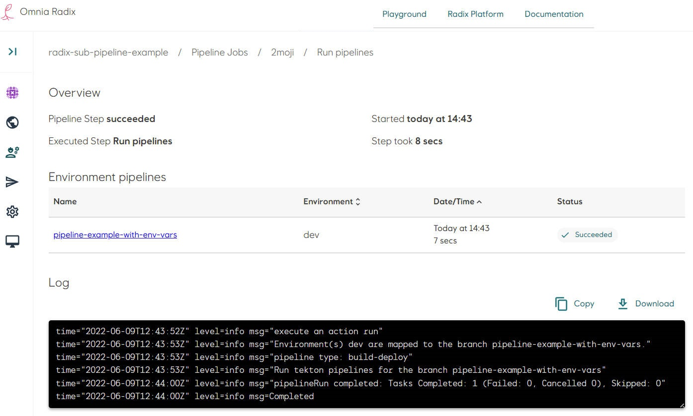
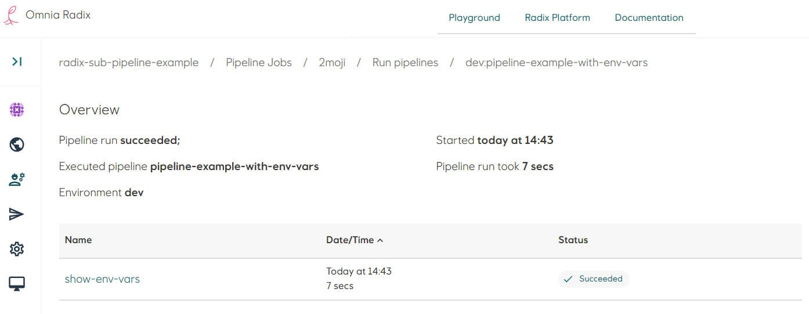
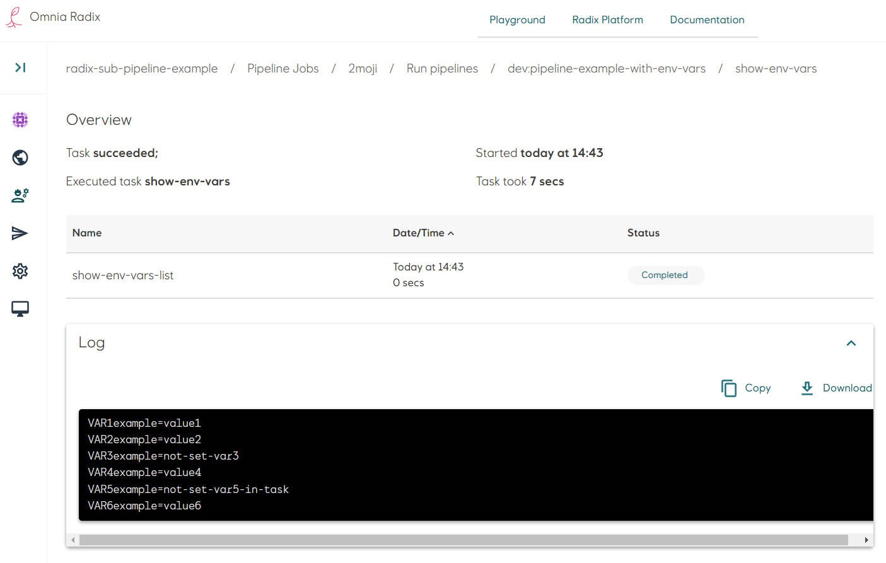

# Sub-pipeline example: Pipeline with environment variables

[Source code](https://github.com/equinor/radix-sub-pipeline-example/tree/pipeline-example-with-env-vars) for this example.

* In the Radix application repository create a folder `tekton`. This folder need to be in the configuration branch and in the same folder, where `radixconfig.yaml` file is located (by default it is a root of the repository).
* The sub-pipeline in this example runs one task.
* Create a file `env-vars-list-task.yaml` for the task `env-vars-list`. This task has one step "show-env-vars-list", which runs in the container with Alpine Linux.
  * The step runs a script with one command `printenv | grep 'VAR'` - show a list of the step's container environment variables, with names containing "VAR".
  * The task has input [parameters](https://tekton.dev/docs/pipelines/tasks/#specifying-parameters) in the field `params`
  * The task step has description of environment variables in the field `env`, which will be created in the step's container. These environment variables can get values from parameters, referencing to them with `$(params.PARAM_NAME)` or explicitly set with a value.
  * In the task below - there is parameters with names `VAR1T`, `VAR2T`, `VAR3T` (names not necessary have to be in capital letters).
    * Actual parameter values are set in the sub-pipeline, which use the task, like arguments of a method in programming languages
    * `VAR1T` - this parameter does not have default value, so it _has_ to be set in the sub-pipeline, otherwise there will be an error "missing parameters". When `type` of a parameter is not set, it is a `string`.
    * `VAR2T`, `VAR3T`, `VAR4T`, `VAR5T` - these parameters have default values. Field `default` allows to specify a value, used when the param is not passed from a sub-pipeline and its type. Available types are `string` and `array`. When type is `string` - default value should be put to the field `stringVal`, when type is `array` - default value should be put to the field `arrayVal`.

  ```yaml
  apiVersion: tekton.dev/v1beta1
  kind: Task
  metadata:
    name: env-vars-list
  spec:
    params:
      - name: VAR1T                 #it must be set in a sub-pipeline's task params, because it does not have default value
      - name: VAR2T                 #it can be set in a sub-pipeline's task params, if not - used default "not-set-var2-in-task"
        default:
          type: string
          stringVal: not-set-var2-in-task
      - name: VAR3T                 #it can be set in a sub-pipeline's task params, if not - used default "not-set-var3-in-task"
        default:
          type: string
          stringVal: not-set-var3-in-task
      - name: VAR4T                 #it can be set in a sub-pipeline's task params, if not - used default "not-set-var4-in-task"
        default:
          type: string
          stringVal: not-set-var4-in-task
      - name: VAR5T                 #it can be set in a sub-pipeline's task params, if not - used default "not-set-var5-in-task"
        default:
          type: string
          stringVal: not-set-var5-in-task
    steps:
      - name: show-env-vars-list
        image: alpine
        env:
          - name: VAR1example
            value: $(params.VAR1T)  #set by parameter VAR1T
          - name: VAR2example
            value: $(params.VAR2T)  #set by parameter VAR2T
          - name: VAR3example
            value: $(params.VAR3T)  #set by parameter VAR3T
          - name: VAR4example
            value: $(params.VAR4T)  #set by parameter VAR4T
          - name: VAR5example
            value: $(params.VAR5T)  #set by parameter VAR5T
          - name: VAR6example
            value: "value6"         #set explicitly with the value "value6"
        script: |
          #!/usr/bin/env sh
          printenv | grep 'VAR'
  ```

* Create a file `pipeline.yaml`. Add a task in the `tasks` list: give it a name (it can be any name, unique within this sub-pipeline), in the property `taskRef` ("reference to a task") put the value from the property `metadata.name` of the task, created above:

```yaml
apiVersion: tekton.dev/v1beta1
kind: Pipeline
metadata:
  name: pipeline-example-with-env-vars
spec:
  params:
    - name: VAR1               #it must be set in the radixconfig.yaml
    - name: VAR2               #it can be set in the radixconfig.yaml, if not - used default "not-set-var2"
      default:
        type: string
        stringVal: not-set-var2
    - name: VAR3               #it can be set in the radixconfig.yaml, if not - used default "not-set-var3"
      default:
        type: string
        stringVal: not-set-var3
  tasks:
    - name: show-env-vars      #name of the task "env-vars-list" in this sub-pipeline
      params:
        - name: VAR1T          #set by parameter VAR1, from the radixconfig.yaml
          value:
            type: string
            stringVal: $(params.VAR1)
        - name: VAR2T          #set by parameter VAR2, from the radixconfig.yaml or used default "not-set-var2"
          value:
            type: string
            stringVal: $(params.VAR2)
        - name: VAR3T          #set by parameter VAR3, not set in the radixconfig.yaml - used default "not-set-var3"
          value:
            type: string
            stringVal: $(params.VAR3)
        - name: VAR4T          #set explicitly with the value "value4"
          value:
            type: string
            stringVal: value4
      taskRef:
        name: env-vars-list    #task name
```

> In Tekton documentation and examples `params` items have fields `value` and `default`, assigned directly with strings, not with objects, which is not correspond to the [API specification](https://github.com/tektoncd/pipeline/blob/main/docs/api-spec.md#param). Currently, Radix strictly follows thes specification.  

* File structure can be like this:

```sh
/
├── tekton/
│   ├── pipeline.yaml
│   └── env-vars-list-task.yaml
└── radixconfig.yaml
```

* In the file `radixconfig.yaml` add a field `build` with sub-field `variables`. Values of these variables will be passed to the sub-pipeline parameters, which have the same name:
  * `VAR1` - mandatory variable, passed to the sub-pipeline's parameter `VAR1`
  * `VAR2` - optional variable, passed to the sub-pipeline's parameter `VAR2`. If it does not exist in the `radixconfig.yaml`, the sub-pipeline parameter `VAR2` will get a value, specified in its `default` field.
  * `VAR100` - unnecessary variable, not used in the sub-pipeline, it will be not passed to the sub-pipeline parameters.

```yaml
spec:
  build:
    variables:
      VAR1: value1     #it must be set, as it is expected by the sub-pipeline
      VAR2: value2     #it can be set, if it does not exist - the sub-pipeline will set default value
      VAR100: value100 #it is not used in the sub-pipeline and its tasks
```

*

This sub-pipeline runs the task `show-env-vars` (which reference to the task `env-vars-list` described in the file `env-vars-list-task.yaml`), which has one step, as described above. This step run a script, printing environment variables, which names contain text `VAR`

```yaml
#!/usr/bin/env sh
printenv | grep 'VAR'
```

> First line of the script is [shebang](https://en.wikipedia.org/wiki/Shebang_(Unix)). It is recommended to use for consistent script behaviour. It can refer to a default shell `sh` or to a specific shell, existing in the step's image distribution, like `bash` for Ubuntu:
>
> ```bash
> #!/usr/bin/env bash
> ```

* Commit changes in the repository. Look at the details of a started Radix pipeline job (if the Radix app is connected to the GitHub WebHook, otherwise - start a job manually).
* Navigate to the Radix pipeline step "Run pipeline", when it is running or completed: the pipelines overview page shows a table with a list of sub-pipelines - in this example it is one sub-pipeline "pipeline-example-with-env-vars", running for an environment "dev", and the sub-pipeline status.
 
* Navigate to the sub-pipeline (click on its name in the table row)
* The sub-pipeline overview page shows a table with a list of this sub-pipeline's tasks - in this example it is one task "env-vars-list", and the task status.
  
* Navigate to the task (click on its name in the table row)
* The sub-pipeline task overview page shows a table with a list of this task's steps - in this example it is one step "show-env-vars-list", the step status and log.
  
The log shows environment variables of the step container:

  ```bash
  VAR1example=value1
  VAR2example=value2
  VAR3example=not-set-var3
  VAR4example=value4
  VAR5example=not-set-var5-in-task
  VAR6example=value6
  ```

  * `VAR1example` and `VAR2example` - these variables are set with values from the `radixconfig.yaml`, field `build.variables`. None of other task step environment variables are set in the `radixconfig.yaml`.

  ```yaml
  build:
    variables:
      VAR1: value1
      VAR2: value2
  ```

  * `VAR3example` - this variable gets its default value fom sub-pipeline's `params` field

  ```yaml
  spec:
    params:
      - name: VAR3
        default:
          type: string
          stringVal: not-set-var3
  ```

  * `VAR4example` - this variable is set explicitly in the sub-pipeline, in the task `params`

  ```yaml
    tasks:
      - name: show-env-vars
        params:
          - name: VAR4T
            value:
              type: string
              stringVal: value4
  ```

  * `VAR5example` - this variable is not defined in the sub-pipeline's task `params`, it is set to its default value, specified in the task

  ```yaml
  spec:
    params:
      - name: VAR5T                 #it can be set in a sub-pipeline's task params, if not - used default "not-set-var5-in-task"
        default:
          type: string
          stringVal: not-set-var5-in-task
  ```

  * `VAR6example` - this variable is not defined in the sub-pipeline's task `params` and task's `params`, it is set implicitly in the task step's field `env`

  ```yaml
    steps:
      - env:
          - name: VAR6example
            value: "value6"
  ```

    
