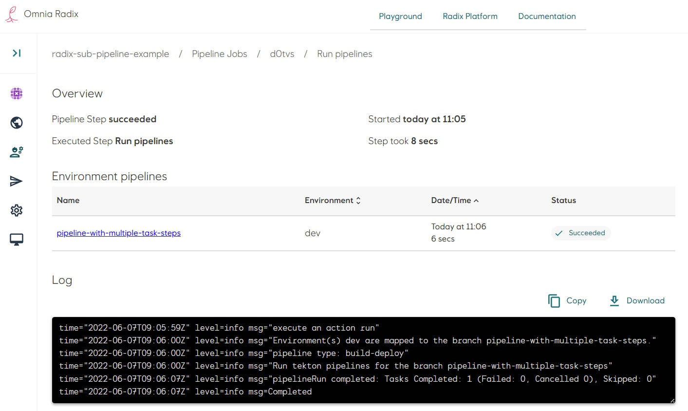
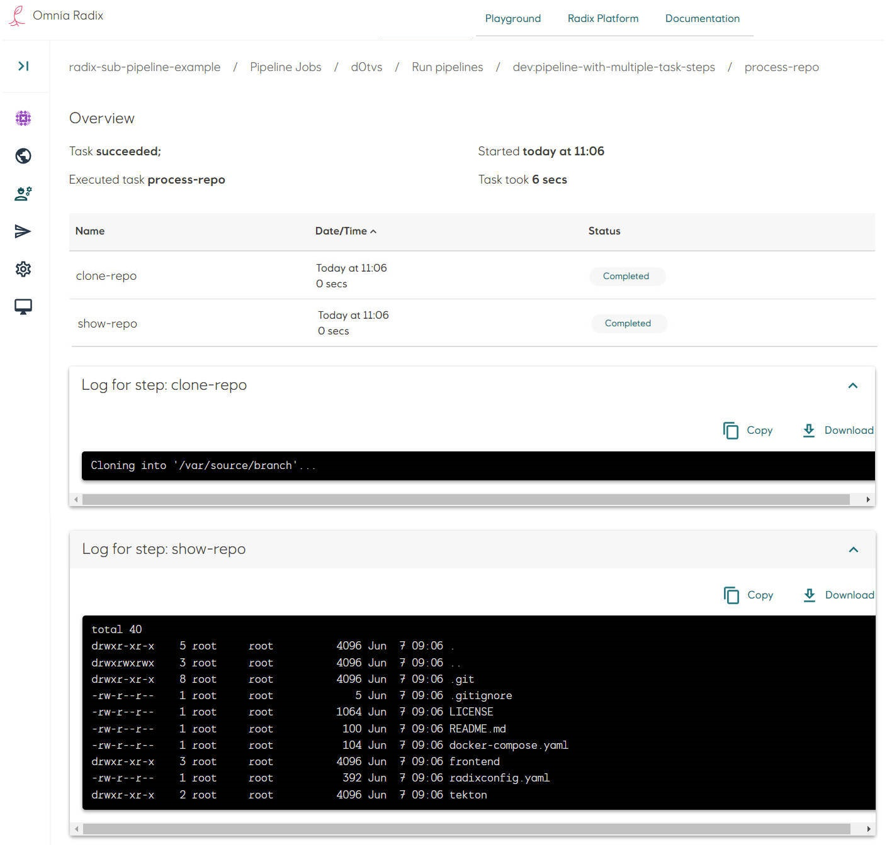

# Sub-pipeline example: Pipeline with multiple task steps

[Source code](https://github.com/equinor/radix-sub-pipeline-example/tree/pipeline-with-multiple-task-steps) for this example.

* In the Radix application repository create a folder `tekton`. This folder need to be on the root level of the repository, in the configuration branch (same as `radixconfig.yaml`) 
* The pipeline in this example runs a task, which has two steps. 
* Create a file `process-repo-task.yaml` for the task `process`. This task has two steps:
  * The first step is "clone-repo" runs in the container with Alpine Linux and Git CLI, pre-installed  on it. `Args` declares options of the Git CLI command, in this example - clone a branch of GitHub repo. This particular repo is public, no need for credentials to access it.
  * The second step is "show-repo" -it performs "processing" of cloned repository, in this example - it just shows its folder content. This "processing" can be a build of the source code, database migration script, etc. or it can be multiple steps
  * Both steps use the same shared volume, based on an "EmptyDir" - an empty volume, created, when the task starts, and deleted, when the task completed. This volume can be mapped within each step to a specified path of the step's container.
  * By default, if any a task steps fail - the execution of a step is stopped. Behavior of the step and step flow can be altered with fields [onError](https://tekton.dev/docs/pipelines/tasks/#specifying-onerror-for-a-step), [timeout](https://tekton.dev/docs/pipelines/tasks/#specifying-a-timeout), [exitCode](https://tekton.dev/docs/pipelines/tasks/#accessing-steps-exitcode-in-subsequent-steps), [params](https://tekton.dev/docs/pipelines/tasks/#specifying-parameters), etc.
  ```yaml
  apiVersion: tekton.dev/v1beta1
  kind: Task
  metadata:
    name: process
  spec:
    steps:
      - name: clone-repo                                          #step to clone a Git repository
        image: alpine/git                                         #Docker image with Git CLI
        args:
          - clone                                                 #command to clone the git repository
          - https://github.com/equinor/radix-sub-pipeline-example #the repository to be cloned
          - -b                                                    #clone specific branch
          - pipeline-with-multiple-task-steps                     #the branch to be cloned
          - /var/source/branch                                    #a folder, where to clone the repository
        volumeMounts:
          - name: source-volume                                   #using an empty volume, shared between this task steps
            mountPath: /var/source                                #path, where the common empty volume is mapped
  
      - name: show-repo                                           #step to process the repository, cloned in the step "clone-repo"
        image: alpine                                             #run a sh-script within a Alpine Linux container
                                                                  #"process" the cloned repository - here just show its folder
        script: |
          #!/usr/bin/env sh
          ls -la /var/cloned-repo/branch
        volumeMounts:
          - name: source-volume                                   #using the same volume, used in the step "clone-repo"
            mountPath: /var/cloned-repo                           #mount this volume to a folder "/var/cloned-repo"
    volumes:
      - name: source-volume                                       #a volume, which can be shared between task steps
        emptyDir: {}                                              #just an empty volume, being deleted after completion of the task
  ```
* Create a file `pipeline.yaml`. Add tasks in the `tasks` list: give them names (it can be any name, unique within this pipeline), in the property `taskRef` ("reference to a task") put the value from the property `metadata.name` of the tasks, created above:
```yaml
apiVersion: tekton.dev/v1beta1
kind: Pipeline
metadata:
  name: pipeline-with-multiple-task-steps
spec:
  tasks:
    - name: process-repo
      taskRef:
        name: process
```
* File structure can be like this:
```
├── tekton
│   ├── pipeline.yaml
│   └── process-repo-task.yaml
└── radixconfig.yaml
```
This pipeline runs the task `process-repo` (which reference to the task `process` described in the file `process-repo-task.yaml`), which has two steps, as described above. 

* Commit changes in the repository. Look at the details of a started Radix pipeline job (if the Radix app is connected to the GitHub WebHook, otherwise - start a job manually). 
* Navigate to the Radix pipeline step "Run pipeline", when it is running or completed: the pipelines overview page shows a table with a list of pipelines - in this example it is one pipeline "pipeline-with-multiple-task-steps", running for an environment "dev", and the pipeline status.
 
* Navigate to the pipeline (click on its name in the table row)
* The pipeline overview page shows a table with a list of this pipeline's tasks - in this example it is one task "process-repo", and the task status.
  )
* Navigate to the task (click on its name in the table row)
* The pipeline task overview page shows a table with a list of this task's steps - in this example these are steps "clone-repo", and "show-repo", the step statuses and logs of these steps.
  
