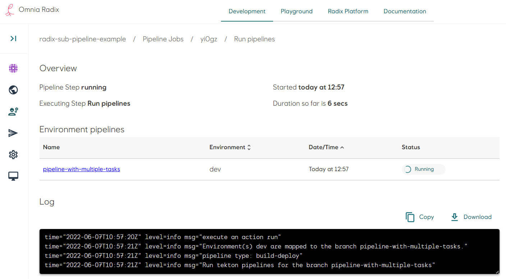
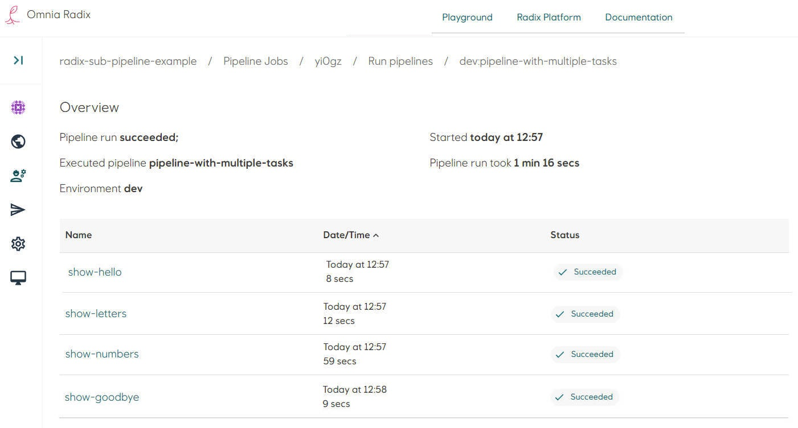
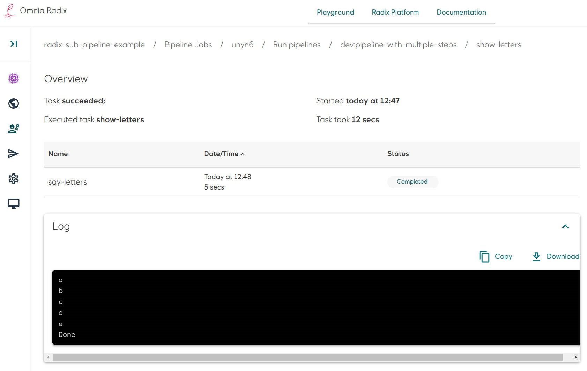

# Sub-pipeline example: Pipeline with multiple tasks

[Source code](https://github.com/equinor/radix-sub-pipeline-example/tree/pipeline-with-multiple-tasks) for this example.

* In the Radix application repository create a folder `tekton`. This folder need to be on the root level of the repository, in the configuration branch (same as `radixconfig.yaml`) 
* The sub-pipeline in this example runs multiple tasks.
* Create files with tasks. File names of tasks can be arbitrary (no any connection with a task actual name, used in a sub-pipeline), file extensions should be `yaml`.
  * Create a file `hello-task.yaml` for the task `hello`. This task runs in the container with Alpine Linux and execute one command `echo "Hello"`.
    ```yaml
    apiVersion: tekton.dev/v1beta1
    kind: Task
    metadata:
      name: hello
    spec:
      steps:
        - name: say-hello
          image: alpine
          command:
            - echo
          args:
            - "Hello"
    ```
  * Create a file `say-letters-task.yaml` for the task `letters`. This task runs in the container with a Python, within Alpine Linux and execute a script, put directly in the task description. The script prints few letters with 1 second interval. 
    ```yaml
    apiVersion: tekton.dev/v1beta1
    kind: Task
    metadata:
      name: letters
    spec:
      steps:
        - name: say-letters
          image: alpine
          script: |
            #!/bin/sh
            for i in "a" "b" "c" "d" "e"
              do echo $i
              sleep 1
            done
            echo "Done"
    ```
  * Create a file `say-numbers-task.yaml` for the task `numbers`. This task is similar to the task `letters`, but  its script prints few numbers with 2 second interval. This task runs longer then `letters` task to see running them in parallel. 
    ```yaml
    apiVersion: tekton.dev/v1beta1
    kind: Task
    metadata:
      name: numbers
    spec:
      steps:
        - name: say-numbers
          image: alpine
          script: |
            #!/bin/sh
            for i in "one" "two" "three" "four" "five" "six" "seven" "eight" "nine" "ten"
              do echo $i
              sleep 2
            done
            echo "Done"
    ```
  * Create a file `goodbye-task.yaml` for the task `goodbye`. This task runs in the container with a Python on Alpine Linux. The task executes a inline Python command `print('Goodbye')`.
    ```yaml
    apiVersion: tekton.dev/v1beta1
    kind: Task
    metadata:
      name: goodbye
    spec:
      steps:
        - name: say-goodbye
          image: python:alpine
          command:
            - python
          args:
            - "-c"
            - "print('Goodbye')"
    ```
* Create a file `pipeline.yaml`. Add tasks in the `tasks` list: give them names (it can be any name, unique within this sub-pipeline), in the property `taskRef` ("reference to a task") put the value from the property `metadata.name` of the tasks, created above:
```yaml
apiVersion: tekton.dev/v1beta1
kind: Pipeline
metadata:
  name: pipeline-with-multiple-steps
spec:
  tasks:
    - name: show-hello
      taskRef:
        name: hello

    - name: show-goodbye
      runAfter:
        - show-numbers
        - show-letters
      taskRef:
        name: goodbye

    - name: show-letters
      runAfter:
        - show-hello
      taskRef:
        name: letters
    - name: show-numbers
      runAfter:
        - show-hello
      taskRef:
        name: numbers
```
* File structure can be like this:
```
├── tekton
│   ├── pipeline.yaml
│   ├── hello-task.yaml
│   ├── say-letters-task.yaml
│   ├── say-numbers-task.yaml
│   └── goodbye-task.yaml
└── radixconfig.yaml
```
This sub-pipeline runs first the task `show-hello` (which reference to the task `hello` described in the file `hello-task.yaml`), then two tasks in parallel `show-numbers` and `show-letters` (referenced to the tasks `numbers` and `letter` correspondingly) - these tasks wait for completion of the task `show-hello` as both have set the _optional_ property `runAfter` 
```yaml
runAfter:
  - show-hello
```
The last task to be running is `show-goodbye` (which reference to the task `goodbye` described in the file `goodbye-task.yaml`). This tak is started after completion of both tasks `show-numbers` and `show-letters`, as it has set the _optional_ property `runAfter`, referenced to both these tasks
```yaml
runAfter:
  - show-numbers
  - show-letters
```
It is not important in which order to put the tasks - tasks can run in parallel or in a sequences, defined by fields [runAfter](https://tekton.dev/docs/pipelines/pipelines/#using-the-runafter-field), [conditions](https://tekton.dev/docs/pipelines/pipelines/#guard-task-execution-using-conditions), [from](https://tekton.dev/docs/pipelines/pipelines/#using-the-from-field). 

* Commit changes in the repository. Look at the details of a started Radix pipeline job (if the Radix app is connected to the GitHub WebHook, otherwise - start a job manually). 
* Navigate to the Radix pipeline step "Run pipeline", when it is running or completed: the pipelines overview page shows a table with a list of sub-pipelines - in this example it is one sub-pipeline "pipeline-example", running for an environment "dev", and the sub-pipeline status.
 
* Navigate to the sub-pipeline (click on its name in the table row)
* The pipeline overview page shows a table with a list of this sub-pipeline's tasks - in this example it is a list of tasks "show-hello", "show-letters", "show-numbers", "show-goodbye", and the task statuses.
  
* Navigate to the task (click on its name in the table row)
* The sub-pipeline task overview page shows a table with a task's step, with a name of a step, step status and the step log.
  
