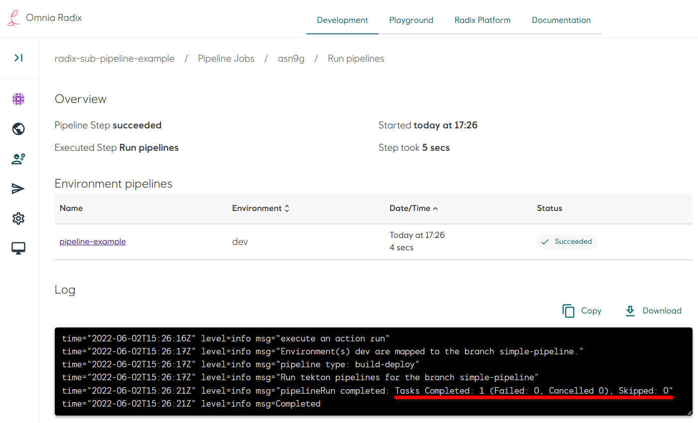
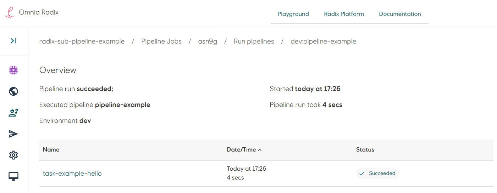

# Sub-pipeline example: Simple pipeline

[Source code](https://github.com/equinor/radix-sub-pipeline-example/tree/simple-pipeline) for this example.

* In the Radix application repository create a folder `tekton`. This folder need to be in the configuration branch and in the same folder, where `radixconfig.yaml` file is located - it is by default a root of the repository.
* The sub-pipeline in this example runs one task with a name `hello`. Create a file `hello-task.yaml` (file name can be arbitrary, file extension should be `yaml`). This task runs in the container with Alpine Linux and execute one command `echo "Hello"`.

```yaml
apiVersion: tekton.dev/v1beta1
kind: Task
metadata:
  name: hello
spec:
  steps:
    - name: say-hello
      image: alpine
      command:
        - echo "Hello"
```

* Create a file `pipeline.yaml`. Add a task in the `tasks` list: give it a name (it can be any name, unique within this sub-pipeline), in the property `taskRef` ("reference to a task") put the value from the property `metadata.name` of the task, created above:

```yaml
apiVersion: tekton.dev/v1beta1
kind: Pipeline
metadata:
  name: pipeline-example
spec:
  tasks:
    - name: task-example-hello
      taskRef:
        name: hello
```

* File structure should be like this:

```sh
/
├── tekton/
│   ├── pipeline.yaml
│   └── hello-task.yaml
└── radixconfig.yaml
```

* Commit changes in the repository. Look at the details of a started Radix pipeline job (if the Radix app is connected to the GitHub WebHook, otherwise - start a job manually).
* Navigate to the Radix pipeline step "Run pipeline", when it is running or completed: the pipelines overview page shows a table with a list of sub-pipelines - in this example it is one sub-pipeline "pipeline-example", running for an environment "dev", and the sub-pipeline status.
 
* Navigate to the sub-pipeline (click on its name in the table row)
* The pipeline overview page shows a table with a list of this sub-pipeline's tasks - in this example it is one task "task-example-hello", and the task status.
  
* Navigate to the task (click on its name in the table row)
* The sub-pipeline task overview page shows a table with a list of this task's steps - in this example it is one step "say-hello", the step status and the step log: text "Hello", printed by the command `echo "Hello"` in the Linux container.
  
