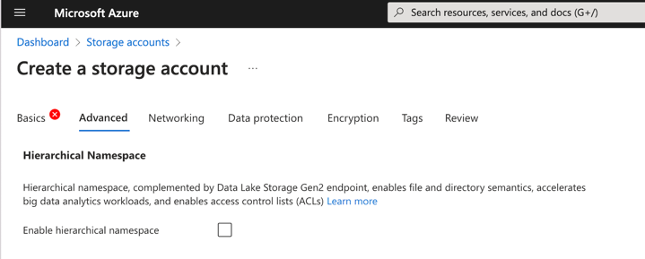
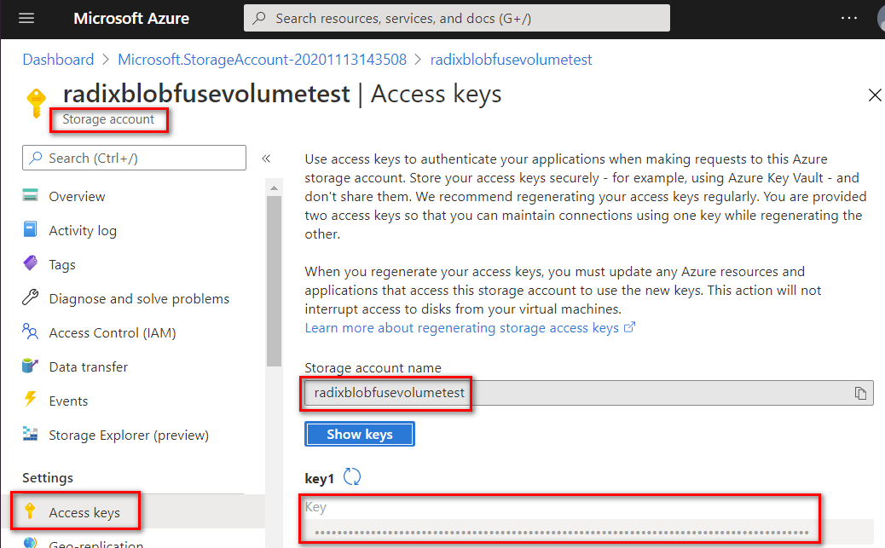
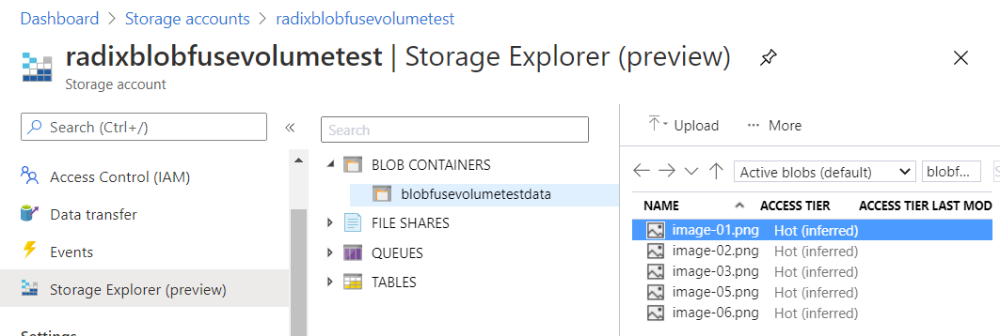
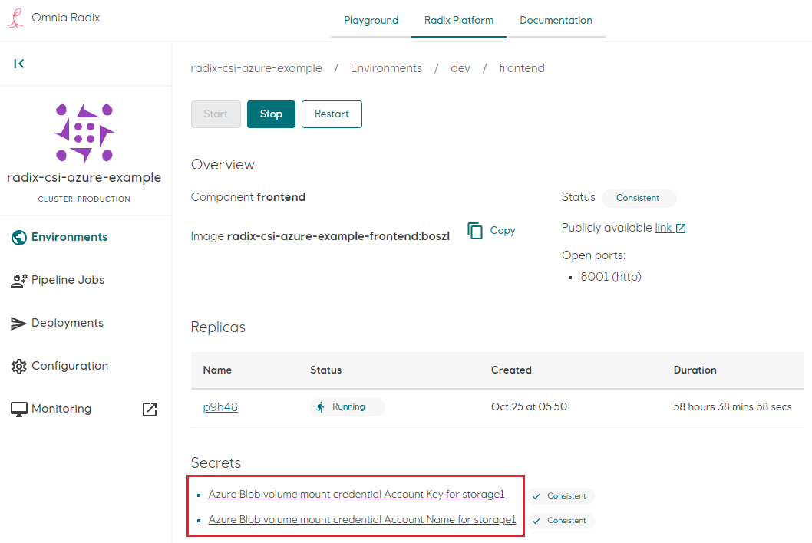
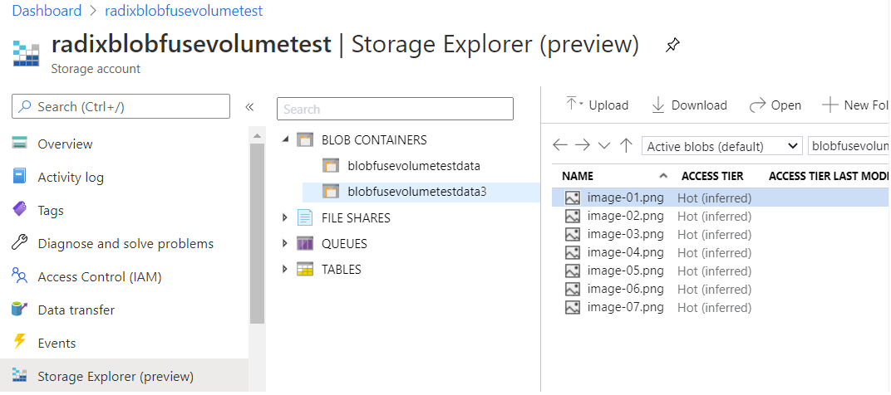
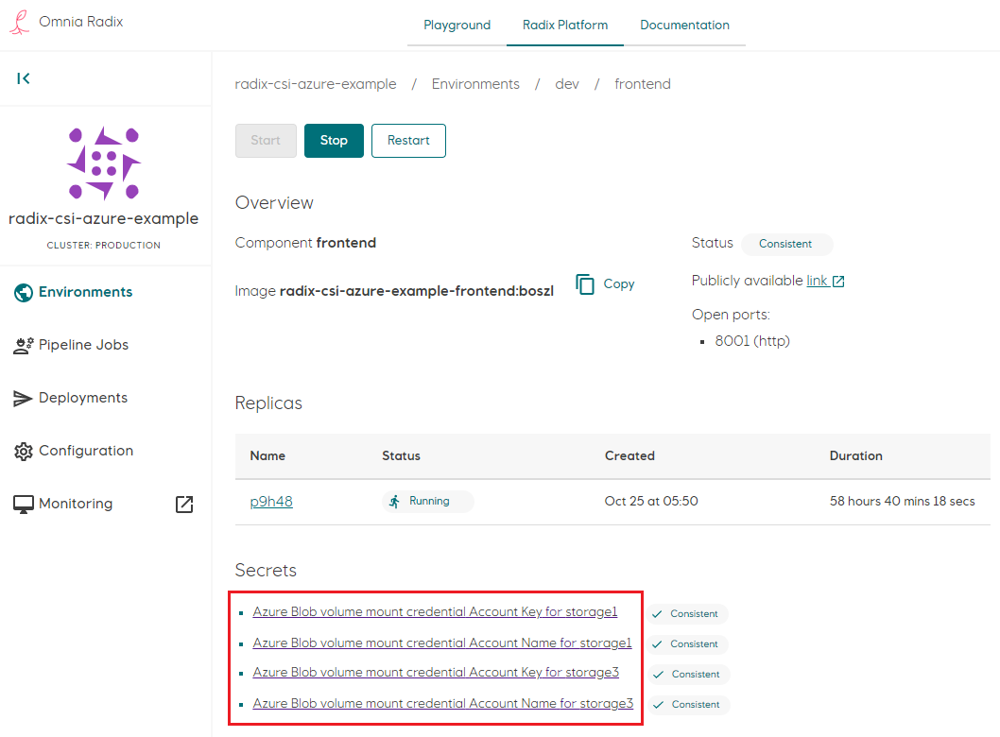

# Configuring and mount volumes

The supported volume mount type is to mount CSI Azure Blob Container, using CSI Azure blob driver for Kubernetes. See [this](https://github.com/kubernetes-sigs/blob-csi-driver) for more information.
::: tip
* BlobFuse FlexVolume is considered obsolete and recommended being replaced with CSI Azure blob driver.
* BlobFuse v1 CSI Azure blob driver is considered obsolete and recommended being replaced with BlobFuse2.
:::

In order to make use of this functionality you have to:

- Retrieve necessary values from [Azure Storage Account](https://learn.microsoft.com/en-us/azure/storage/common/storage-account-overview) with [BlobFuse2 - a Microsoft supported Azure Storage FUSE driver](https://learn.microsoft.com/en-us/azure/storage/blobs/blobfuse2-what-is). 

### Supported features
* [Hierarchical file system](https://learn.microsoft.com/en-us/azure/storage/blobs/data-lake-storage-namespace) in the Storage Account, particularly [Azure Data Lake Storage Gen2](https://docs.microsoft.com/en-us/azure/storage/blobs/data-lake-storage-introduction). In this case an option `useAdls` should be set to `true` in the [radixconfig](../../references/reference-radix-config/#volumemounts).
 
* File streaming, when there is no file caching on nodes. In this case an option `streaming.enabled` should be set to `true` in the [radixconfig](../../references/reference-radix-config/#volumemounts) (it is `true` by default). Streaming file operations are slower than with use of cache, but it is more reliable, and it is recommended to use it, particularly for large files. More details about streaming can be found [here](https://learn.microsoft.com/en-us/azure/storage/blobs/blobfuse2-what-is#streaming)

## Account name and key


Name of container


- Define the volume mounts for the environment in the [radixconfig.yaml](../../references/reference-radix-config). The container should match the one found in step 1

```yaml
environmentConfig:
  - environment: dev
    volumeMounts:
      - name: storage
        path: /app/image-storage
        blobfuse2:
          container: blobfusevolumetestdata
```

- After environment has been built, set the generated secret to key found in step 1. This should ensure that key value is Consistent status. It is recommended to restart a component after a key has been set in the console



This results in the Kubernetes deployment holding the volume mount in PersistentVolumeClaim and its StorageClass:

```yaml
spec:
  containers:
    - env:
  ...
volumeMounts:
  - mountPath: /app/image-storage
    name: csi-az-blob-frontend-storage1-blobfusevolumetestdata
  ...
volumes:
  - name: csi-az-blob-frontend-storage-blobfusevolumetestdata
    persistentVolumeClaim:
      claimName: pvc-csi-az-blob-frontend-storage-blobfusevolumetestdata
```

and files appear inside the container. If there are folders within blob container - it will exist in the pod's container as well

```sh
kubectl exec -it -n radix-csi-azure-example-dev deploy/frontend -- ls -l /app/image-storage
total 0
-rwxrwxrwx    1 root     root         21133 Nov 13 13:56 image-01.png
-rwxrwxrwx    1 root     root         21989 Nov 13 13:56 image-02.png
-rwxrwxrwx    1 root     root         47540 Nov 26 14:51 image-04.png
-rwxrwxrwx    1 root     root         48391 Nov 26 14:50 image-06.png
-rwxrwxrwx    1 root     root         47732 Nov 26 14:50 image-07.png
```

Multiple volume mounts are also supported

- for multiple blob-containers within one storage account
- for containers within multiple storage accounts
- for containers within storage accounts within multiple subscriptions and tenants

Not supported mount from same blob container to different folders within one component.

Multiple containers within one storage account


To add multiple volumes

- Define the volume mounts for the environment in the [radixconfig.yaml](../../references/reference-radix-config).
  - add more `volumeMounts`, with `name`-s, unique within `volumeMounts` of an environment (do not use storage account name as this `name` as it is not secure and can be not unique)
  - specify `container` names for each `volumeMount`. The `container` should match the one found in step 1
  - specify `path` for each `volumeMount`, unique within `volumeMounts` of an environment

  ```yaml
  environmentConfig:
    - environment: dev
      volumeMounts:
        - name: storage1
          path: /app/image-storage
          blobfuse2:
            container: blobfusevolumetestdata
            uid: 1000
        - name: storage3
          path: /app/image-storage3
          blobfuse2:
            container: blobfusevolumetestdata3
            uid: 1000
  ```

- After environment has been built, set the generated secret to account name and key, found in step 1 - for each volume. This should ensure that key value is Consistent status. It is recommended to restart a component after a all secrets have been set in the console



This results in the Kubernetes deployment holding the volume mounts in its spec:

```yaml
spec:
  containers:
    - env:
  ...
volumeMounts:
  - mountPath: /app/image-storage
    name: csi-az-blob-frontend-storage1-blobfusevolumetestdata
  - mountPath: /app/image-storage3
    name: csi-az-blob-frontend-storage3-blobfusevolumetestdata3
  ...
volumes:
  - name: csi-az-blob-frontend-storage1-blobfusevolumetestdata
    persistentVolumeClaim:
      claimName: pvc-csi-az-blob-frontend-storage1-blobfusevolumetestdata
  - name: csi-az-blob-frontend-storage3-blobfusevolumetestdata3
    persistentVolumeClaim:
      claimName: pvc-csi-az-blob-frontend-storage3-blobfusevolumetestdata3
```

and files appear inside the container

```sh
kubectl exec -it -n radix-csi-azure-example-dev deploy/frontend -- ls -lR /app
/app:
total 4
drwxrwxrwx    2 root     root          4096 Dec 11 15:10 image-storage
drwxrwxrwx    2 root     root          4096 Dec 11 15:10 image-storage3
-rw-r--r--    1 root     root          1343 Dec 11 11:52 index.html

/app/image-storage:
total 0
-rwxrwxrwx    1 root     root         21133 Nov 13 13:56 image-01.png
-rwxrwxrwx    1 root     root         21989 Nov 13 13:56 image-02.png
-rwxrwxrwx    1 root     root         47540 Nov 26 14:51 image-04.png
-rwxrwxrwx    1 root     root         48391 Nov 26 14:50 image-06.png
-rwxrwxrwx    1 root     root         47732 Nov 26 14:50 image-07.png

/app/image-storage3:
total 0
-rwxrwxrwx    1 root     root         27803 Dec 11 11:11 image-01.png
-rwxrwxrwx    1 root     root         28692 Dec 11 11:11 image-02.png
-rwxrwxrwx    1 root     root         29008 Dec 11 11:11 image-03.png
-rwxrwxrwx    1 root     root         59023 Dec 11 11:11 image-04.png
-rwxrwxrwx    1 root     root         28732 Dec 11 11:11 image-05.png
-rwxrwxrwx    1 root     root         60062 Dec 11 11:11 image-06.png
-rwxrwxrwx    1 root     root         59143 Dec 11 11:11 image-07.png
```
