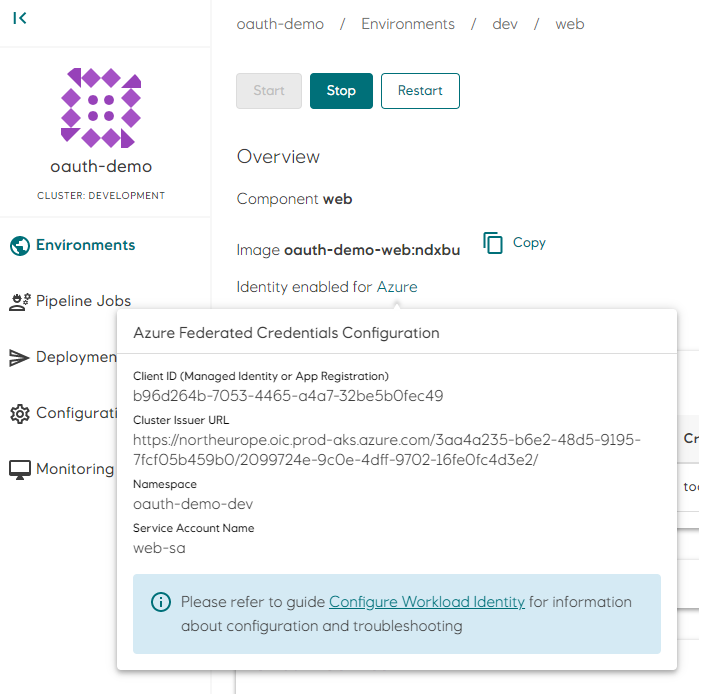

# Workload Identity

Many workloads (components or jobs) running in Radix require credentials (JWT access tokens) for an **Azure AD application** or **user-assigned managed identity** to access Azure AD protected resources, like MS Graph, Key Vaults, Storage Accounts or Azure SQL Databases. Credentials for these types of workloads can be aquired using the [Oauth 2.0 client credentials flow](https://learn.microsoft.com/en-us/azure/active-directory/develop/v2-oauth2-client-creds-grant-flow). The **client credentials flow** permits a workload to use its own credentials to access protected resources, instead of impersonating a user, and credentials can be aquired by using either a shared secret, a certificte or with [federated credentials](https://learn.microsoft.com/en-us/azure/active-directory/develop/v2-oauth2-client-creds-grant-flow#third-case-access-token-request-with-a-federated-credential).

Using shared secrets or certificates pose a security risk as they have to be stored securely and rotated regularly. with **federated credentials**, a trust between the [workload identity](https://learn.microsoft.com/en-us/azure/active-directory/develop/workload-identity-federation) and an **Azure AD application** or **user-assigned managed identity** is established. The **workload identity** is a JSON Web Token (JWT) mounted as a file inside the workload's container.

## Configure Workload Identity in Radix

**Workload identity** for a component or job is configured in the [identity](../../references/reference-radix-config/#identity) section in [radixconfig.yaml](../../references/reference-radix-config/). When configured, a file with the **workload identity** (JWT) is mounted into the running container. The full path and name of this file is set in an environment variable with name **AZURE_FEDERATED_TOKEN_FILE**, e.g. */var/run/secrets/azure/tokens/azure-identity-token*.

The following environment variables are set when `identity` is configured in `radixconfig.yaml`
- **AZURE_FEDERATED_TOKEN_FILE** - path to the file containing the workload identity JWT
- **AZURE_CLIENT_ID** - the value of `clientId` in `identity`
- **AZURE_AUTHORITY_HOST** - The base URL to Azure identity provider (https://login.microsoftonline.com/)
- **AZURE_TENANT_ID** - The tenant ID to use when aquiring tokens from the Azure identity provider (3aa4a235-b6e2-48d5-9195-7fcf05b459b0)

Information required for setting up the trust relationship between a workload and the **Azure AD application** or **user-assigned managed identity** is available on the component/job page in Radix Web Console.
  

## Configure Trust Relationship in Azure

Setting up the trust relationship between the 


## SDK and Examples

The [Azure Identity SDK](https://azure.github.io/azure-workload-identity/docs/topics/language-specific-examples/azure-identity-sdk.html) for *Go*, *C#/.NET*, *Javascript/Typescript*, *Python* and *Java* has native support for **workload identity federation**, and will use the **AZURE_\*** environment variables internally to aquire credentials for accessing protected Azure resources.

[Examples](https://azure.github.io/azure-workload-identity/docs/topics/language-specific-examples/msal.html) on how to use **workload identity federation** with [MSAL](https://learn.microsoft.com/en-us/azure/active-directory/develop/msal-overview)

[Azure CLI](https://learn.microsoft.com/en-us/cli/azure/) can also login using federated credentials:

```
# Login
az login --service-principal -u $AZURE_CLIENT_ID --tenant $AZURE_TENANT_ID --federated-token $(cat $AZURE_FEDERATED_TOKEN_FILE) --allow-no-subscriptions

# Read a secret from a key vault that the logged on service principal has access to
MYSECRET=$(az keyvault secret show -n mysecret --vault-name mykeyvault --query value -o tsv)
```
