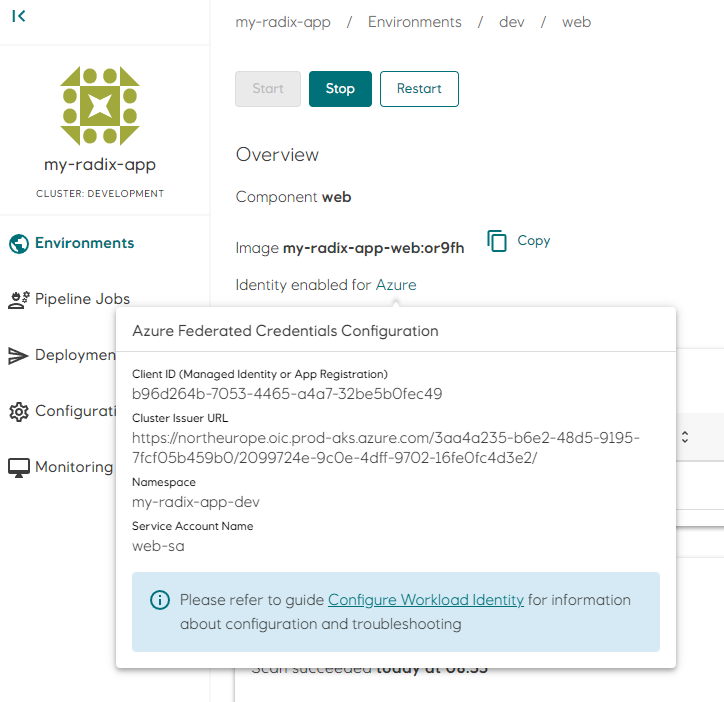

# Workload Identity

Many workloads (components or jobs) running in Radix require credentials (JWT access tokens) for an **Azure AD application** or **managed identity** to access Azure AD protected resources, like MS Graph, Key Vaults, Storage Accounts or Azure SQL Databases. Credentials for these types of workloads can be aquired using the [Oauth 2.0 client credentials flow](https://learn.microsoft.com/en-us/azure/active-directory/develop/v2-oauth2-client-creds-grant-flow). The **client credentials flow** permits a workload to use its own credentials to access protected resources, instead of impersonating a user, and credentials can be aquired by using either a shared secret, a certificte or with [federated credentials](https://learn.microsoft.com/en-us/azure/active-directory/develop/v2-oauth2-client-creds-grant-flow#third-case-access-token-request-with-a-federated-credential).

Using shared secrets or certificates pose a security risk as they have to be stored securely and rotated regularly. with **federated credentials**, a trust between the [workload identity](https://learn.microsoft.com/en-us/azure/active-directory/develop/workload-identity-federation) and an **Azure AD application** or **managed identity** is established. The **workload identity** is a JSON Web Token (JWT) mounted as a file inside the workload's container.

## Configure workload identity in Radix

**Workload identity** for a component or job is configured in the [identity](../../references/reference-radix-config/#identity) section in [radixconfig.yaml](../../references/reference-radix-config/).  
The value of `clientId` is either the *Application (client) ID* for an Azure AD application or the *Client ID* for a managed identity.

```yaml
apiVersion: radix.equinor.com/v1
kind: RadixApplication
metadata:
  name: my-radix-app
spec:
  environments:
    - name: prod
    - name: dev
  components:
    - name: web
      identity:
        azure:
          clientId: b96d264b-7053-4465-a4a7-32be5b0fec49
  ...
```

Information required for setting up the trust relationship between a workload and the **Azure AD application** or **user-assigned managed identity** is available on the component/job page in Radix Web Console.
  

## Configure trust relationship in Azure

Create a trust relationship (federated credential) between the workload (component or job) running in Radix and the application or managed identity in Azure. A trust must be created per environment and workload. In the example above there are two environments (**prod** and **dev**) and one workload (**web**). Two trust relationships must therefore be created; one for **web** in **dev** environment and one for **web** in **prod** environment.

To create a trust relationship, open the [Azure Portal](https://portal.azure.com/), navigate to the *Azure AD application* or *managed identity* configured in `clientId` and open the *Federated credentials* page.

For *Azure AD applications*, the page is located in *Certificates & secrets*
  

For *managed identities*, the page is located in *Federated credentials*
  

Click **Add Credential** and select **Kubernetes accessing Azure resources** in the drop-down. Fill out the required fields **Cluster Issuer URL**, **Namespace** and **Service Account** with information from the component/job page in Radix Web Console. Enter a value in the **Name** field that uniquely describes the federated credential, e.g. *my-radix-app_dev_web*. Click **Add** to save the changes.
  

## Aquire credentials to access protected Azure resources

When workload identity is configured for a component or job, the following environment variables are set in the running container:
- **AZURE_FEDERATED_TOKEN_FILE** - path to the file containing the workload identity JWT (e.g. */var/run/secrets/azure/tokens/azure-identity-token*)
- **AZURE_CLIENT_ID** - the value of `clientId` in the `identity` configuration section (e.g. *b96d264b-7053-4465-a4a7-32be5b0fec49*)
- **AZURE_AUTHORITY_HOST** - The base URL to Azure identity provider (e.g. *https://login.microsoftonline.com/*)
- **AZURE_TENANT_ID** - The tenant ID to use when aquiring tokens from the Azure identity provider (e.g. *3aa4a235-b6e2-48d5-9195-7fcf05b459b0*)

Combine **AZURE_AUTHORITY_HOST** and **AZURE_TENANT_ID** to build the token endpoint URI for requesting access tokens, e.g. *https://login.microsoftonline.com/b96d264b-7053-4465-a4a7-32be5b0fec49/oauth2/v2.0/token

The file defined by **AZURE_FEDERATED_TOKEN_FILE** contains a JWT which identifies the current workload, and is used as the **client_assertion** value when requesting access tokens for Azure resources using the [OAuth 2.0 client credentials flow with federated credentials](https://learn.microsoft.com/en-us/azure/active-directory/develop/v2-oauth2-client-creds-grant-flow#third-case-access-token-request-with-a-federated-credential).

**AZURE_CLIENT_ID** should be used as the **client_id** value in the token request.

It is recommended to use trusted SDKs/libraries (see examples) to handle the client credentials flow.

```bash
curl ${AZURE_AUTHORITY_HOST}${AZURE_TENANT_ID}/oauth2/v2.0/token \
	-X POST \
	-d "scope=https%3A%2F%2Fgraph.microsoft.com%2F.default&client_id=${AZURE_CLIENT_ID}&client_assertion_type=urn%3Aietf%3Aparams%3Aoauth%3Aclient-assertion-type%3Ajwt-bearer&client_assertion=$(cat $AZURE_FEDERATED_TOKEN_FILE)&grant_type=client_credentials"
	
```

## SDKs and examples

The [Azure Identity SDK](https://azure.github.io/azure-workload-identity/docs/topics/language-specific-examples/azure-identity-sdk.html) for *Go*, *C#/.NET*, *Javascript/Typescript*, *Python* and *Java* has native support for **workload identity federation**, and will use the `AZURE_*` environment variables internally to aquire credentials for accessing protected Azure resources.

[Examples](https://azure.github.io/azure-workload-identity/docs/topics/language-specific-examples/msal.html) on how to use **workload identity federation** with [MSAL](https://learn.microsoft.com/en-us/azure/active-directory/develop/msal-overview)

[Azure CLI](https://learn.microsoft.com/en-us/cli/azure/) can also login using federated credentials:

```
# Login
az login --service-principal -u $AZURE_CLIENT_ID --tenant $AZURE_TENANT_ID --federated-token $(cat $AZURE_FEDERATED_TOKEN_FILE) --allow-no-subscriptions

# Read a secret from a key vault that the logged on service principal has access to
MYSECRET=$(az keyvault secret show -n mysecret --vault-name mykeyvault --query value -o tsv)
```
