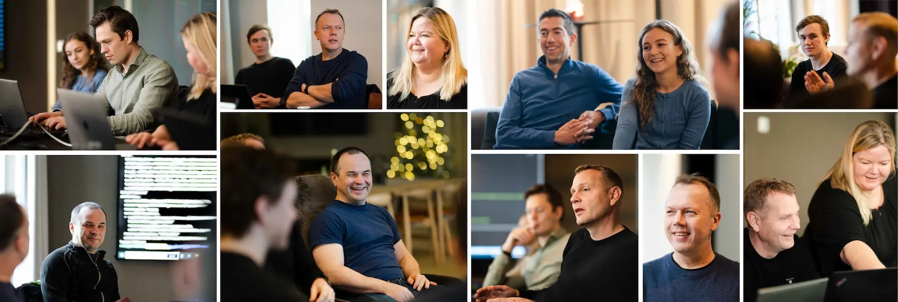
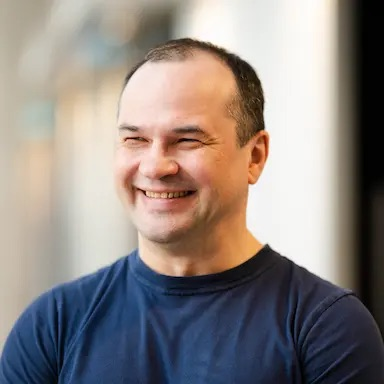

<h1 class="main-heading centered">There’s no place like Radix</h1>

February, 2023

#### Users love the platform, and the platform loves its users. Here’s why Radix, our own devops PaaS, has become such a success.

We last met Radix in 2019, when it had just launched and was ready to steam ahead. Three years later, it’s become a staple in many of our software development projects and a key component in more than 245 applications – a number that keeps on growing.

In short, Radix is a devops Platform-as-a-Service (PaaS) that builds, deploys and monitors applications. You provide your code, a Docker file that can build it and Radix takes it from there. Basically, it automates the basics and lets developers focus on building the app.

The large number of applications running on their platform is not just because of how much easier it makes a developer’s life. Just answering questions and providing support to the entire user base would have been a full-time position but now they have a support team of more than 200 people.

“Considering how many different technologies that are in use on different apps, we wouldn’t have been able to provide as quick support as the community does either,” Radix developer Nils Gustav Stråbø explains.

>*Radix has hundreds of committed users who register issues, suggest improvements, report bugs and provide support to each other. They are the true source of Radix’s success and play a big role in driving us forward and deciding what features we need.* 
> 
>**Nils Gustav Stråbø, Radix developer**
 
 
 

Creating a good developer experience is key for Radix, and a core mantra is “it should be easy to do it right” - meaning the platform should support recommended ways of solving common problems. For Equinor, this means building a platform on top of existing open source frameworks and libraries, and that the Radix code as much as possible acts as glue to bind these components together.

# Finding an easier way

With that in mind, there’s only one thing to do: find these users to see if the Radix love goes both ways! Our research into the Radix universe gave us three different use cases: a one-man team with a simple webapp, a 70-person strong team with several apps and one team who needed some special attention.

The journey begins with Philipp Affolter, Leading Advisor Cloud Infrastructure, who was inspired by the IT Professional Network webapp and wanted to setup a similar site for the IT Cloud Network he organizes.

>*My first attempt had me submitting requests through ServiceNow for DNS-entries, certificates and whatnot across two weeks with little progress made. It made me think that ‘there has to be a more reasonable way of doing this’. That’s when I heard of Radix, and that had me up and running in a couple of hours.* 
> 
>**Philipp Affolter, Leading Advisor Cloud Infrastructure**
 
 

He got in touch with the team to find out if setting up Radix was a big task to undertake, but quickly found out that all it takes is a Docker-file, authentication and off you go! Gone were the days of installing the app and monitoring separately or spending hours on maintenance and updates.

“While my webapp is very basic and was simple to set up, the core functionality is the same for apps of any size. I just had to ‘hand over’ my app and then Radix handles everything else for me, so I can focus on developing my app instead of spending time on the ‘boring details’," Philipp tells us.

Nils Gustav and Elsa during a Radix team workshop.

# Size doesn’t matter

We’ve established that Radix was a good fit for a one-man team with a very simple webapp, but what about the big teams who maintain several different applications? Could it still be a good fit?

Ronnie Henriksen Laugen is part of the Oil Trade team, who manage 7 applications that vary in complexity and how much of Radix’ functionality they use and explains that yes it can!

“The main selling point for us was the easy scalability that Radix provides, while also letting us take full advantage of Kubernetes without having to run our own cluster - at a fraction of the cost,” Ronnie says.

Since Radix saw first light in 2019, several other PaaS’ have been launched – including one in Microsoft Azure. But there are clear advantages to having our very own PaaS.

>*One of the biggest advantages to Radix is that it’s Equinor’s own. We can play an active part in what direction the platform takes and make sure that the features that are developed are the ones we need in Equinor.*
>
>**Ronnie Henriksen Laugen**

One clear example of having such a direct influence on development are SOX-critical applications: applications that need to meet strict financial regulations that limit access to certain systems.

“Because we can influence the platform itself, we have been able to get all the functionality in place to have these SOX-critical applications running on Radix in the future,” Ronnie explains.

“I think Radix is a good fit for 90% of our applications and should really be the first stop on your journey. The more applications that use Radix, the more features we’ll see, making it the best choice for all of us in the long run,” he adds.

The current Radix team took over in 2020, and Sergey has been part of the group since then.
Anneli works part-time as a Radix developer during her university studies.

# Dealing with special requests

So, Radix is a good match for applications both big and small, but what about the ones that need a little special care and solutions? To answer that question, we turn to Nils Magne Lunde, team lead for the ‘Heap Purple’ team that deals with all things technical for equinor.com.

They went down the Radix route for two simple reasons. Number one being it’s a pre-approved solution, greatly reducing the need for any bureaucracy, and reason number two being it’s developed in-house – meaning help is right around the corner

>*Once we got everything up and running, we did face some challenges both in terms of performance and the tech that we use. But because Radix is so flexible, we were able to move the build-environments out of Radix and into GitHub repos. This flexibility meant we could do things exactly like we needed.*
>
>**Nils Magne Lunde**

One of the reasons why they needed to take the build process out of Radix was due to how they work with rollbacks and updates. While all Radix apps have promotion and rollback functionality, the Heap Purple team’s needs were a bit different.

“All Radix apps can promote from one environment to another, but what makes our case special is that we have separate containers for both the different sites and environments. For that reason, we could not use the built-in Radix functionality," Nils Magne tells us.

A moment of concentration during a Radix workshop.

Pairing this together with more than 12 websites and 24 containers per environment running at once, you need to be sure that you’re deploying the right update to the right site - at the right time.

"We can’t roll equinor.com back to a previous version of Equinor Japan for example,” Nils Magne says.

“We also had to be sure that if some of the other apps had an issue or went down that it wouldn’t affect us – or the other way around. There are also extra security layers specifically for us that we had to be sure wouldn’t negatively affect any of the other apps,” he adds.

Team workshops aren’t all work – they're also an excellent opportunity to get together with your colleagues.
Sondre spends his time as a developer on Radix. 

# Security and cutting-edge tech

We’ve heard what the users think, but what about the Radix team themselves? For Magnus Longva, who joined the team in 2021, it was almost like a dream come true. He’d seen first-hand the problems developers faced when moving to the cloud and was hoping to be able to work on a platform project that reduced those very bottlenecks.

>*Working on Radix means helping to make the cloud journey easier and better for developers, while working with cutting edge technology in the largest company in Norway. To me, that’s an excellent combo.* 
> 
>**Magnus Longva, Radix developer**
 
 
 
 

He tells us that this strong community of users makes the work feel much more meaningful. Magnus works with infrastructure and has a special place in his developer heart for security issues – and working on Radix means being able to better security for more than just a single app.

“Ultimately, it’s the developers on each app’s responsibility to make sure they create secure code, but we make it hard to commit certain infrastructure pitfalls by providing opinionated defaults. Since we have so many applications running on Radix, the work we do has the potential to make a real impact,” Magnus explains.

Svein-Petter is ready to tackle whatever problems come the team’s way during the workshop...
...just like the rest of the 9-person strong team.

# A dynamic day to day

Not only does the work they do have a real impact, but they get to work with modern technologies that are constantly evolving. This makes for quite a dynamic day-to-day, Sergey Smolnikov tells us:

> *We get work with so many different technologies that are always changing - together with so many different, talented developers, and we’re always learning something new. This dynamic aspect, together with how fast we deliver new, usable features to our users, are my two favorite parts of being on the team.* 
> 
>**Sergey Smolnikov**
 
 

This way of working, with a platform providing a way of solving a variety of tasks for different applications, he believes is the way forward – especially when there is such a low threshold to join and a lot of documentation readily available.

“It's a little like Lego, all your team has to do is to develop some small, specific bricks that connect your creation to the big infrastructure that Radix provides – and off you go,” Sergey says.

Working as a fullstack-developer, Sergey has been part of the team since they replaced the first team and took over the project back in 2020. A team that deserves a proper tip of the hat, he says:

“The previous team did a great job when they built Radix, and I really like the choices they made in technology and how they designed it. The work they did has made it easy for us to keep working and improving,” Sergey explains.

We should probably try to wrap this up with a paragraph or two about what’s in store for the future of Radix but seeing how quickly they develop new features we’d be at risk of being outdated by the time you’re reading this. So, we won’t!

Instead, we’d recommend you meet the community on Slack or read up on their documentation – before coming back to Loop for a new story from our software development community.

Until then, stay safe and take care!

<h1 class="centered">Meet the team</h1>

    

        
        Elsa Mäyrä Irgens
    

    

        
        Magnus Longva
    

    

        
        Nils Gustav Stråbø
    

    

        
        Sergey Smolnikov
    

    

        
        Anneli Walla Aune
    

    

        
        Svein-Petter Johnsen
    

    

        
        Sondre Sjølyst
    

    

        
        Fredrik Hatletvedt
    

    

        
        Øyvind Rønne
    

