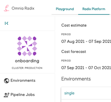
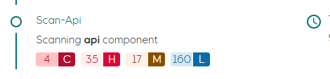

# What's new

## 2022

### 2022-02-01 Aupport for Azure Key vault

[Azure Key vault](https://docs.microsoft.com/en-us/azure/key-vault/general/basic-concepts) secrets, keys and certificates can be used in Radix as secrets. Once configured, they are available in replicas of Radix application as environment variables and files.  

Read more in secretref section in [radixconfig.yaml](https://www.radix.equinor.com/references/reference-radix-config/#secretrefs) and [Azure Key vaults](https://www.radix.equinor.com/guides/azure-key-vaults/) guide.

### 2022-02-01 Build-in configuration for OAuth2 authorization

Radix provides built-in configuration for adding OAuth2 authorization with OIDC to the component. Common `oauth2` settings can be configured at component level and/or in the component's `environmentConfig` section. When OAuth2 is configured for a component, Radix creates an OAuth2 service (using [OAuth2 Proxy](https://oauth2-proxy.github.io/oauth2-proxy/)) to handle the OAuth2 authorization code flow, and to verify the authorization state of incoming requests to the component.  

Read more in the OAuth section in [radixconfig.yaml](https://www.radix.equinor.com/references/reference-radix-config/#oauth2) documentation and the [OAuth guide](https://www.radix.equinor.com/guides/authentication/#using-the-radix-oauth2-feature).  

### 2022-01-11 Changes to validation of radixconfig 

Two new validation rules now apply to radixconfig.  
(1) Component ports lower than **1024** are prohibited.  
(2) Environment variables prefixed with **RADIX_** or **RADIXOPERATOR_** are prohibited.  

## 2021

### 2021-12-09 Active cluster IPs as environment variable

The IPs actively assigned the the cluster of which an application is deployed to are now added to the Radix environment variable RADIX_ACTIVE_CLUSTER_EGRESS_IPS. This environment variable contains a list of IPs which are used for outgoing traffic from the cluster and is added to every component.  

### 2021-11-23 Cluster IPs

Cluster IPs are now visible in the [About page (Radix Platform)](https://console.radix.equinor.com/about) or [About page (Radix Playground)](https://console.playground.radix.equinor.com/about) of Radix Web Console.  

### 2021-11-18 - Radix Slack Alerts

We have released a new feature in Radix for sending alerts to Slack if a pipeline job fails, or a component or job fails to start or crashes/restarts (e.g. due to insufficient memory, unhandled exceptions etc.).  
Read the documentation, https://www.radix.equinor.com/guides/alerting/,  on how to configure alerting for your application.  

PS! The alert GUI in Radix web console is still "work in progress". We're working with EDS to make it more aligned with the EDS design standard.  

### 2021-10-29 - New design - Radix documentation - Public site

The [Radix documentation site](https://www.radix.equinor.com/) has now been updated to a brand new version with a new design. And last but not least, now also with a SEARCH function.  
The most used page - [radixconfig.yaml reference](https://www.radix.equinor.com/references/reference-radix-config/) can be easily located under the Reference heading.

### 2021-10-14 - Radix CLI - New version

New version of the [Radix CLI](https://github.com/equinor/radix-cli) is now available. [Version v1.0.7](https://github.com/equinor/radix-cli/releases/tag/v1.0.7)

### 2021-09-09 - New Radix Web Console

#### New design

The Radix Web Console has been redesigned in all its glory in accordance with the EDS Design Guidelines. This includes a more responsive design, new colors, new navigation, collapsable menus, icons, fonts and more!  



#### Improved vulnerability scanning

The results from the vulnerability scanning running on all components deployed to Radix are now visualized in the Pipeline Job page as a count of Critical, High, Medium and Low severity. The details of each vulnerabilities can be inspected in the Vulnerability page. This scanning is now performed by Snyk (due to rate limits in Trivy scans)  

  

[Vulnerability scanning - more information](../../docs/topic-concepts#scanning-images-for-security-issues)

#### Favourites

Users now have the ability to favourite their most precious applications! (We all have at least one 😉)  

The new favourites section can be found at the top of the Applications page, making it easier to get an overview of what's important to you amongst the ever increasing list of available applications.  
Favourites are local and stored in the browser cache.


#### Environment variables

Environment variables can now be overridden from the Radix Web Console. Previously users would have to make changes to their `radixconfig.yaml` file and redeploy it to change the value of environment variables.  

> Note that you will need to restart the component, or for jobs a new job should be started, for your changes to take effect.


[Environment variables documentation](../../guides/environment-variables/)

#### Performance improvement

The Applications page can now load up to 5x faster than before. Due to the increase in the number of applications, the load time of the Applications page had become way too long (due to the chain of Kubernetes queries needed to determine which applications a user have access to). With this improvement the page loads in a few seconds. Future improvements will be considered if/when needed.  

### 2021-09-01 - Radix Security Policy - enforce 'Run as non-root'

As you may know, Docker containers have root privileges enabled by default. This is unnecessary and can introduce security risks and vulnerabilities into your applications. The policy will technically configure the PodSecurityContext for your application.  

From now on every time you (build and) deploy your app, Radix will not allow applications to run as root. If you have not configured the app correctly, an error will be logged in Events (Events section can be found in the Environments page). The new image will not be deployed and the previous image will remain running.  
If by any circumstance the pod running your app restarts, for instance due to lack of required memory, all applications running on it will also be restarted. Any app not complying with the Security Policy will not be started.  

[Security – running as non-root](../../docs/topic-docker/#running-as-non-root)  

Sample - [non-root oauth application](https://github.com/equinor/radix-example-oauth-proxy)  
Sample - [.NET non-root](https://github.com/equinor/radix-example-4-dotnet)  
Sample - [NODE non-root](https://github.com/equinor/radix-example-scenario-5-nodejs)  

### 2021-06-22 - Support for files in Azure blob container

The Blobfuse FlexVolume driver has been deprecated by Microsoft. Radix has decided to replace it with the Azure Blob Storage CSI driver (particularly azure-storage-fuse), which is the recommended option.  
FlexVolume will be supported in Radix during transition periods for projects that still uses it.  
[Volume mounts documentation](../../references/reference-radix-config/#volumemounts)

```yaml
environmentConfig:
  - environment: dev
    volumeMounts:
      - type: azure-blob
        name: storage-name
        storage: blob-container-name
        path: /app/image-storage
        uid: 1000
```

For those who have used the FlexVolume driver: the `container` property is deprecated, being replaced by the `storage` property to specify a blobs container name.

### 2021-06-16 - Pipeline job status badges

We have added support for generating badges that shows the status of the latest Radix Pipeline Job for a specific job type, environment and application.
A common place to add a status badge is in the README.md file of your repository, but it can be added to any web page you'd like.  

Read more about Pipeline Badges here: [Pipeline Badge](../../guides/pipeline-badge/)

### 2021-06-07 - Support for ClientCertificate authentication

We have added support for ClientCertificates, which can be configured for a component or a specific environment.  

Read more about ClientCertificates here: [ClientCertificate](../../references/reference-radix-config/#clientcertificate)

### 2021-04-19 - Running on-demand jobs in Radix

A job is an on-demand and short lived container/process that performs a set of tasks, e.g. a ML training job or an ETL job, and exits when it's done.
The duration of a job can span from seconds to hours, depending on what tasks it performs, but it is expected to exit when it has completed the work.
Multiple jobs can be created and running simultaneously.  

CPU, GPU and memory resources requested by a job are reserved when it starts, and released when it ends. This will help reduce the total cost for an application since cost is only calculated for running containers.  

You define jobs in the radixconfig.yaml file in your repo, similar to how you define components.  

Jobs are started and monitored through a job-scheduler web API, created by Radix for each job defined in radixconfig.yaml
The OpenAPI/Swagger definition for the job-scheduler can be downloaded here, and you can use <https://github.com/OpenAPITools/openapi-generator> to generate clients for your preferred language.  

Read more about jobs here: [Configure Jobs](../../guides/configure-jobs)

### 2021-03-22 - Regenerate webhook secret and deploy key

To support the lifecycle managment of applications, it is now possible to update the webhook secret and the deploy key for the integration from Radix to the GitHub repo.  

To get a brand new secret and key use the "Regenerate deploy key and webhook secret" button in the Application Configuration area in the Radix Web Console.

### 2021-01-13 - Radix Web Console - Indication of outdated image

You will now be alerted on the Applications page if there is anything wrong with the running components on your application. A warning icon will now be present on the environment card on the Applications page if any of the active components are failing.  

The icon is a small exclamation mark next to the component name. To get more information on what is wrong you can hover over the icon. There is also a new warning label stating 'Outdated image' on the Environments page under 'Active components'.  
This label will appear when your running component is using an old image and typically happens when the latest deployment causes the new component to be unable to start, or the readiness probe is unable to reach it.  

> Note: In the transition right after a deployment, the Outdated image label will appear. Once the new replicas have started this will be replaced with the Ok label.

### 2021-01-12 - Radix Web Console - Events available

Kubernetes events related to application environments are now displayed in the Environments page, below Previous deployments.  

These events can be helpful when diagnosing application issues, e.g. recurring crashes/restarts or incorrect port configurations.  

Events are sorted descending by the time the event occurred. There are two types of events; Normal and Warning.  

- Normal events are informational messages related to resources in the application environment, e.g. creating, starting, stopping and deleting containers, pulling images, syncing ingresses etc.
Warning events are logged when there is a problem with a resource in the application environment, eg. backoff (container crashing/restarting), readiness probe failure (container not listening on defined port), missing secrets etc.
- Warnings are usually related to issues with containers running in pods.
If/when the cause of a pod related warning is resolved, e.g. the readiness probe receives a response on the defined port or a crashed container restarts, the warning will be flagged as Resolved. Warnings that reference pods from an old deployment will be flagged as Obsolete.
Events older than one hour are delete from the list. A Warning event will remain in the list as long as it is not Resolved or Obsolete.

## 2020

### 2020-12-16 - Support for mounting external storage in app containers

We have added support for mounting Blob Containers from Azure Storage Accounts to applications hosted in Radix.
The current implementation uses the Blobfuse FlexVolume Driver.  
This driver will most likely be replaced by the Blob CSI Driver, which was in preview when development started.
Blob storage is available in both Radix Playground and Radix Platform.  

[External storage configuration](../../guides/volume-mounts/)
