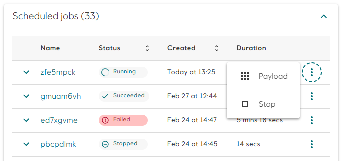
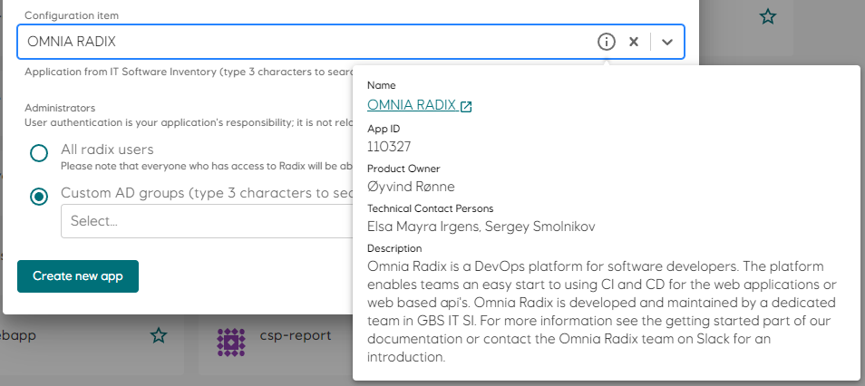
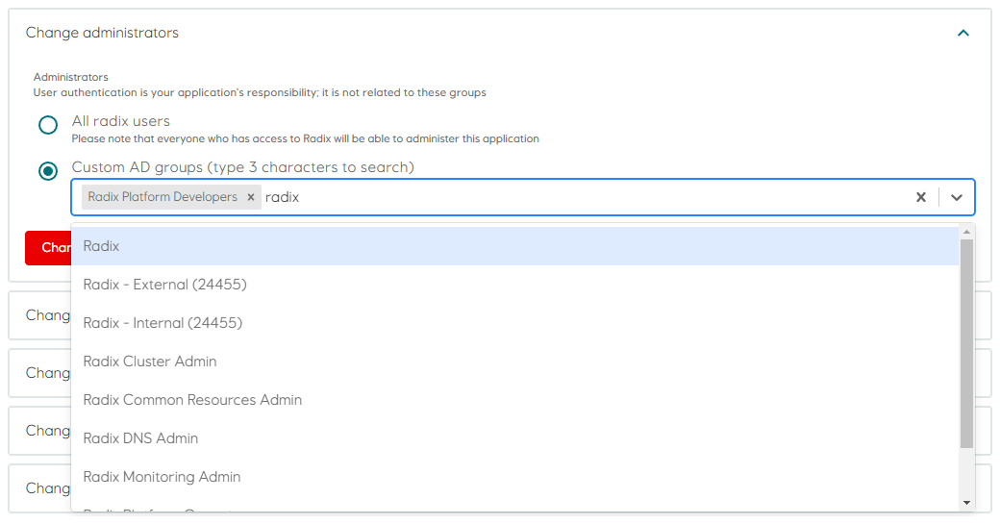
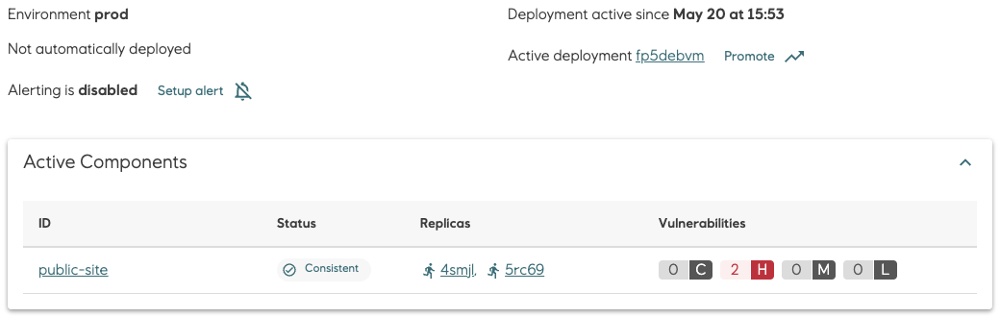
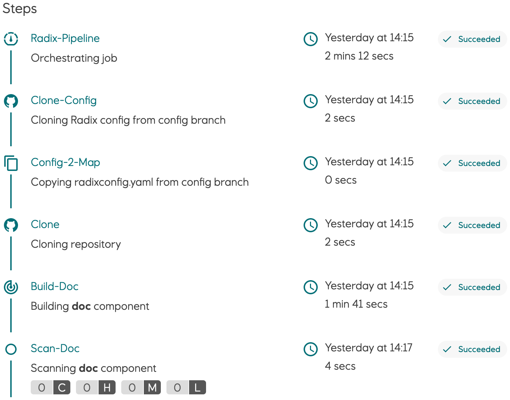
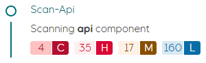

# What's new

## 2023


### 2023-08-15 - Radix application reader role
A `Radix application reader` role has been added to Radix. This role is a read-only role intended for users who need to view information about a Radix application, but should not be allowed to perform any actions such as starting or stopping components, or deleting the application.
Readers have the privilege to view logs associated with their replicas and jobs.
The role is an Azure AD group that can be assigned under `Access control` in the Configuration page of the application. 

### 2023-07-05 - Change in Azure Blob volume-mounts option

If your Radix application uses [Azure Blob volume mount](../../guides/volume-mounts/), [radixconfig.yaml](../../references/reference-radix-config/index.md) it is recommended to replace its configuration with BlobFuse2:  

```yaml
  volumeMounts:
    - name: storage1
      path: /app/image-storage
      blobfuse2:
        protocol: fuse2
        container: blobfusevolume
        uid: 1700
```

### 2023-05-16 - Support for custom CPU scaling threshold and autoscaling on memory
Autoscaling has only been supported on CPU, with a hardcoded threshold of 80% utilization. Now the CPU threshold is configurable, and you can also configure autoscaling on memory.
This can be enabled in [radixconfig.yaml](../../references/reference-radix-config/#horizontalscaling).

Example:

```yaml
spec:
  components:
    - name: backend
      environmentConfig:
        - environment: prod
          horizontalScaling:
            resources:
                memory:
                  averageUtilization: 75
                cpu:
                  averageUtilization: 85
            minReplicas: 2
            maxReplicas: 6
```

### 2023-05-24 - Old Replica logs! Get your old Replica logs here!

Is one of your replicas crashing? Have you ever wondered what the last signs of life were before it dramatically had its last breath of digital air?  
Well wonder no more!  
You can now download the logs of a components previous replicas, or even individual replica containers.  
This feature can be found on any of your Component Pages in the Radix Web Console, just below the Replica table.  

### 2023-05-02 - Radix does not allow to run Sub-Pipeline task steps with root users

Radix cluster policy does not allow to run containers with root user. Sub-pipelines are also not allowed to run its task steps with root users. Please use rootless docker images or use step spec option runAsUser. E.g. `runAsUser: 1000`

```yaml
spec:
  steps:
    - image: alpine
      name: step1
      script: |
        #!/usr/bin/env sh
        id
        :
      securityContext:
        runAsUser: 1000
```

### 2023-04-14 - Radix supports Azure Workload Identity for Azure Key Vaults

Radix now supports two options for authentication to Azure Key Vault from a Radix application component  
- [Azure Service Principal Client ID and Client Secret](../../guides/azure-key-vaults/#authentication-with-azure-service-principal-client-id-and-client-secret) , already existing  
- [Azure Workload Identity](../../guides/azure-key-vaults/#authentication-with-azure-workload-identity) , available from now, authentication without need of Azure Service Principal's Client ID and Client Secret  

### 2023-04-12 - Radix application configuration - Admin AD group is now mandatory

Admin AD group can be set in Web console => Configuration => “Change administrator”.

### 2023-03-28 - New version of Radix CLI version 1.7

More details in the [Radix documentation](../../docs/topic-radix-cli/#commands) or with built-in `help`   
rx scale --help  
rx get logs component --help  
rx create job deploy --help  

### 2023-03-14 - Radix updates

* Job component configuration has an option `notifications.webhook` - it is a Radix application's component URL, which will be called on status changes of running batches and jobs.  
* Scheduled Batches and Scheduled Jobs were renamed in the Radix console to Batches and Jobs. Job Scheduler was also renamed to Job Manager. It is to simplify terminology.  
* We added basic overview information for Radix CLI.   
* A new property `backoffLimit` for jobs defines the number of times a job will be restarted if it exists in error. This value can be configured in radixconfig.yaml or when creating a new job or batch . The `backoffLimit` for a specific job, and the number of times a job has failed is available in the job detail page in Radix Web Console.  


### 2023-03-07 - Schema for radixconfig.yaml

We have released the OpenAPI 3.0 Schema (an extended subset of JSON Schema) for the radixconfig.yaml file.  
This schema can be used in code editors (e.g. VS Code and Jetbrains IDEs) to provide auto-completion and validation when working with `radixconfig.yaml`, see [radixconfig schema](../../references/reference-code-editor-integration/)

### 2023-02-28 - Radix Web Console: Stop a regular job and batched jobs

A brand new button has been added to allow users to easily stop a job or a batch.  
The `Payload` button (`Scheduled Jobs` only) has been moved inside an elipsis menu together with the new `Stop` button for convenience.  


### 2023-02-24 Option to pass $GITHUB_TOKEN to the Radix GH Action

The Radix Github Action is used by many Radixians to execute rx CLI commands in workflows. We have seen cases where workflows fail because the Radix Action fails to download the rx CLI because of GitHub API rate limits. To remedy this, we have patched the Action with an optional argument github-token, where you can supply your workflow's GITHUB_TOKEN secret. This effectively increases the hourly API request limit from 60 to 15,000.

```yaml
      - name: list-apps
        uses: equinor/radix-github-actions@master
        with:
          github-token: ${{ secrets.GITHUB_TOKEN }}
          args: >
            get
            application
```

### 2023-02-16 - Radix Web Console: Start, Stop and Restart environments

- Git Tags are now visible on the Environment Summary Cards.
- Buttons to start, stop and restart an envrionment has been added.
  

### 2023-01-31 Radix Playground lifecycle policy

We will now implement a stricter lifecycle policy for using Radix Playground.  
Any application which has not been  
a - deployed - or  
b - restarted  
in the last 7 days will be stopped.  
After further 21 days of inactivity, all stopped applications will be deleted.  


### 2023-01-23 - Radix Web Console: Shown replica resources and scheduled job resources and settings

Radix now provides Request and Limit resources for component replicas and scheduled jobs. For scheduled jobs it is also shown Time Limit and Backoff Limit (later will be soon configurable)


### 2023-01-18 - Custom branch name for wildcard branch mapping

Radix now provides a text input field to put a full branch name for a build environment with [wildcard branch mappings](../../references/reference-radix-config/#build-2)

### 2023-01-17 - Machine user tokens deprecated

Machine user tokens pose a security risk due to lack of expiration time.  
Kubernetes underlying functionality used by machine user tokens has been removed in newer versions.  
Applications that currently use machine user tokens in their external CICD pipelines must switch to using Azure service principals (Azure AD app registrations or user-assigned managed identities).  


### 2023-01-10 - Federated Credentials with Azure AD Application and Managed Identity

We have enabled support for federated credentials between applications running in Radix and Azure AD applications and Azure Managed Identities.
[Workload identities](../../guides/workload-identity/) in Radix

## 2022

### 2022-11-10 - Configuration Item replaces WBS and owner and is now mandatory

The `Owner` and `WBS` fields has been removed and is replaced by `Configuration Item` which refers to an IT application in ServiceNow.
When registering a new application in Radix, you will have to select a `Configuration Item` from the drop-down list. The drop-down will automatically query ServiceNow when you start typing.

To see more information regarding the selected `Configuration Item`, click the `info` icon on the right in the drop-down.

Existing applications should be updated with a `Configuration Item` in the Application Configuration page.

::: tip
For the Playground cluster a Configuration Item is not mandatory.
:::



### 2022-11-01 - Enable and/or Disable components

Components in the Radix application now can be enabled and disabled for any and all environments.  
This can be configured in [radixconfig.yaml](../../references/reference-radix-config/#enabled).

Example:

```yaml
spec:
  components:
    - name: backend
      environmentConfig:
        - environment: prod
          enabled: false
spec:
  components:
    - name: backend
      enabled: false
      environmentConfig:
        - environment: prod
          enabled: true
```

### 2022-11-01 - External DNS certificate and key validation

You can now view information about TLS certificates for [external DNS aliases](../../guides/external-alias/#apply-custom-certificate) in Radix Web Console.

### 2022-10-13 - Supporting monorepo and custom radixconfig names

Radix now supports multiple Radix applications in the same GitHub repository - **monorepo** strategy.
It is now possible to use custom Radix configuration filenames (aka [radixconfig.yaml](../../references/reference-radix-config/index.md)) and/or its location in the GitHub repository.  
Please read more in the [monorepo guideline](../../guides/monorepo/)

### 2022-10-12 - Radix CLI version v1.2.1

A new command have been added.
Use `version` to print current version of the rx     fd

### 2022-09-23 - Improvements in Radix Web Console

Ensure you have assigned permissions to your app's [configuration](../../guides/configure-an-app/#registering-the-application), now you are able to grant the permission using the name of an AD group. At the same time add your applications to the list of favourites, only favourites will have the application status available on the Web Console front page.

Check out your vulnerability scan results: Are you using OAUTH feature? You may want to switch to [Radix OAUTH service](../../guides/authentication/#using-the-radix-oauth2-feature), we are updating the images (dependencies) regularly

### 2022-09-20 - Radix CLI version v1.2.0

Radix CLI 1.2.0 has new commands added such as `start`, `stop` and `restart` for a specific component, environment or an entire application.

#### Example

```sh
rx start component -a <application-name> -e <environment-name> -n <component-name>
rx stop environment -a <application-name> -e <environment-name>
rx restart application -a <application-name>
```

### 2022-09-20 - Azure key vault secret autorotation

Radix now offers the [Azure Key Vault autorotation](../../guides/azure-key-vaults/#autorotation-of-secrets) feature.

### 2022-09-01 - Vulnerability scan removed from build pipeline

The `Vulnerability Scan` step has been removed from the `build-deploy` pipeline. It has been replaced by a scheduled scan (daily and after new deployment) that scans images for all components, not only those built by Radix. Aggregated scan results are shown in environment pages, and details in the component page.

### 2022-09-01 - Select Radix Application Administrator Group by name

A new feature in Radix Web Console simplifies the configuration of application administrators. You can now select AD Groups in a drop-down list instead of entering a comma-separated list of ids. The drop-down list is populated as you type after two characters are entered.


### 2022-08-16 - GIT Metadata updates

- Two new default build-time environment variables, `$RADIX_GIT_COMMIT_HASH` and `$RADIX_GIT_TAGS`.
- `$RADIX_GIT_COMMIT_HASH` has up until now been injected into pods if pipeline job was triggered via GitHub webhook. This variable is now also inferred from HEAD of the build branch for build-deploy jobs which are not triggered via the GitHub webhook.
- `$RADIX_GIT_COMMIT_HASH` is inherited from source deployments after promote pipeline.
- New default pod environment variable `$RADIX_GIT_TAGS`, containing a whitespace separated list of git tags which refer to `$RADIX_GIT_COMMIT_HASH`, if present.
- UI for creating promote pipeline jobs displays the build commit and git tags of source deployments, if present on the source deployment.
- The overview page for Environment now has a GitHub link to the source code commit from which the active deployment was built, if applicable. GitHub links to tags are also present, if applicable.
- The overview page for Deployment also has GitHub links to commit and tags, if applicable.

### 2022-08-10 - Azure Key Vault values version

Radix Web Console can show version of [Azure Key Vault values](../../guides/azure-key-vaults/#azure-key-vault-secret-certificate-and-key-versions) used in a Radix application component (if applicable) - which pod uses which version. Click the link of the Azure Key Vault secret, certificate or key to open a popup with this info. Statuses also reflect actual state, not just *External*

### 2022-08-10 - Pipeline information for favourite appliactions in Radix Web Console

Radix Web Console now shows the last pipeline job status badge only for applications which are your favourites.

### 2022-06-28 - Log lines limit

The Radix component log size have been limited to only display the last 1000 lines to reduce browser resources usage.  
Copy log to clipboard has also been limited to the last 1000 lines.  
The **Download** button will return the entire log.

### 2022-06-20 - Change in Azure Blob volume-mounts accessMode

If your Radix application uses [Azure Blob volume mount](../../guides/volume-mounts/), [radixconfig.yaml](../../references/reference-radix-config/index.md) has a configuration of this volume mount, which has an optional property `accessMode`. If the application need not only read, but also write to this Azure Blob container, please specify explicitly this property.  
For `read-write` acces, we recommend to set it to `ReadWriteMany`.  

```yaml
  volumeMounts:
    - type: azure-blob
      name: storage1
      storage: blobfusevolume
      path: /app/image-storage
      gid: 1700
      accessMode: ReadWriteMany
```

Radix will soon get an update to set Blob volumes `accessMode` as `ReadOnlyMany` by default, when `accessMode` is not specified explicitly in the [radixconfig.yaml](../../references/reference-radix-config/#volumemounts). If a Radix application needs a read-only access to the Azure blob volume mount, please specify it explicitly  
**accessMode: ReadOnlyMany**

### 2022-06-20 - Introducing sub-pipeline concept (Tekton)

This is an optional, configurable build step that is run before deployment. A typical use case for [sub-pipeline](../../guides/sub-pipeline/#configure-sub-pipeline) is to perform a database update/migration immediately before deployment

### 2022-06-20 - Improved performance of the Radix Operator

Various improvements have been made to optimize the Radix Operator

### 2022-05-30 - Scheduled vulnerability scan implemented

Up until now all deployments to Radix was scanned by Snyk and the result was reported in the deploy pipeline in Radix Web Console. However, as most of you will be aware of, new vulnerabilities are discovered all the time and can exist in the image deployed to Radix.  
The scan of all images in Radix will now be done on a regular basis, and the  is reported in the environment page.

### 2022-04-28 - Improved/simpler **egress** rules configuration

[Egress rules](../../references/reference-radix-config/#egress) have been simplified. A new field `allowRadix` can be set to allow or deny traffic to other Radix applications.  
If you use the [built-in Oauth2 feature](../../guides/authentication/#using-the-radix-oauth2-feature), it is no longer necessary to allow traffic to [login.microsoftonline.com](http://login.microsoftonline.com/).

Docs now recommend using [Private Link](../../guides/egress-config/index.md/#use-private-link) to get static IP address to Azure databases or other SaaS for use in egress rules

### 2022-04-12 - Static **ingress** IPs

The Radix clusters now have static ingress IP ranges.  
This information can be found on the :information_source: information page on the applicable Radix Web Console.

#### Note: IP ranges

```text
Production: 20.223.122.0/30
Playground: 20.223.26.208/30
```

### 2022-03-11 - Custom configuration of the Metrics endpoint

You can now specify a custom port and path for monitoring.

Specifying monitoring path and port is now supported for application components in Radix. Read the [radixconfig.yaml reference entry](../../references/reference-radix-config/#monitoringconfig) for details.

### 2022-02-28 - Support for egress rules

Network egress rules are now supported for application environments in Radix. Read the [radixconfig.yaml reference entry](https://www.radix.equinor.com/references/reference-radix-config/#egressrules) for details, and read the [guide](../../guides/egress-rules/#default-rules) for limitations, tips and usage patterns.

Implement egress rules with caution!  
Applications may break if egress rules inadvertently block required resources.

### 2022-02-18 - Build Pipeline steps

The sequence of steps performed in the build/deploy pipeline has been changed. This will reduce time to deploy and new builds.  
To achieve this the scan of the deployment was moved to the end of the workflow, allowing deployment before the scan is completed.



### 2022-02-07 - Job manager: Configure time limit for jobs

To control running jobs, it is now possible to configrue a maximum time limit a job should is allowed to run.  
Specify "timeLimitSeconds" in [job payload](https://www.radix.equinor.com/guides/jobs/configure-jobs/#timelimitseconds) or in [radixconfig.yaml](https://www.radix.equinor.com/references/reference-radix-config/#timelimitseconds).  
A job exceeding the specified limit will be stopped automatically.

### 2022-02-01 - Support for Azure Key Vault

[Azure Key Vault](https://docs.microsoft.com/en-us/azure/key-vault/general/basic-concepts) secrets, certificates and keys can be used in Radix as secrets. Once configured, they are available in replicas of Radix application as environment variables and files.  

Read more about this in [radixconfig.yaml](https://www.radix.equinor.com/references/reference-radix-config/#secretrefs) and [Azure Key Vaults](https://www.radix.equinor.com/guides/azure-key-vaults/) guide.

### 2022-02-01 - Built-in configuration for OAuth2 authorization

Radix provides built-in configuration for adding OAuth2 authorization with OIDC to the component. Common `oauth2` settings can be configured at component level and/or in the component's `environmentConfig` section. When OAuth2 is configured for a component, Radix creates an OAuth2 service (using [OAuth2 Proxy](https://oauth2-proxy.github.io/oauth2-proxy/)) to handle the OAuth2 authorization code flow, and to verify the authorization state of incoming requests to the component.  

Read more in the OAuth section in [radixconfig.yaml](https://www.radix.equinor.com/references/reference-radix-config/#oauth2) documentation and the [OAuth guide](https://www.radix.equinor.com/guides/authentication/#using-the-radix-oauth2-feature).  

### 2022-01-11 - Changes to validation of radixconfig

Two new validation rules now apply to radixconfig.

1. Component ports lower than **1024** are prohibited.  
1. Environment variables prefixed with **RADIX_** or **RADIXOPERATOR_** are prohibited.  

## 2021

### 2021-12-09 - Active cluster IPs as environment variable

The IPs actively assigned the the cluster of which an application is deployed to are now added to the Radix environment variable RADIX_ACTIVE_CLUSTER_EGRESS_IPS. This environment variable contains a list of IPs which are used for outgoing traffic from the cluster and is added to every component.  

### 2021-11-23 - Cluster IPs

Cluster IPs are now visible in the `About Pages` in Radix Web Console.

- [Radix Platform](https://console.radix.equinor.com/about)
- [Radix Playground](https://console.playground.radix.equinor.com/about)

### 2021-11-18 - Radix Slack Alerts

We have released a new feature in Radix for sending alerts to Slack if a pipeline job fails, or a component or job fails to start or crashes/restarts (e.g. due to insufficient memory, unhandled exceptions etc.).  
Read the documentation, <https://www.radix.equinor.com/guides/alerting/>,  on how to configure alerting for your application.  

PS! The alert GUI in Radix web console is still "work in progress". We're working with EDS to make it more aligned with the EDS design standard.  

### 2021-10-29 - New design: Radix documentation (Public site)

The [Radix documentation site](https://www.radix.equinor.com/) has now been updated to a brand new version with a new design. And last but not least, now also with a SEARCH function.  
The most used page - [radixconfig.yaml reference](https://www.radix.equinor.com/references/reference-radix-config/) can be easily located under the Reference heading.

### 2021-10-14 - Radix CLI version v1.0.7

A new version of the [Radix CLI](https://github.com/equinor/radix-cli) is now available.  
[Version v1.0.7](https://github.com/equinor/radix-cli/releases/tag/v1.0.7)

### 2021-09-09 - New Radix Web Console

#### New design

The Radix Web Console has been redesigned in all its glory in accordance with the EDS Design Guidelines. This includes a more responsive design, new colors, new navigation, collapsable menus, icons, fonts and more!  


#### Improved vulnerability scanning

The results from the vulnerability scanning running on all components deployed to Radix are now visualized in the Pipeline Job page as a count of Critical, High, Medium and Low severity. The details of each vulnerabilities can be inspected in the Vulnerability page. This scanning is now performed by Snyk (due to rate limits in Trivy scans)  

  

[Vulnerability scanning - more information](../../docs/topic-concepts#scanning-images-for-security-issues)

#### Favourites

Users now have the ability to favourite their most precious applications! (We all have at least one 😉)  

The new favourites section can be found at the top of the Applications page, making it easier to get an overview of what's important to you amongst the ever increasing list of available applications.  
Favourites are local and stored in the browser cache.


#### Environment variables

Environment variables can now be overridden from the Radix Web Console. Previously users would have to make changes to their `radixconfig.yaml` file and redeploy it to change the value of environment variables.  

> Note that you will need to restart the component, or for jobs a new job should be started, for your changes to take effect.


[Environment variables documentation](../../guides/environment-variables/)

#### Performance improvement

The Applications page can now load up to 5x faster than before. Due to the increase in the number of applications, the load time of the Applications page had become way too long (due to the chain of Kubernetes queries needed to determine which applications a user have access to). With this improvement the page loads in a few seconds. Future improvements will be considered if/when needed.  

### 2021-09-01 - Radix Security Policy: Enforce 'Run as non-root'

As you may know, Docker containers have root privileges enabled by default. This is unnecessary and can introduce security risks and vulnerabilities into your applications. The policy will technically configure the PodSecurityContext for your application.  

From now on every time you (build and) deploy your app, Radix will not allow applications to run as root. If you have not configured the app correctly, an error will be logged in Events (Events section can be found in the Environments page). The new image will not be deployed and the previous image will remain running.  
If by any circumstance the pod running your app restarts, for instance due to lack of required memory, all applications running on it will also be restarted. Any app not complying with the Security Policy will not be started.  

[Security – running as non-root](../../docs/topic-docker/#running-as-non-root)  

Sample - [non-root oauth application](https://github.com/equinor/radix-example-oauth-proxy)  
Sample - [.NET non-root](https://github.com/equinor/radix-example-4-dotnet)  
Sample - [NODE non-root](https://github.com/equinor/radix-example-scenario-5-nodejs)  

### 2021-06-22 - Support for files in Azure blob container

The Blobfuse FlexVolume driver has been deprecated by Microsoft. Radix has decided to replace it with the Azure Blob Storage CSI driver (particularly azure-storage-fuse), which is the recommended option.  
FlexVolume will be supported in Radix during transition periods for projects that still uses it.  
[Volume mounts documentation](../../references/reference-radix-config/#volumemounts)

```yaml
environmentConfig:
  - environment: dev
    volumeMounts:
      - type: azure-blob
        name: storage-name
        storage: blob-container-name
        path: /app/image-storage
        uid: 1000
```

For those who have used the FlexVolume driver: the `container` property is deprecated, being replaced by the `storage` property to specify a blobs container name.

### 2021-06-16 - Pipeline job status badges

We have added support for generating badges that shows the status of the latest Radix Pipeline Job for a specific job type, environment and application.
A common place to add a status badge is in the README.md file of your repository, but it can be added to any web page you'd like.  

Read more about Pipeline Badges here: [Pipeline Badge](../../guides/pipeline-badge/)

### 2021-06-07 - Support for ClientCertificate authentication

We have added support for ClientCertificates, which can be configured for a component or a specific environment.  

Read more about ClientCertificates here: [ClientCertificate](../../references/reference-radix-config/#clientcertificate)

### 2021-04-19 - Running on-demand jobs in Radix

A job is an on-demand and short lived container/process that performs a set of tasks, e.g. a ML training job or an ETL job, and exits when it's done.
The duration of a job can span from seconds to hours, depending on what tasks it performs, but it is expected to exit when it has completed the work.
Multiple jobs can be created and running simultaneously.  

CPU, GPU and memory resources requested by a job are reserved when it starts, and released when it ends. This will help reduce the total cost for an application since cost is only calculated for running containers.  

You define jobs in the radixconfig.yaml file in your repo, similar to how you define components.  

Jobs are started and monitored through a job-scheduler web API, created by Radix for each job defined in radixconfig.yaml
The OpenAPI/Swagger definition for the job-scheduler can be downloaded here, and you can use <https://github.com/OpenAPITools/openapi-generator> to generate clients for your preferred language.  

Read more about jobs here: [Configure Jobs](../../guides/jobs)

### 2021-03-22 - Regenerate webhook secret and deploy key

To support the lifecycle managment of applications, it is now possible to update the webhook secret and the deploy key for the integration from Radix to the GitHub repo.  

To get a brand new secret and key use the "Regenerate deploy key and webhook secret" button in the Application Configuration area in the Radix Web Console.

### 2021-01-13 - Radix Web Console: Indication of outdated image

You will now be alerted on the Applications page if there is anything wrong with the running components on your application. A warning icon will now be present on the environment card on the Applications page if any of the active components are failing.  

The icon is a small exclamation mark next to the component name. To get more information on what is wrong you can hover over the icon. There is also a new warning label stating 'Outdated image' on the Environments page under 'Active components'.  
This label will appear when your running component is using an old image and typically happens when the latest deployment causes the new component to be unable to start, or the readiness probe is unable to reach it.  

> Note: In the transition right after a deployment, the Outdated image label will appear. Once the new replicas have started this will be replaced with the Ok label.

### 2021-01-12 - Radix Web Console: Events available

Kubernetes events related to application environments are now displayed in the Environments page, below Previous deployments.  

These events can be helpful when diagnosing application issues, e.g. recurring crashes/restarts or incorrect port configurations.  

Events are sorted descending by the time the event occurred. There are two types of events; Normal and Warning.  

- Normal events are informational messages related to resources in the application environment, e.g. creating, starting, stopping and deleting containers, pulling images, syncing ingresses etc.
Warning events are logged when there is a problem with a resource in the application environment, eg. backoff (container crashing/restarting), readiness probe failure (container not listening on defined port), missing secrets etc.
- Warnings are usually related to issues with containers running in pods.
If/when the cause of a pod related warning is resolved, e.g. the readiness probe receives a response on the defined port or a crashed container restarts, the warning will be flagged as Resolved. Warnings that reference pods from an old deployment will be flagged as Obsolete.
Events older than one hour are delete from the list. A Warning event will remain in the list as long as it is not Resolved or Obsolete.

## 2020

### 2020-12-16 - Support for mounting external storage in app containers

We have added support for mounting Blob Containers from Azure Storage Accounts to applications hosted in Radix.
The current implementation uses the Blobfuse FlexVolume Driver.  
This driver will most likely be replaced by the Blob CSI Driver, which was in preview when development started.
Blob storage is available in both Radix Playground and Radix Platform.  

[External storage configuration](../../guides/volume-mounts/)
