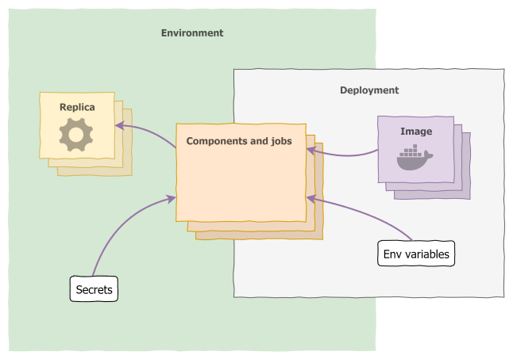

## Application

Applications are the highest level of objects that can be created in Radix — all other objects are contained within them.

An application declares all its [components](#component); this allows for them to be deployed and managed together within [environments](#environment). For instance, `front-end` and `back-end` components would in principle be part of the same application.

The components of an application don't need to share aspects like coding language, runtime, or system resources — they are just running processes. But within an application, components should in principle relate closely by communicating with each other.

The basic configuration for an application (the _application registration_) is composed of a **name**, the URL of a **GitHub repository**, and **access control** configuration (i.e. which Active Directory groups can administer the application in Radix). The remaining of the configuration is provided by the 📖 [`radixconfig.yaml`](../../references/reference-radix-config/), which is by default kept in the root of the application GitHub repository.

## Environment

An environment is an isolated area where all of an application's [components](#component) run. It is meant to compartmentalise an instance of the application, and can be used to provide that instance to users.

A typical setup is to create two environments, `development` and `production` — the former can be used for testing and showcasing features under development, and the latter is the "live" application that users rely on. Any (reasonable) number of environments is allowed in Radix; you can use these in a way that best fits your development and deployment [workflow](../workflows/).

Within an environment, components should address each other over the network by using just their names, instead of IP addresses or FQDNs. For instance, if you have two components, `api` and `worker` (listening on port 3000 for HTTP calls), the API can communicate with `http://worker:3000/some-endpoint`.

::: tip  Tip  
If you ❤️ Kubernetes, you'll be happy to know that Radix environments are actually just [K8s namespaces](https://kubernetes.io/docs/concepts/overview/working-with-objects/namespaces/).
:::

Environments are targets for [deployments](#deployment); at any time an environment will contain at most one _active deployment_. When a deployment is made active, all components within the environment are shut down and new ones are started, using the images defined in the deployment.

Environments (not deployments) also define any [secrets](#secret) that are required by the running components. Those secrets are kept in the environment when the active deployment is changed, and applied to the new components.

## Component

A component represents a standalone process running within an [environment](#environment) in a Radix application. Components are defined in the [`radixconfig.yaml`](../../references/reference-radix-config/#components), but they are only instantiated by [deployments](#deployment), which specify the Docker image to use. A component can have one or more running [replicas](#replica), depending on its configuration.

> Familiar with Docker or containers? A Radix component can be thought of as Docker image, and replicas as containers running that image.

If a component's `publicPort` is defined, endpoints are made available on the public Internet for each environment the component is deployed to. This allows connections via HTTPS into Radix, which are routed internally to an HTTP endpoint on the component. The domain name for the public endpoint is auto-generated from the component, environment, and application names: `https://[component]-[application]-[environment].[cluster-name].radix.equinor.com`.

> The `[cluster-name]` does not exists for Radix Platform cluster for publicly available link when dnsAppAlias is used.

Components can further be configured independently on each environment. Besides [environment variables](#environment-variable) and [secrets](#secret), a component can have different resource usage and monitoring settings.

## Job

A [job](../../guides/configure-jobs/) represents an on-demand and short lived container/process, running within an [environment](#environment), that performs a set of tasks and exits when it is done. Jobs are defined in the [`radixconfig.yaml`](../../references/reference-radix-config/#jobs). They share the same configuration as a component with a few exceptions; a job does not have publicPort, ingressConfiguration, replicas, horizontalScaling and alwaysPullImageOnDeploy. A job has two extra configuration options; [`schedulerPort`](../../guides/configure-jobs#schedulerport) (required), which is the port the [job-scheduler](../../guides/configure-jobs#job-scheduler) will listen to, and [`payload`](../../guides/configure-jobs#payload) (optional), which is a directory in the container where the payload, sent via the job-scheduler, is mounted.

Radix creates a [job-scheduler](../../guides/configure-jobs#job-scheduler) service for each job-component defined in [`radixconfig.yaml`](../../references/reference-radix-config/#jobs). The job-scheduler is a web API that you use to create, delete and monitor containers from the Docker image built or defined for the job. HTTP requests to the job-scheduler can only be sent by components running in the same application and environment.

When creating a new job, a payload with arbitrary arguments can be specified in the body of the HTTP request to the job-scheduler. The payload is a string and can therefore contain any type of data (text, json, binary) as long as you encode it as a string, e.g. base64, when sending the request to the job-scheduler, and decode it when reading it from the file in the container where the payload is mounted.

Multiple job containers can run simultaneously. Each job is assigned a unique name that can be used to monitor the state of the job through the job-scheduler API. This name is also the internal DNS name that you can use to communicate with a specific job if it exposes any ports, e.g. a custom metrics HTTP endpoint.

## Replica

A replica is a running instance of a [component](#component). As a normal process, it can write to the standard output (`stdout`), which is made available for inspection by Radix.

If a replica terminates unexpectedly, a new one is started so that the component will maintain the specified number of replicas running (by default, this number is one). Each replica is started with the exact same configuration.
