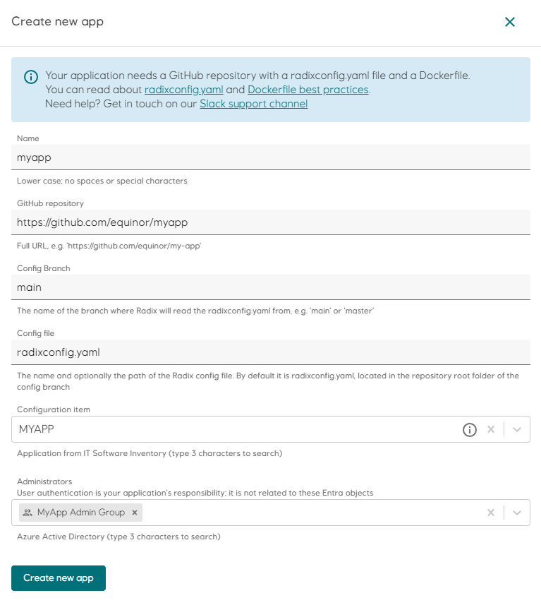

# Registering your application

We are now ready to register our application using the Radix Web Console. Load the console for the [Radix cluster](../radix-clusters) that you want to use: [Radix Playground](https://console.playground.radix.equinor.com/applications/) or [Radix Platform](https://console.radix.equinor.com/applications/). Click "Create new app" in the top right of the page and follow the instructions there to integrate the GitHub repository with Radix.

Remember that we can always change the 📖 [`radixconfig.yaml`](/radix-config/index.md) file and the `Dockerfile`(s) after registration to change how the application builds and deploys.  

Here is an example of how a new application registration could look like  
:::tip
For the Playground cluster a Configuration Item is not mandatory.
:::

