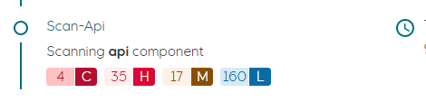
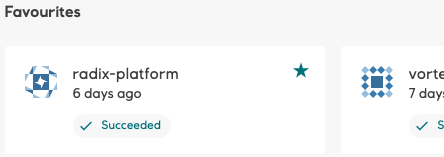

# Radix Releases

## 2021

## 09.09.2021 - New Radix Web Console  
### New design  

The web console has been redesign according to EDS design guidelines, and implemented with EDS React components. This includes responsive design, new navigation, collapsable menu, new colors, icons and fonts, etc.  


### Improved vulnerability scanning  
The results from the vulnerability scanning running on all components deployed to Radix are now visualized in the pipeline job page as a count of critical, high, medium and low vulnerabilities. The details of each vulnerabilities can be inspected in the vulnerability page. The scanning is now performed by Snyk (due to rate limits in Trivy scans)  

  

[Vulnerability scanning - more information](../../docs/topic-concepts/index.md#scanning-images-for-security-issues)

### Favorites  
Applications in the Radix console can be marked as favorites. Favorites are listed at the top of the application list page. This way users can easily get an overview of their relevant applications among the longer list of available applications.  

The favorites are stored in the browser cache.  



### Environment variables  
Environment variables can be overridden in the web console. Previously, users have had to make a change in the radixconfig file and do a redeploy to change the value of environment variables. Now, this can be done in ´a moment´ through the console. However you'll need to restart the component to take effect, or for jobs a new job should be started.  

  

[Environment variables documentation](../../guides/environment-variables/)  

### Performance improvement  
The application page now loads 5x faster than the previous version. Due to the increase in number of applications, the load time of the application page had become way too long (due to the chain of Kubernetes queries needed to determine which applications a user have access to). With this improvement the page loads in a few seconds. Future improvements will be considered if/when needed.  


## 01.09.2021 - Radix Security Policy - enforce Run as non-root  

As you may know, Docker containers have root privileges enabled by default, this is unnecessary and expose security risks and vulnerabilities in your application. The policy will technically configure the PodSecurityContext for your application.  

From now on every time you (build and) deploy your app, Radix will not allow apps to run as root, if you have not configured the app correctly, an error will be logged in Events (Events section can be found in the Environments page). The new image will not be deployed, and the previous will remain running.
HOWEVER, if by any circumstances the pod running your app will need to restart, by for instance lack of required memory, a restart will be triggered and the app will not comply to the Security Policy, hence it will not start at all.  

[Security – running as non-root](../../docs/topic-docker/#running-as-non-root)  

Sample - non-root oauth application - https://github.com/equinor/radix-example-oauth-proxy  
Sample - dotnet non-root - https://github.com/equinor/radix-example-4-dotnet  
Sample - node non-root - https://github.com/equinor/radix-example-scenario-5-nodejs  

## 22.06.2021 Support for files in Azure blob container  
Blobfuse FlexVolume driver has been deprecated by Microsoft, Radix replaced it with Azure Blob Storage CSI driver (particularly azure-storage-fuse), which is recommended to use.  FlexVolume will be supported in Radix during transition periods for projects, which use it now.  

[Volume mounts documentation](../../docs/reference-radix-config/#volumemounts)  

```yaml
environmentConfig:
   - environment: dev
     volumeMounts:
       - type: azure-blob 
         name: storage-name
         storage: blob-container-name
         path: /app/image-storage
         uid: 1000
```  

For those, who used FlexVolume driver: container property is outdated, now it is used property storage  to specify blob's container name.  

## 16.06.2021 Pipeline job status badges

We have added support for generating badges that shows the status of the latest Radix pipeline job for a specific job type, environment and application.
A common place to add a status badge is in the README.md file of your repository, but it can be added to any web page you'd like.  

Read more here https://www.radix.equinor.com/guides/pipeline-badge/

## 07.06.2021 Support for ClientCertificate authentication

We have added support for ClientCertificates, which can be configured on a component or a specific environment.  

Read more here https://www.radix.equinor.com/docs/reference-radix-config/#clientcertificate


## 19.04.2021 Running on-demand jobs in Radix

A job is an on-demand and short lived container/process that performs a set of tasks, e.g. a ML training job or an ETL job, and exits when it is done.
The duration of a job can span from seconds to hours, depending on what tasks it performs, but it is expected to exit when it has completed the work.
Multiple jobs can be created and running simultaneously.  

CPU, GPU and memory resources requested by a job are reserved when it starts, and released when it exits. This will help reduce the total cost for an application since cost is only calculated for running containers.  

You define jobs in the radixconfig.yaml file in your repo, similar to how you define components.  

Jobs are started and monitored through a job-scheduler web API, created by Radix for each job defined in radixconfig.yaml
The OpenAPI/Swagger definition for the job-scheduler can be downloaded here, and you can use https://github.com/OpenAPITools/openapi-generator to generate clients for your preferred language.  

Read more about jobs here https://www.radix.equinor.com/guides/configure-jobs/


## 22.03.2021 Regenerate webhook secret and deploy key

To support the lifecycle managment of application, it is now possible to update the webhook secret and the deploy key for the integration from Radix to the GitHub repo.  

To get a brand new secret and key use the "Regenerate deploy key and webhook secret" button in the application configuration area in the Radix Web Console.


## 13.01.2021 - Radix Web Console - Indication of outdated image

You will now be alerted at the application page if there is anything wrong with the running components on your application. A warning icon will now be present on the environment card on the application page if any of the active components are failing.  

The icon is a small exclamation mark next to the component name. To get more information on what is wrong you can hover over the icon. There is also a new warning label stating 'Outdated image' on the environments page under 'Active components'.  
This label will appear when your running component is using an old image and typically happens when the latest deployment causes the new component to be unable to start, or the readiness probe is unable to reach it.  

> Note: In the transition right after a deployment, the Outdated image  label will appear. Once the new replicas have started this will be replaced with the Ok  label.  

## 12.01.2021 - Radix Web Console - Events available

Kubernetes events related to application environments now are displayed in the environment page, below Previous deployments.  

These events can be helpful when diagnosing application issues, e.g. recurring crashes/restarts or incorrect port configurations.  

Events are sorted descending by the time the event occurred. There are two types of events; Normal and Warning.  
- Normal events are informational messages related to resources in the application environment, e.g. creating, starting, stopping and deleting containers, pulling images, syncing ingresses etc.
Warning events are logged when there is a problem with a resource in the application environment,
eg. backoff (container crashing/restarting), readiness probe failure (container not listening on defined port), missing secrets etc.  
- Warnings are usually related to issues with containers running in pods.
If/when the cause of a pod related warning is resolved, e.g. the readiness probe receives a response on the defined port or a crashed container restarts, the warning will be flagged as Resolved. Warnings that reference pods from an old deployment will be flagged as Obsolete.
See the attached image for an example of Warning events with Resolved and Obsolete state.
Events older than one hour are delete from the list. A Warning event will remain in the list as long as it is not Resolved or Obsolete.


## 2020

## 16.12.2020 - Support for mounting external storage in app containers

We have added support for mounting Blob Containers from Azure Storage Accounts to applications hosted in Radix.
The current implementation uses the Blobfuse FlexVolume Driver.  
This driver will most likely be replaced by the Blob CSI Driver, which was in preview when development started.
Blob storage is available in both Radix Playground and Radix Platform.  

[External storage configuration](../../guides/volume-mounts/)
