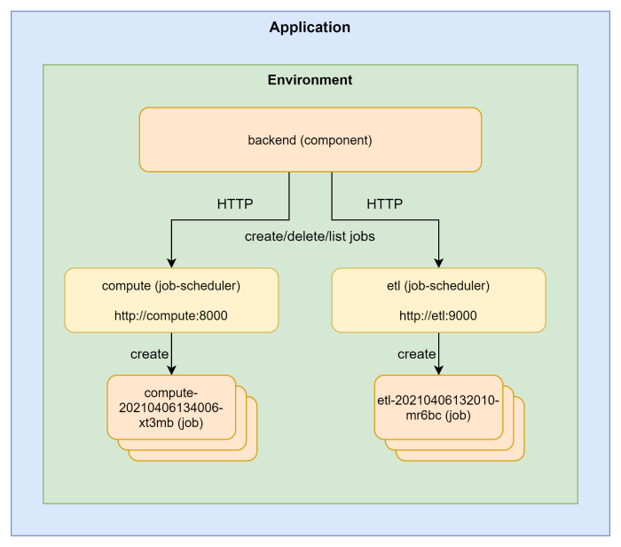

A job is an on-demand and short lived container/process that performs a set of tasks, e.g. a ML training job or an ETL job, and exits when it is done.
The duration of a job can span from seconds to hours, depending on what tasks it performs, but it is expected to exit when it has completed the work. Multiple jobs can be created and running simultaneously.

CPU, GPU and memory resources requested by a job are reserved when it starts, and released when it exits. This will help reduce the total cost for an application since cost is only calculated for running containers. A job that requests 10GB of memory and 2 CPUs, started once per day and runs for one hour, will only accumulate cost for the hour it is running. A component that requests the same resources will accumulate cost for all 24 hours of a day.

Docker images built from the definition in the components section in radixconfig.yaml are started automatically when a new build-deploy, promote or deploy pipeline completes. Jobs on the other hand, must be managed through the [job-scheduler](#job-scheduler) web API service. Radix creates a job-scheduler for each job and environment defined in [`radixconfig.yaml`](../../docs/reference-radix-config/#jobs). The job-scheduler can start new containers from the Docker image build by the pipeline, delete and list existing jobs.
The job-scheduler does not require any authentication since it is not exposed to the Internet and is only accessible by components in the same application and environment.


# Configure a job

Jobs are configured in [`radixconfig.yaml`](../../docs/reference-radix-config/#jobs), similar to how components are configured.

```yaml
spec:
  environments:
    - name: dev
    - name: prod
  components:
    - name: backend
      ...
  jobs:
    - name: compute
      src: compute
      schedulerPort: 8000
      payload:
        path: "/compute/args"
      ports:
        - name: http
          port: 3000
    - name: etl
      src: etl
      schedulerPort: 9000
```

They share many of the same configuration options with a few exceptions.

A job does not have `publicPort`, `ingressConfiguration`, `replicas`, `horizontalScaling` and `alwaysPullImageOnDeploy`:
- `publicPort` and `ingressConfiguration` controls exposure of component to the Internet. Jobs cannot be exposed to the Internet, so these options do not apply.
- `replicas` and `hortizontalScaling` controls how many containers of a Docker image a component should run. A job is always one container.
- `alwaysPullImageOnDeploy` is used by Radix to restart components that use static Docker image tags, and pulling the newest image if the SHA has changed. Jobs will always pull and check the SHA of the cached image with the SHA of the source image.

Jobs have two extra configuration options; `schedulerPort` and `payload`:
- `schedulerPort` (required) defines the port that the job-scheduler for a job will listen to.
- `payload` (optional) defines a directory in the job container where the payload received by the job-scheduler is mounted.

## SchedulerPort

In the [`radixconfig.yaml`](../../docs/reference-radix-config/#jobs) example above, we have defined two jobs, `compute` and `etl`.

`compute` has schedulerPort set to 8000, and Radix will create a job-scheduler service called compute that listens for HTTP requests on port 8000. The URL for the compute job-scheduler is `http://compute:8000`

The job-scheduler for the `etl` job listens for HTTP requests on port 9000, and the URL is `http://etl:9000`

## Payload

Arguments required by a job is sent in the request body to the job-scheduler as a JSON document with an element named `payload`.
The content of the payload is then mounted in the job container as a file named `payload` in the directory specified in `payload.path` in radixconfig.yaml.
The data type of the `payload` value is string, and it can therefore contain any type of data (text, json, binary) as long as you encode it as a string, e.g. base64, when sending it to the job-scheduler, and decoding it when reading it from the mounted file inside the job container. The max size of the payload is 1MB.

The compute job in the example above has payload.path set to `/compute/args`. Any payload send to the compute job-scheduler will available inside the job container in the file `/compute/args/payload`


# Job Scheduler

The job-scheduler is a web API service that you use to create, delete and monitor the state of jobs.
Radix creates one job-scheduler per job defined in radixconfig.yaml. A job-scheduler will listen to the port defined by `schedulerPort` and host name equal to the `name` of the job. The job-scheduler API can only be accessed by components running in the same environment, and it is not exposed to the Internet. No authentication is required.

The job-scheduler exposes four methods for managing jobs:
- `POST /api/v1/jobs` Create a new job using the Docker image that Radix built for the job. Job specific arguments must be sent in the request body:
```json
{
    "payload": "Sk9CX1BBUkFNMTogeHl6Cg=="
}
```

- `GET /api/v1/jobs` List name and state for all jobs
- `GET /api/v1/jobs/{jobName}` Get state for a named job
- `DELETE /api/v1/jobs/{jobName}` Delete a named job



> Job Scheduler keeps the 10 latest `Succeeded` jobs. Jobs with status `Failed` is not automatically cleaned up, and must be deleted with the `DELETE /api/v1/jobs/{jobName}` method.

## Starting a new job

Using the example configuration in the top, we have a `backend` component and two jobs, `compute` and `etl`. Radix creates two job-schedulers, one for each job. The job-scheduler for `compute` listens to `http://compute:8000`, and job-scheduler for `etl` listens to `http://etl:9000`.
We want to start a new `compute` job. Let's assume that the `compute` job requires a JSON document with elements `x` and `y`.

From our `backend` component we send a `POST` request to `http://compute:8000/api/v1/jobs` with request body set to
```json
{
    "payload": "{\"x\": 10, \"y\": 20}"
}
```
The job-scheduler creates a new job and mounts the payload we sent in the request body to a file named `payload` in the directory `/compute/args`.
Once the job has been created successfully, the `job-scheduler` responds to `backend` with a job object:
```json
{
    "name": "compute-20210407105556-rkwaibwe",
    "started": "",
    "ended": "",
    "status": "Running"
}
```
- `name` is the unique name for the job. This is the value we must use in the `GET /api/v1/jobs/{jobName}` and `DELETE /api/v1/jobs/{jobName}` methods. It is also the host name we can use if the job listens to incoming requests, e.g. `http://compute-20210407090837-mll3kxxh:3000`
- `started` is the date and time the job was started. It is represented in RFC3339 form and is in UTC. The value is normally empty when a new job is created, due to the fact that it can take a few seconds to initialize the Docker container for the job.
- `ended` is the date and the the job successfully ended. Also represented in RFC3339 form and is in UTC. This value is only set for `Successful` jobs.
- `status` is the current status of the job container. Possible values are `Running`, `Successful` and `Failed`. Status is `Failed` if the container exits with a non-zero exit code, and `Successful` if the exit code is zero.

## Getting the status of existing jobs

We can get a list of all jobs and their status by sending a `GET` request to `http://compute:8000/api/v1/jobs`. The response is an array of job objects, similar to the response we received when creating a new job
```json
[
  {
    "name": "compute-20210407090837-mll3kxxh",
    "started": "2021-04-07T09:08:37Z",
    "ended": "2021-04-07T09:08:45Z",
    "status": "Succeeded"
  },
  {
    "name": "compute-20210407105556-rkwaibwe",
    "started": "2021-04-07T10:55:56Z",
    "ended": "",
    "status": "Failed"
  }
]
```

If we want to get status for a specific job, let say `compute-20210407090837-mll3kxxh`, we send a request to `http://compute:8000/api/v1/jobs/compute-20210407090837-mll3kxxh`. The response is a single job object
```json
{
  "name": "compute-20210407090837-mll3kxxh",
  "started": "2021-04-07T09:08:37Z",
  "ended": "2021-04-07T09:08:45Z",
  "status": "Succeeded"
}
```

## Deleting an existing job
 
The job-scheduler keeps the last 10 jobs with status `Successful`. The oldest jobs exceeding this limit is automatically deleted. Jobs with status `Failed` will never be delete by the job-scheduler and must be deleted manually by calling `DELETE /api/v1/jobs/{jobName}`.

In our job list we have one job with status `Failed`. If we want to delete it, we must send a `DELETE` request to `http://compute:8000/api/v1/jobs/compute-20210407105556-rkwaibwe`. A successful deletion will respond with
```json
{
  "status": "Success",
  "message": "job compute-20210407105556-rkwaibwe successfully deleted",
  "code": 200
}
```

> The `DELETE` method is not limited to jobs with status `Failed`. Both `Running` and `Successful` jobs can be deleted with this method.

## OpenAPI/Swagger spec

[Download][1] Swagger/OpenAPI specification for job-scheduler

## Managing jobs in Web Console

TBA

[1]:swagger.json