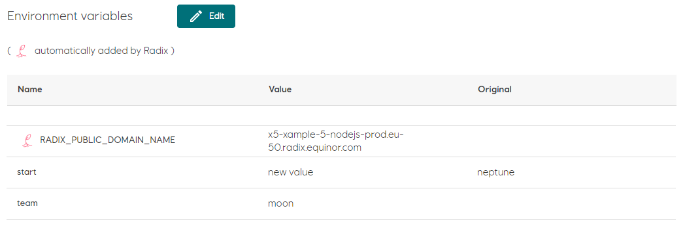

# Environment variables

[Environment variables](../../docs/reference-radix-config/#variables) are configured in [radixconfig.yaml](../../docs/reference-radix-config/#variables). In addition, for each application Radix sets environment variables with prefix `RADIX_` and `RADIXOPERATOR_` - these prefixes should not be used for application environment variables.

Values of application environment variables can be overridden in the Radix Console, excluding those, prefixed with `RADIX_` and `RADIXOPERATOR_`.

The value of an environment variable, changed to a new value in the Radix Console, will use this new value for all new deployments. To revert to the original value  - edit it again, changing to its original value, specified in the `radixconfig.yaml`.

### Edit environment variables
- Navigate to the application component or job
- Hit the button "Edit"
- Change one variable or multiple variables values
- Hit the button "Apply"
After few seconds changed environment variable values will be shown in the table.
> Changed environment variable values will be applied to the component or job configuration, but not to _currently running_ replicas or jobs. 
>
> To apply changed environment variables:
> - to component replicas - restart the component
> - to jobs - start new jobs
 
In the table with environment variables, there is column `Original`, containing value, configured originally in the `radixconfig.yaml` for changed environment variables. 

It is an option to add empty environment variables to `radixconfig.yaml` and populate them in the Radix Console.

#### Example:

- Environment variables, configured in `radixconfig.yaml`. `VAR3` is empty.
    ```yaml
    variables:
        VAR1: "val1"
        VAR2: "val2"
        VAR3: "" #variable with empty value
    ```

- Environment variables, entered in Radix Console. Environment variable `VAR3` got a value.

